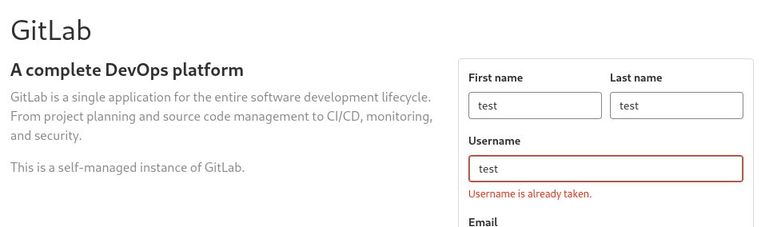

---
layout:
  title:
    visible: true
  description:
    visible: false
  tableOfContents:
    visible: true
  outline:
    visible: true
  pagination:
    visible: false
---

# GitLab

## General

In GitLab the 2FA is disabled by default. It has the following 3 types of repositories:

<table><thead><tr><th width="217">Repository</th><th>Access</th></tr></thead><tbody><tr><td>Public</td><td>Available to everyone (no authentication required)</td></tr><tr><td>Internal</td><td>Available to all authenticated users</td></tr><tr><td>Private</td><td>Restricted to specific users</td></tr></tbody></table>

## Footprinting


The below examples has been taken from the Gitlab section of the [Attacking Common Applications](https://academy.hackthebox.com/module/113) HTB's module.


For finding the version we can register an account and browse to `/help` (Figure 1).

<figure><figcaption><p>Figure 1: Footprinting GitLab as authenticated users.</p></figcaption></figure>

## Manual Enumeration

We can browse to `/explore` both as unauthenticated (Figure 2) and authenticated users (Figure 3).

<div>

<figure><figcaption><p>Figure 2: Exploring project as an unauthenticated user.</p></figcaption></figure>

 

<figure><figcaption><p>Figure 3: Exploring project as an authenticated user.</p></figcaption></figure>

</div>

Check for registration errors (Figure 4):

<figure><figcaption><p>Figure 4: Enumerating usernames via registration errors.</p></figcaption></figure>


## User Enumeration








```bash
# download script
wget https://raw.githubusercontent.com/dpgg101/GitLabUserEnum/main/gitlab_userenum.py
# usage
./gitlab_userenum.py --url URL --wordlist WORDLIST
```









```bash
./gitlab_userenum.sh --url URL --userlist WORDLIST
```




## Vulnerabilities

```bash
$ searchsploit gitlab
------------------------------------------------------------------------------------------------------------------------------------------------------------------------------- ---------------------------------
 Exploit Title                                                                                                                                                                 |  Path
------------------------------------------------------------------------------------------------------------------------------------------------------------------------------- ---------------------------------
GitLab - 'impersonate' Feature Privilege Escalation                                                                                                                            | ruby/webapps/40236.txt
GitLab 11.4.7 - RCE (Authenticated) (2)                                                                                                                                        | ruby/webapps/49334.py
GitLab 11.4.7 - Remote Code Execution (Authenticated) (1)                                                                                                                      | ruby/webapps/49257.py
GitLab 12.9.0 - Arbitrary File Read                                                                                                                                            | ruby/webapps/48431.txt
Gitlab 12.9.0 - Arbitrary File Read (Authenticated)                                                                                                                            | ruby/webapps/49076.py
Gitlab 13.10.2 - Remote Code Execution (Authenticated)                                                                                                                         | ruby/webapps/49951.py
GitLab 13.10.2 - Remote Code Execution (RCE) (Unauthenticated)                                                                                                                 | ruby/webapps/50532.txt
Gitlab 13.9.3 - Remote Code Execution (Authenticated)                                                                                                                          | ruby/webapps/49944.py
Gitlab 14.9 - Authentication Bypass                                                                                                                                            | ruby/webapps/50888.txt
GitLab 14.9 - Stored Cross-Site Scripting (XSS)                                                                                                                                | ruby/webapps/50889.txt
Gitlab 6.0 - Persistent Cross-Site Scripting                                                                                                                                   | php/webapps/30329.sh
GitLab CE/EE < 16.7.2 - Password Reset                                                                                                                                         | java/remote/51889.txt
GitLab Community Edition (CE) 13.10.3 - 'Sign_Up' User Enumeration                                                                                                             | ruby/webapps/49822.txt
GitLab Community Edition (CE) 13.10.3 - User Enumeration                                                                                                                       | ruby/webapps/49821.sh
GitLab v15.3 - Remote Code Execution (RCE) (Authenticated)                                                                                                                     | ruby/webapps/51181.py
Gitlab-shell - Code Execution (Metasploit)                                                                                                                                     | linux/remote/34362.rb
Jenkins Gitlab Hook Plugin 1.4.2 - Reflected Cross-Site Scripting                                                                                                              | java/webapps/47927.txt
NPMJS gitlabhook 0.0.17 - 'repository' Remote Command Execution                                                                                                                | json/webapps/47420.txt
------------------------------------------------------------------------------------------------------------------------------------------------------------------------------- ---------------------------------
Shellcodes: No Results
Papers: No Results
```
