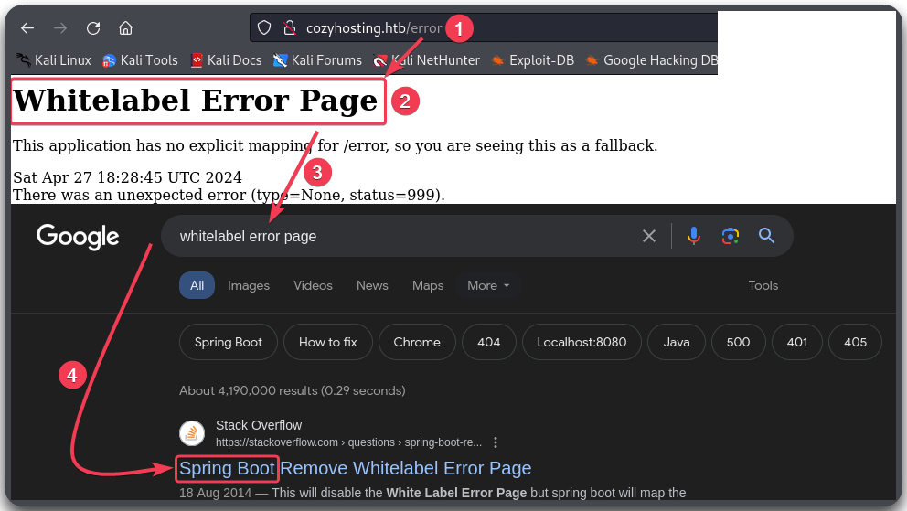

---
layout:
  title:
    visible: true
  description:
    visible: false
  tableOfContents:
    visible: true
  outline:
    visible: true
  pagination:
    visible: true
---

# Spring Boot

## Information

<table><thead><tr><th width="146" align="right">Technology</th><th>Description</th></tr></thead><tbody><tr><td align="right">  <a href="https://spring.io/projects/spring-framework">Spring</a></td><td>A framework for building Java applications.</td></tr><tr><td align="right"><a href="https://spring.io/projects/spring-boot">Spring Boot</a></td><td>A Spring extension that simplifies the configuration of Spring apps by providing defaults and conventions to minimize the boilerplate code required.</td></tr></tbody></table>

## Exploitation

### Identify

The default error page has the `Whitelabel Error Page` message.

<figure><figcaption></figcaption></figure>

### Fuzz


```bash
ffuf -u http://cozyhosting.htb/FUZZ -w /usr/share/wordlists/seclists/Discovery/Web-Content/spring-boot.txt -c -ac -ic
```


### Actuators

Spring Boot's [actuators](https://www.baeldung.com/spring-boot-actuators#understanding-actuator) is a set of built-in monitoring and debugging features and its endpoints should not be public facing. For instance, [`/actuator/sessions`](https://www.baeldung.com/spring-boot-actuators#3-predefined-endpoints) -> lists active HTTP Spring sessions_._ For an example of leveraging an actuator for **session hijacking** see [Cozyhosting](../../../../boxes/boxes/easy/cozyhosting.md#leveraging-actuator).

*
