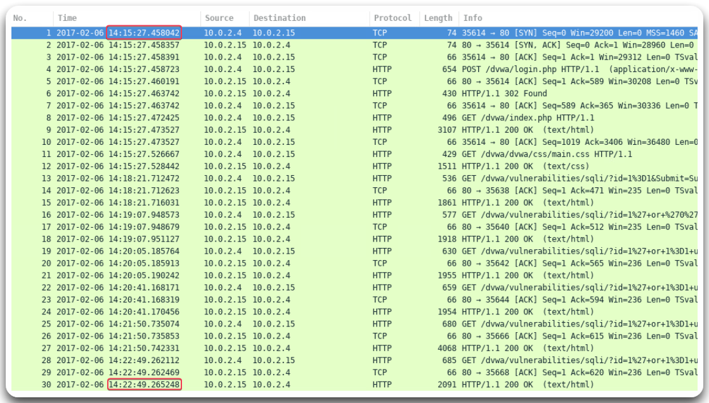
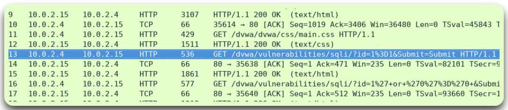
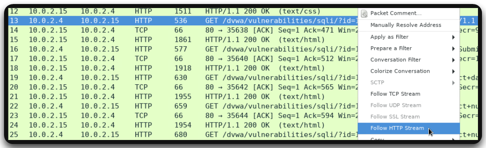
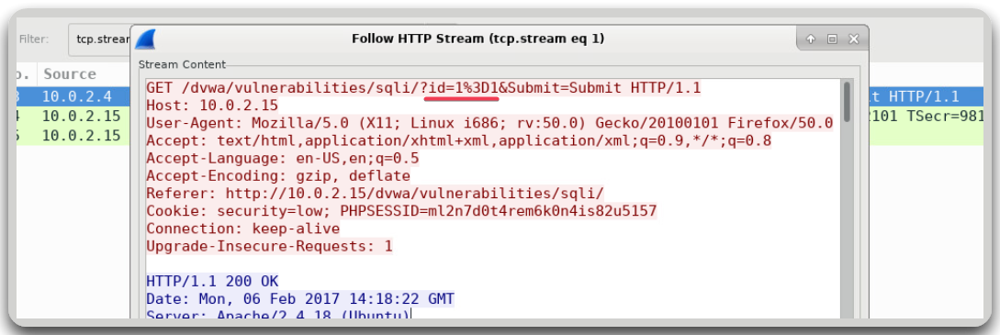

---
layout:
  title:
    visible: true
  description:
    visible: false
  tableOfContents:
    visible: true
  outline:
    visible: true
  pagination:
    visible: true
---

# Traffic Capture

## CLI-tools



`tcpdump` is a CLI tool used to capture and analyze network traffic in real time.

```bash
# Capture the HTTP-related traffic on the tun0 interface
sudo tcpdump -i tun0 port 80 -n -w http_traffic.pcap
```



`tshark` is the CLI version of Wireshark used to capture and analyze network traffic:

```bash
# Capture the HTTP-related traffic on the tun0 interface
sudo tshark -i tun0 -f "port 80" -n -w http_traffic.pcap
```



## WireShark

We can analyze the `.pcap` files with WireShark using filters such as:

```bash
# HTTP traffic only
http
# HTTPS traffic (TLS/SSL)
ssl or tls
# SMB protocol traffic
smb || smb2
# LDAP traffic
ldap
# RDP traffic
tcp.port == 3389
# NTML authentication
ntlmssp
# Base64 encoded strings (common in HTTP headers)
frame contains "Basic "
# FTP credentials (user/pass)
ftp.request.command == "USER" || ftp.request.command == "PASS"
# HTTP POST requests (often contain data submission)
http.request.method == "POST"
# Kerberos tickets (useful for Kerberoasting)
kerberos
# IP addresses
ip.addr == 192.168.1.10
ip.dst == 192.168.1.10
ip.src == 192.168.1.10
# TCP traffic with data (non-empty payloads)
tcp.len > 0
# HTTP traffic on non-standard ports
http && tcp.port != 80
```

### SQLi Example

The SQLi[^1] attack lasted \~8 minutes (Figure 1).

<figure><figcaption><p>Figure 1: Duration of the SQLi attack.</p></figcaption></figure>

The attack starts on line 13 (Figure 2).

<figure><figcaption><p>Figure 2: The start of the SQLi attack.</p></figcaption></figure>

By right-clicking the line and selecting _Follow HTTP Stream_ (Figure 3), _&#x77;_&#x65; can see the raw HTTP requests and that the attacker has entered `1=1` into the `id` parameter to test for SQLi (Figure 4).

<figure><figcaption><p>Figure 3: Following the HTTP stream.</p></figcaption></figure>

<figure><figcaption><p>Figure 4: Inspecting the HTTP packets.</p></figcaption></figure>

[^1]: Structured Query Language Injection
