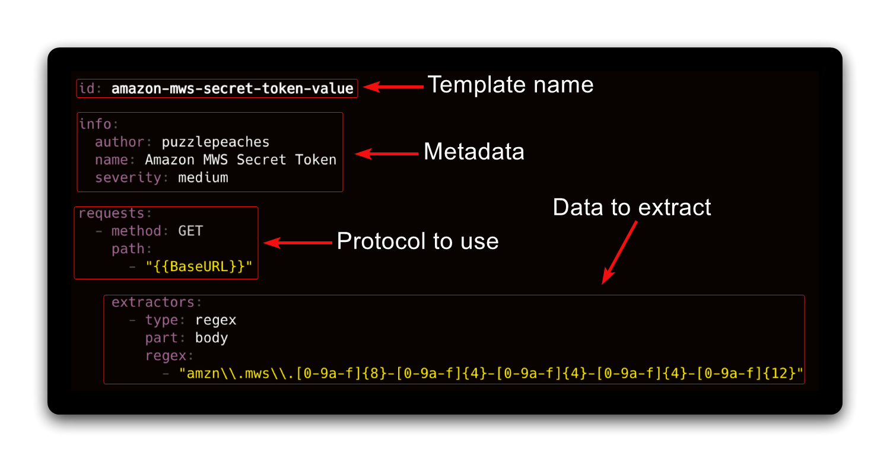
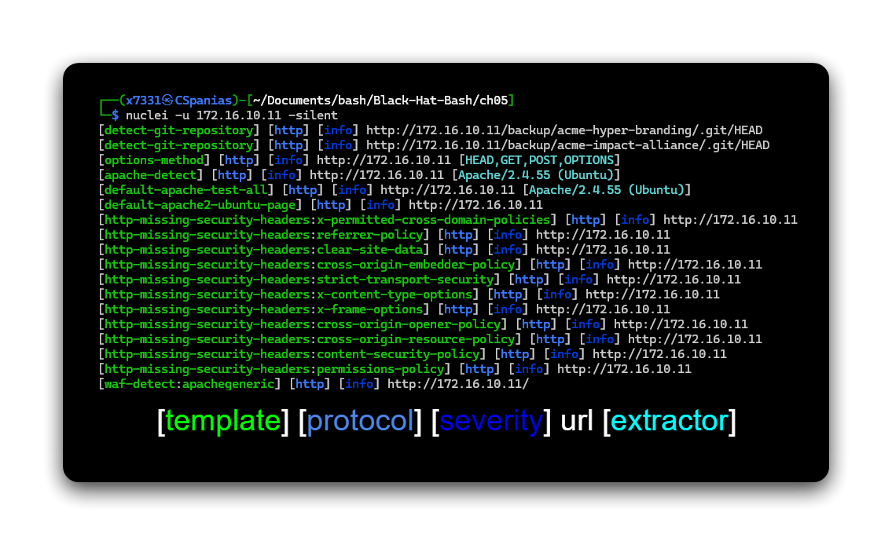
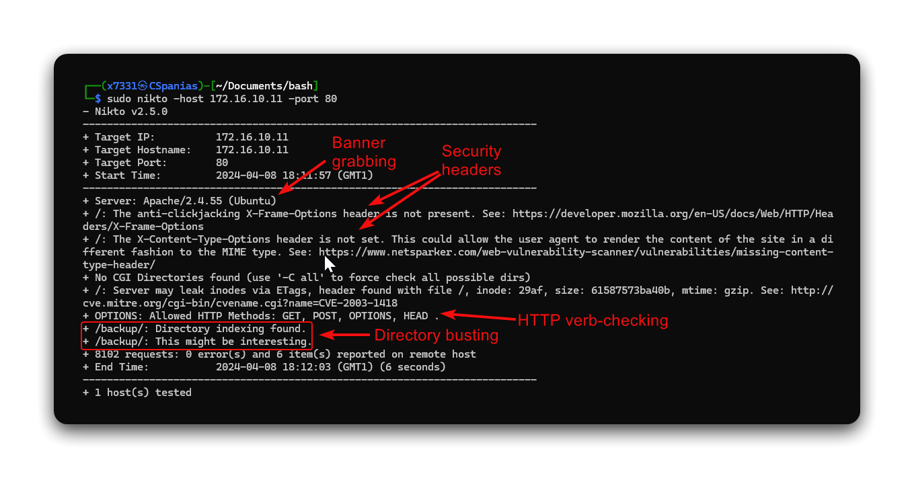

---
layout:
  title:
    visible: true
  description:
    visible: false
  tableOfContents:
    visible: true
  outline:
    visible: true
  pagination:
    visible: true
---

# Vulnerability Scanners



[**Nuclei**](https://github.com/projectdiscovery/nuclei) is a fast, customizable vulnerability scanner that uses templates to automate security testing across web applications and networks. It is open-source based on **YAML-written templates** (`/home/x7331/.local/nuclei-templates`).

<figure><figcaption></figcaption></figure>

Nuclei expects a socket to be passed, thus, a [port scan](port-scanners.md) needs to precede it:

```bash
# Update db
nuclei -ut

# List templates
nuclei -tl

# Specify a target host
nuclei -u <target-ip>

# Specify a target file
nuclei -l <file>

# Run with a custom template
nuclei -u <target-ip> -t <template-name>

# Run with tags
nuclei -u <target-ip> -tags apache,git
```

Nuclei has a `-silent` parameter which shows only the findings in the output which makes parsing the output easier:

<figure><figcaption></figcaption></figure>





[**Nikto**](https://github.com/sullo/nikto) is an open-source web server scanner that identifies security issues, outdated software, and misconfigurations. It performs banner grabbing, runs basic checks to determine if the web server uses common security headers, checks available HTTP verbs, dirbusting, etc.:

```bash
nikto -host 172.16.10.11 -port 80
```

<figure><figcaption></figcaption></figure>


