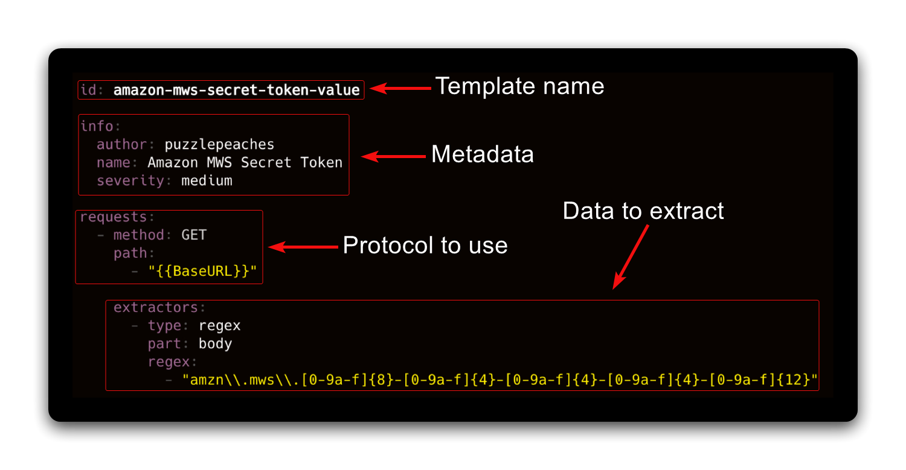
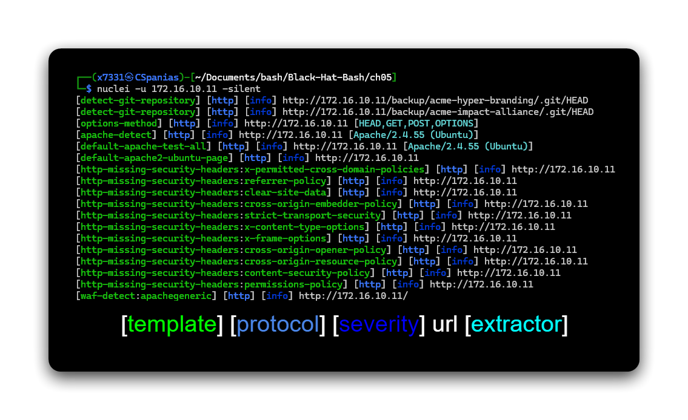

---
layout:
  title:
    visible: true
  description:
    visible: false
  tableOfContents:
    visible: true
  outline:
    visible: true
  pagination:
    visible: true
---

# Nuclei

An open-source vulnerability scanner based on **YAML-written templates**. Templates are stored at (`/home/x7331/.local/nuclei-templates`).

<figure><figcaption></figcaption></figure>

## Usage

Nuclei expects a socket to be passed, thus, a [port scan](../port-scanners/) needs to precede it.

```bash
# update db
nuclei -ut
# list templates
nuclei -tl
# specify target host
nuclei -u <IP-ADDRESS>
# specify file
nuclei -l <FILE>
# run with a custom template
nuclei -u <IP-ADDRESS> -t <TEMPLATE-NAME>
# run with tags
nuclei -u <IP-ADDRESS> -tags apache,git
```

Nuclei has a `-silent` parameter which shows only the findings in the output which makes parsing the output easier.

<figure><figcaption></figcaption></figure>


```bash
#!/bin/bash
EMAIL_TO="security@blackhatbash.com"
EMAIL_FROM="nuclei-automation@blackhatbash.com"

for ip_address in "$@"; do
  echo "Testing ${ip_address} with Nuclei..."
  result=$(nuclei -u "${ip_address}" -silent -severity medium,high,critical)
  if [[ -n "${result}" ]]; then
    while read -r line; do
      template=$(echo "${line}" | awk '{print $1}' | tr -d '[]')
      url=$(echo "${line}" | awk '{print $4}')
      echo "Sending an email with the findings ${template} ${url}"
      sendemail -f "${EMAIL_FROM}" \
                      -t "${EMAIL_TO}" \
                -u "[Nuclei] Vulnerability Found!" \
                -m "${template} - ${url}"

    done <<< "${result}"
  fi
done
```


## Resources






