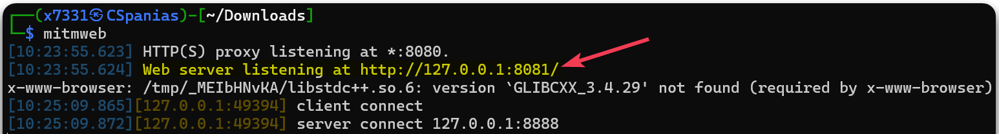
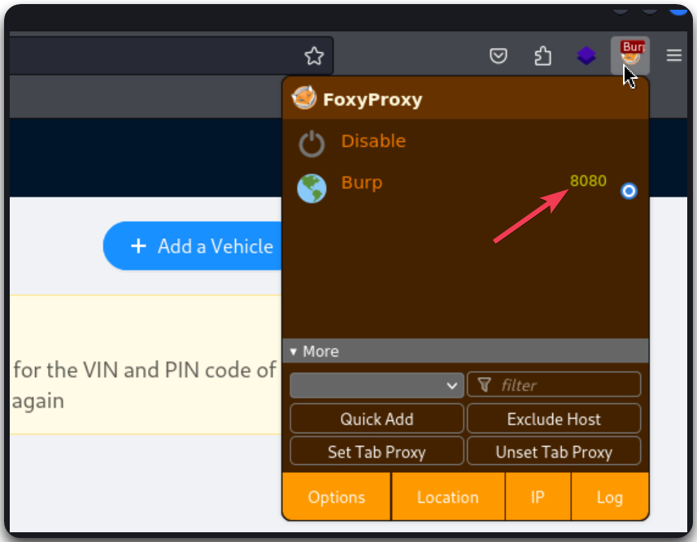
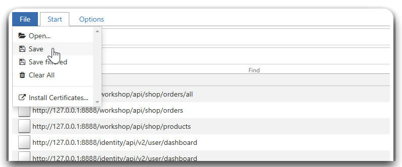
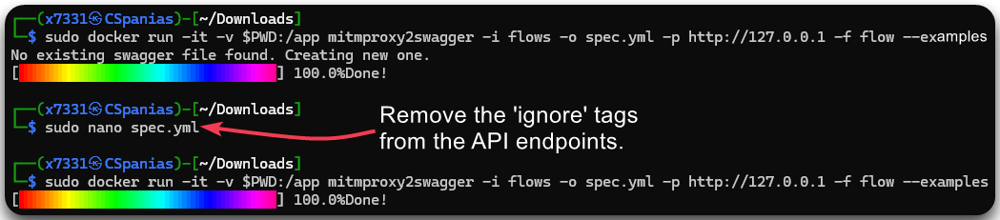
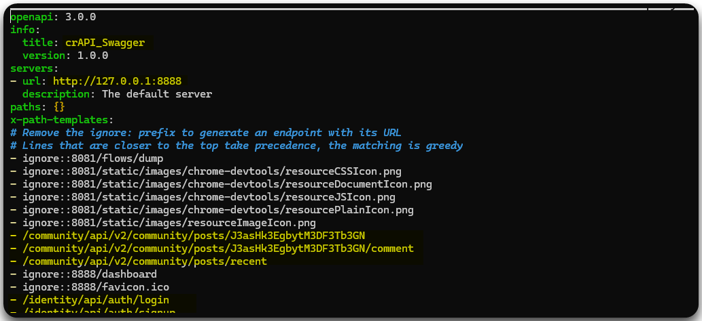
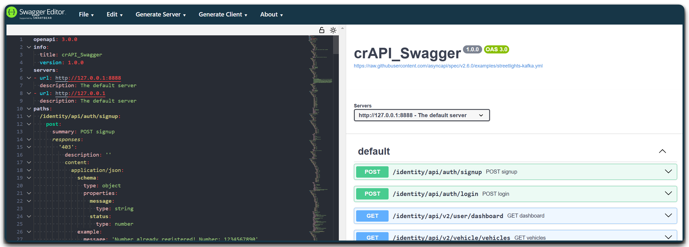
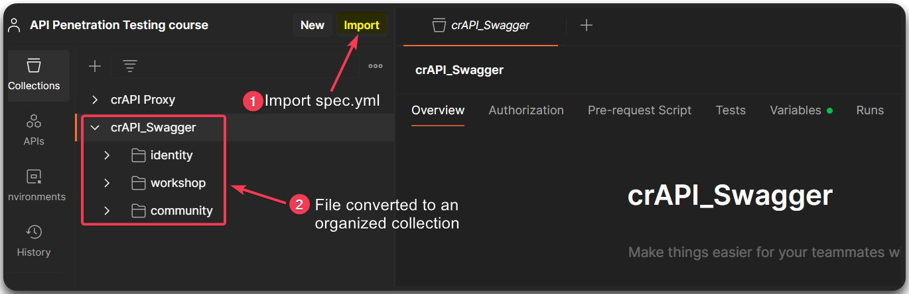

---
layout:
  title:
    visible: true
  description:
    visible: false
  tableOfContents:
    visible: true
  outline:
    visible: true
  pagination:
    visible: true
---

# mitmweb

## Usage


```bash
# start proxy to intercept traffic
mitmproxy
```


<figure><figcaption><p>Starting the <code>mitmweb</code> GUI and proxy.</p></figcaption></figure>

Proxy the traffic from the browser.

<figure><figcaption><p>Proxying the traffic from the browser with FoxyProxy.</p></figcaption></figure>

Use the web application as intented and visit `mitmweb` server to export the file (`flow`).

<figure><figcaption><p>Exporting the requests as a <code>flow</code> file.</p></figcaption></figure>

Download `mitmproxy2swagger`'s [latest release](https://github.com/alufers/mitmproxy2swagger/releases), build with Docker, and convert `flow` file to `spec.yml`.


```bash
# convert flow file to swagger (from within the flow directory)
sudo docker run -it -v $PWD:/app mitmproxy2swagger -i flows -o spec.yml -p http://127.0.0.1 -f flow --examples
# remove the ignore tags
sudo nano spec.yml
# re-run the command
sudo docker run -it -v $PWD:/app mitmproxy2swagger -i flows -o spec.yml -p http://127.0.0.1 -f flow --examples
```


<figure><figcaption><p>Converting the <code>flow</code> file to <code>spec.yml</code>.</p></figcaption></figure>

<figure><figcaption><p>Removing the <code>ignore</code> tags.</p></figcaption></figure>

Import the `spec.yml` file to [SwaggerEditor](https://editor.swagger.io/) to visualize it and to Postman to work with.

<figure><figcaption><p>Importing <code>spec.yml</code> to SwaggerEditor.</p></figcaption></figure>

<figure><figcaption><p>Importing <code>spec.yml</code> to Postman.</p></figcaption></figure>

## Resource










