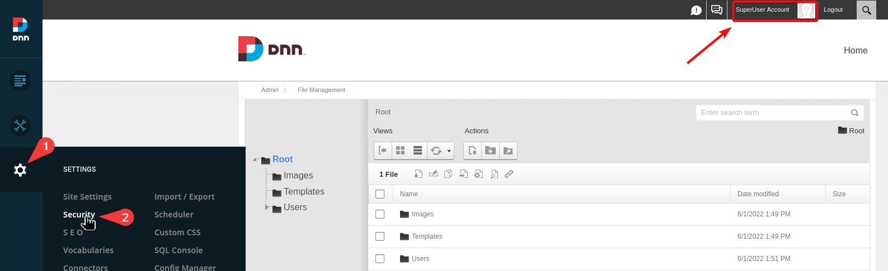
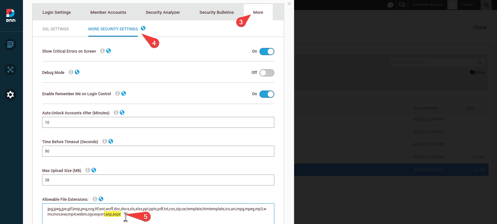
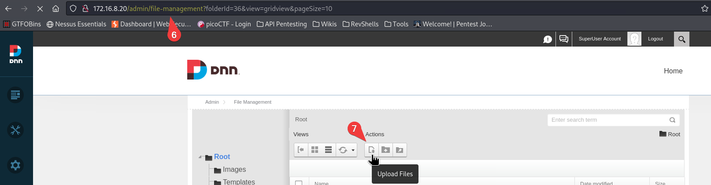
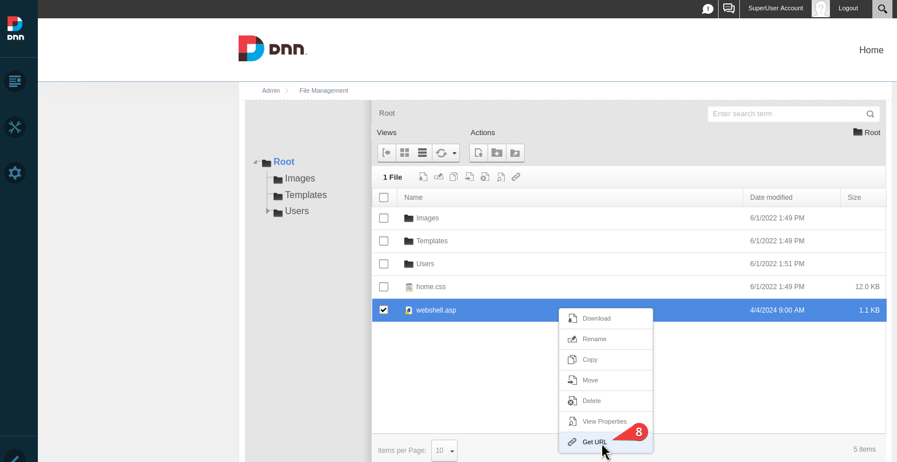

---
layout:
  title:
    visible: true
  description:
    visible: false
  tableOfContents:
    visible: true
  outline:
    visible: true
  pagination:
    visible: true
---

# DNN

## RCE

### SQL Console

System command can be run via the built-in SQL console under the Settings menu.

```sql
# enable xp_cmdshell
EXEC sp_configure 'show advanced options', '1'
RECONFIGURE
EXEC sp_configure 'xp_cmdshell', '1' 
RECONFIGURE
```

After pressing `Run Script` OS commands can be executed.

```sql
xp_cmdshell 'whoami'
```

### ASP Webshell

If the `SuperUser` account is compromised, we can access the Security settings (Figure 1) and allow any file extensions needed so we can upload a webshell (Figure 2).&#x20;

<figure><figcaption><p>Figure 1: Accessing the Security settings.</p></figcaption></figure>

<figure><figcaption><p>Figure 2: Add the desired file extensions.</p></figcaption></figure>

Upload a webshell, such as this [`.asp` webshell](https://raw.githubusercontent.com/backdoorhub/shell-backdoor-list/master/shell/asp/newaspcmd.asp) (Figure 3).

<figure><figcaption><p>Figure 3: Uploiad the webshell.</p></figcaption></figure>

Get the file's URL by right-clicking and interact with the webshell.

<figure><figcaption><p>Figure 4: Get the URL and interact with the webshell.</p></figcaption></figure>

## Resources






