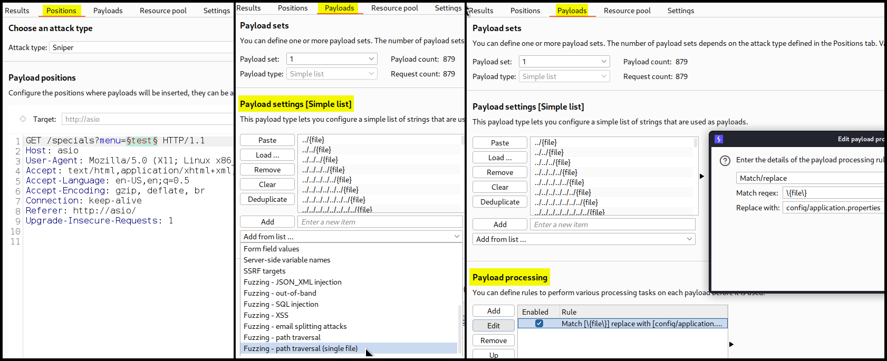
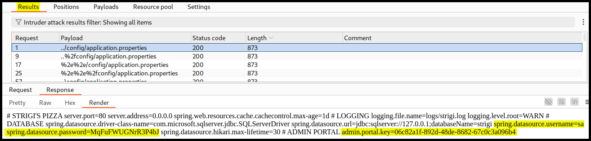

---
layout:
  title:
    visible: true
  description:
    visible: false
  tableOfContents:
    visible: true
  outline:
    visible: true
  pagination:
    visible: true
---

# Spring

## Information

<table><thead><tr><th width="146" align="right">Technology</th><th>Description</th></tr></thead><tbody><tr><td align="right"><a href="https://spring.io/projects/spring-framework">Spring</a></td><td>A framework for building Java applications.</td></tr><tr><td align="right"><a href="https://spring.io/projects/spring-boot">Spring Boot</a></td><td>A Spring extension that simplifies the configuration of Spring apps by providing defaults and conventions to minimize the boilerplate code required.</td></tr></tbody></table>

## Recon

The default error page has the `Whitelabel Error Page` message (Figure 1).

<figure><figcaption><p>Figure 1: The default error page of a Spring-based application.</p></figcaption></figure>

## Attacks

### Fuzzing

We can use seclists's [Spring boot-specific wordlist](https://github.com/danielmiessler/SecLists/blob/master/Discovery/Web-Content/spring-boot.txt).


```bash
ffuf -u http://cozyhosting.htb/FUZZ -w /usr/share/wordlists/seclists/Discovery/Web-Content/spring-boot.txt -c -ac -ic
```


### Actuators

Spring Boot's [actuators](https://www.baeldung.com/spring-boot-actuators#understanding-actuator) is a set of built-in monitoring and debugging features and its endpoints should not be public facing. For instance, [`/actuator/sessions`](https://www.baeldung.com/spring-boot-actuators#3-predefined-endpoints) lists active HTTP Spring sessions_._ For an example of leveraging an actuator for **session hijacking** see [Cozyhosting](../../../boxes/easy/cozyhosting.md#leveraging-actuator).

### Config Files

[Spring applications](https://docs.spring.io/spring-boot/docs/1.4.1.RELEASE/reference/html/boot-features-external-config.html#boot-features-external-config-application-property-files) will load properties from the `application.propertie` file which is typically under the webroot (`/`) or the `config` subdirectory. This file can contain sensitive information, such as credentials and database information.&#x20;

> _The example below is based on OffSec's_ [_WEB-200_](https://www.offsec.com/courses/web-200/) _course (Asio lab)._

Spring applications will load properties from[`application.properties`](https://docs.spring.io/spring-boot/docs/1.4.1.RELEASE/reference/html/boot-features-external-config.html#boot-features-external-config-application-property-files) files which are typically located under the webroot (`/`) or the `config` subdirectory. We can use Burp Intruder along with the default wordlist called `Fuzzing - path traversal (single file)` (Figure 2.2) and a `Match/replace` rule (Figure 2.3) to search for the `application.properties` file.

<figure><figcaption><p>Figure 2: Fuzzing for the target file.</p></figcaption></figure>

We successfully managed to read the `application.properties` file which contains plaintext credentials as well as an admin portal key (Figure 3).

<figure><figcaption><p>Figure 3: Reading the <code>applications.properties</code> configuration file.</p></figcaption></figure>
