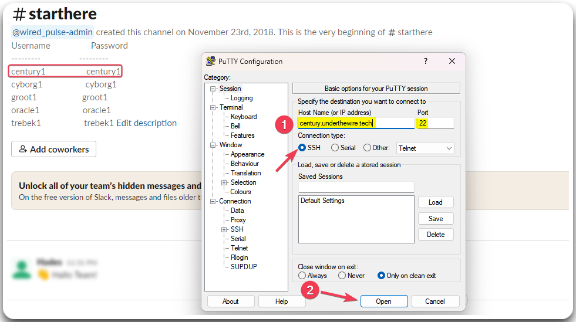
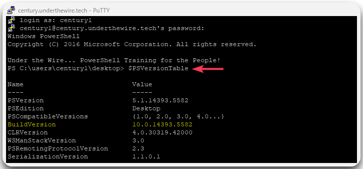

---
layout:
  title:
    visible: true
  description:
    visible: false
  tableOfContents:
    visible: true
  outline:
    visible: true
  pagination:
    visible: true
---

# Century


[Century](https://underthewire.tech/century) is the UTW[^1]'s initial game.


## Level 0 -> 1

Visit the [Slack channel](https://communityinviter.com/apps/underthewire/under-the-wire), get the credentials required to access Level 1, and use Putty to connect to the SSH server (Host Name: `century.underthewire.tech`, Port: `22`).

<figure><figcaption></figcaption></figure>

To find the build version of the PowerShell we can use the automatic variable `$PSVersionTable`. which provides information about the version of the PowerShell engine running on the system.


```powershell
# list the properties of the PSVersionTable
$PSVersionTable
```


<table><thead><tr><th width="299">Property</th><th>Description</th></tr></thead><tbody><tr><td><code>PSVersion</code></td><td>Version number of the PS engine.</td></tr><tr><td><code>PSEdition</code></td><td>Edition of PS (e.g., Desktop, Core).</td></tr><tr><td><code>PSCompatibleVersions</code></td><td>Compatible PS versions with the current version.</td></tr><tr><td><strong><code>BuildVersion</code></strong></td><td><strong>Indicates the build number of the PS engine.</strong></td></tr><tr><td><code>CLRVersion</code></td><td>Version of the <a data-footnote-ref href="#user-content-fn-2">CLR</a> associated with the PS engine.</td></tr><tr><td><code>WSManStackVersion</code></td><td>Version of the WS-Management protocol used by PS.</td></tr><tr><td><code>PSRemotingProtocolVersion</code></td><td>Version of the WinRM protocol used by PS.</td></tr><tr><td><code>SerializationVersion</code></td><td>Serialization version used by the PS engine.</td></tr></tbody></table>

<figure><figcaption></figcaption></figure>

## Level 1 -> 2

[^1]: Under The Wire

[^2]: Common Language Runtime
