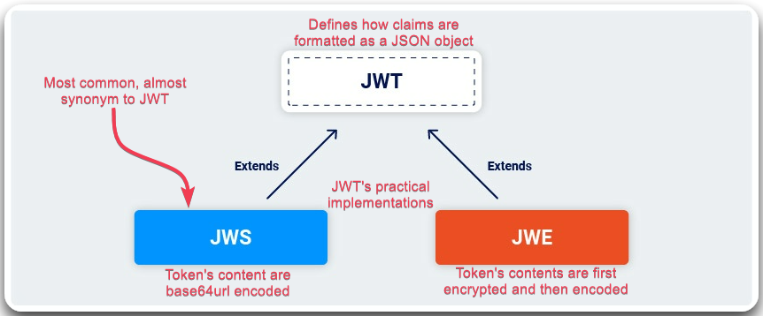

---
layout:
  title:
    visible: true
  description:
    visible: false
  tableOfContents:
    visible: true
  outline:
    visible: true
  pagination:
    visible: true
---

# JWTs


Most vulnerabilities arise due to **implementation flaws** and/or **leaking the sercret key**. Our goal is typically to modify the JWT to **bypass authentication** or **impersonate users**.


## Token Characteristics

<table><thead><tr><th width="152" align="right">Feature</th><th>Details</th></tr></thead><tbody><tr><td align="right"><mark style="color:orange;"><strong>Format</strong></mark></td><td><em>How is it encoded</em></td></tr><tr><td align="right"><strong>By value</strong> </td><td>Contains all the details within it, can be validated by the receiver without calling the AS, can be encrypted/signed</td></tr><tr><td align="right"><strong>By reference</strong></td><td>Random string that acts as a reference to a db entry; only the AS can read it</td></tr><tr><td align="right"><mark style="color:orange;"><strong>Purpose</strong></mark></td><td><em>Who is it for</em></td></tr><tr><td align="right"><strong>Access token</strong></td><td>Resource Server</td></tr><tr><td align="right"><strong>Refresh token</strong></td><td>Authorization Server</td></tr><tr><td align="right"><strong>ID Token</strong> </td><td>Client (OpenID Connect)</td></tr><tr><td align="right"><mark style="color:orange;"><strong>Type</strong></mark></td><td><em>How can it be used</em></td></tr><tr><td align="right"><strong>Bearer</strong> </td><td>Coin analogy: if you find one you use it wihtout proving that it's yours</td></tr><tr><td align="right"> <a data-footnote-ref href="#user-content-fn-1"><strong>PoP</strong></a><strong>/</strong><a data-footnote-ref href="#user-content-fn-2"><strong>HoK</strong></a></td><td>Credit card analogy: you need proof of ownership to use them (<em>sender-constrained tokens</em>, i.e., bound to a single user)</td></tr></tbody></table>

<figure><figcaption>
Figure 1: An example of a <code>Bearer</code> and a <code>DPoP</code> token (<em>image adapted from</em> <a href="https://www.apisecuniversity.com/courses/api-authentication"><em>here</em></a>).
</figcaption></figure>

## JSON Web Tokens

JWT is a **format** that can be used for many purposes, such as ID Tokens (always JWTs), access tokens (can be JWTs), and refresh tokens (almost never JWTs). Most often are signed (**JWS**), but they can also be encrypted (**JWE**). They are Base64 encoded, start with `ey`, and can be decoded using [https://jwt.io/](https://jwt.io/\)) or using [`jwt_tool.py`](https://github.com/ticarpi/jwt_tool).


**JWTs** are a standardized format for sending **cryptographically signed JSON data** between systems.&#x20;

* They **typically contain claims**, i.e., information about users.
* They contain all the data required by a server on the **client-side**.


<figure><figcaption>
Figure 2: Different JWT formats (<em>image adapted from</em> <a href="https://portswigger.net/web-security/jwt"><em>here</em></a>).
</figcaption></figure>

The **JWT signature** is typically **generated by hashing the header and the payload**. The resulting hash might be also encrypted. In both cases, the process involves a **secret signing key** which provides a way for servers to verify that the token data hasn't been tampered with.

<figure><figcaption>
Figure 3: The elements of a JWT (<em>image adapted from</em> <a href="https://www.apisecuniversity.com/courses/api-authentication"><em>here</em></a>).
</figcaption></figure>

[^1]: **Proof of Possession**

[^2]: **Holder of Key**
