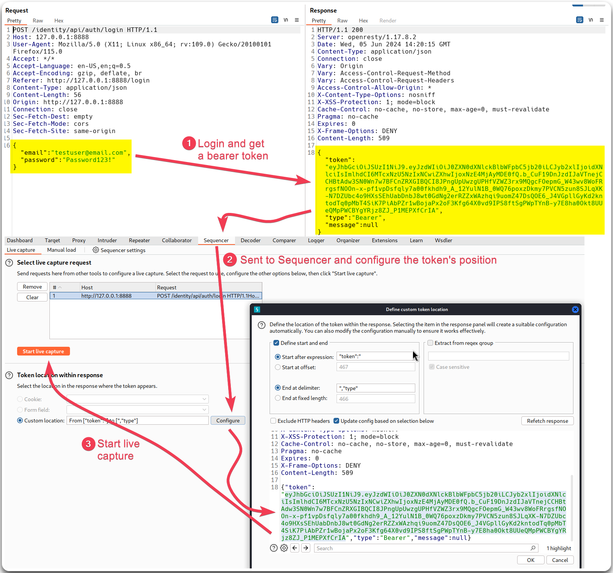

# Entropy Analysis


JWT **entropy analysis** involves evaluating the randomness and unpredictability of the tokens' secret keys or payloads. High entropy ensures that tokens are difficult to guess or brute-force.


> _The below example is based on the_ [_crAPI_](https://github.com/OWASP/crAPI) _application._

We can check if the token has a somewhat **predictable pattern**, and if that is the case, we could try brute-forcing it with Intruder (Figure 1).

<figure><figcaption>
Figure 1: Performing entropy analysis with Burp's Sequencer.
</figcaption></figure>
