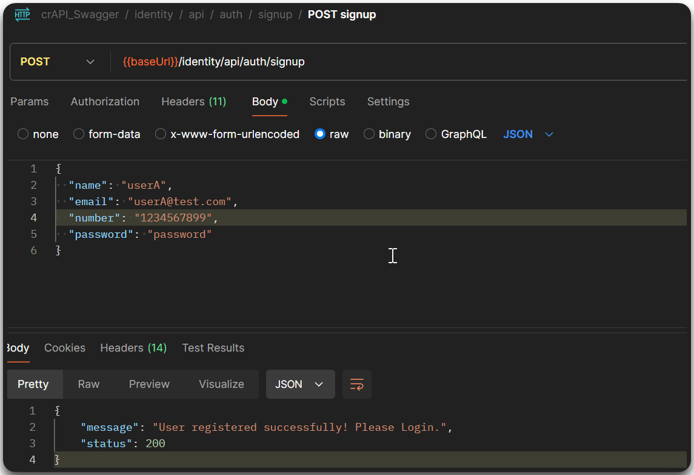
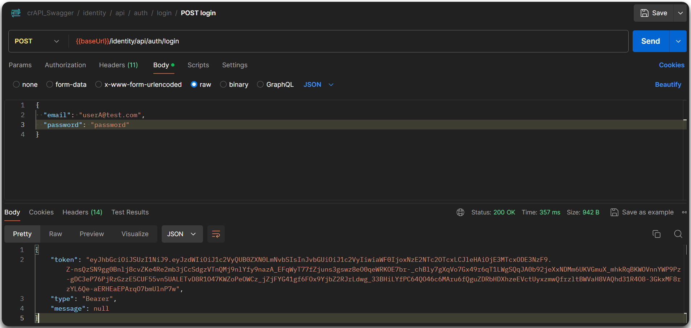
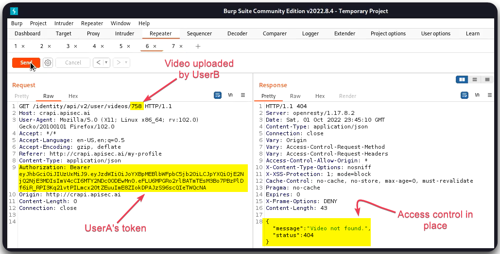

# BOLA


Broken Object Level Authorization (BOLA) is a vulnerability where an attacker can access or manipulate objects or resources they are not authorized to by manipulating object references in requests (e.g., URLs or parameters).



This can lead to unauthorized access to sensitive data or actions, as attackers can exploit insufficient authorization checks to view or modify other users' data or resources.



Implement robust server-side authorization checks, ensure that access controls are enforced for every request, and avoid exposing direct references to sensitive objects in user inputs.


## General Information

Testing for BOLA involves:

1. Identifying relevant requests, i.e., requests that have resources IDs and/or that access other resources.
2. Perform **A-B testing**:
   1. Create and make requests as `userA`.&#x20;
   2. Create `userB` and repeat the requests to `userA`'s resources using `userB`'s token.

## Example

> _The below example is based on the_ [_crAPI_](https://github.com/OWASP/crAPI) _application._

The below example shows how A/B testing works:

1. Two users are created: `userA` and `userB` (Figure 1).

<figure><figcaption>
Figure 1: Creating a new user account (<code>userA</code>).
</figcaption></figure>

2. We have uploaded a video on `userB`'s profile as well as booked a vehicle.
3. We request the video and car's details with `userB`'s token and we save these requests.
4. We then replace `userB`'s with `userA`'s token and trying to access the same information (Figure 2).

<figure><figcaption>
Figure 2: Logging in &#x26; getting <code>userA</code>'s token.
</figcaption></figure>

5. We are unable to access the video information (Figure 3), but we are able to access the car's information (Figure 4). The latter is considered a BOLA flaw.

<figure><figcaption>
Figure 3: Trying to access <code>userB</code>'s video with <code>userA</code>'s token.
</figcaption></figure>

<figure><figcaption>
Figure 4: Trying to access <code>userB</code>'s vehicle details with <code>userA</code>'s token.
</figcaption></figure>
