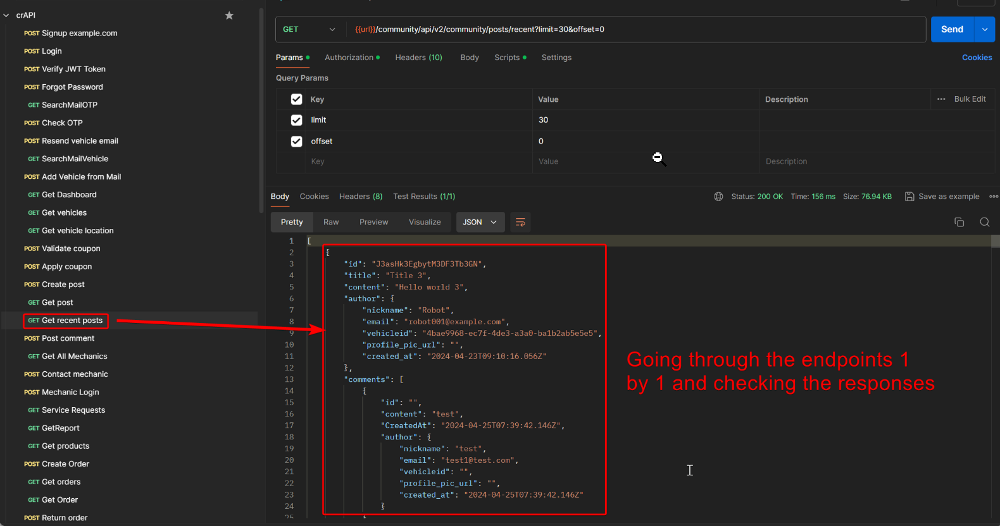

---
layout:
  title:
    visible: true
  description:
    visible: false
  tableOfContents:
    visible: true
  outline:
    visible: true
  pagination:
    visible: true
---

# Excessive Data Exposure


Excessive Data Exposure occurs when an application unintentionally reveals more data than necessary, often through APIs or error messages.



This can lead to unauthorized access to sensitive information, which may include personal data, system details, or other confidential information that can be exploited by attackers.



Limit the amount of data returned by APIs or error messages to only what is necessary, implement proper data access controls, and use data masking or anonymization techniques to protect sensitive information.


> _The below example is based on the_ [_crAPI_](https://github.com/OWASP/crAPI) _application._

<figure><figcaption>
Figure 1: Identifying an excessive data exposure vulnerability.
</figcaption></figure>

> _The below example is based on HTB's_ [_API Attacks_](https://academy.hackthebox.com/course/preview/api-attacks) _module._

<figure><figcaption>
Figure 2: Discovering an Excessive Data Exposure flaw.
</figcaption></figure>
