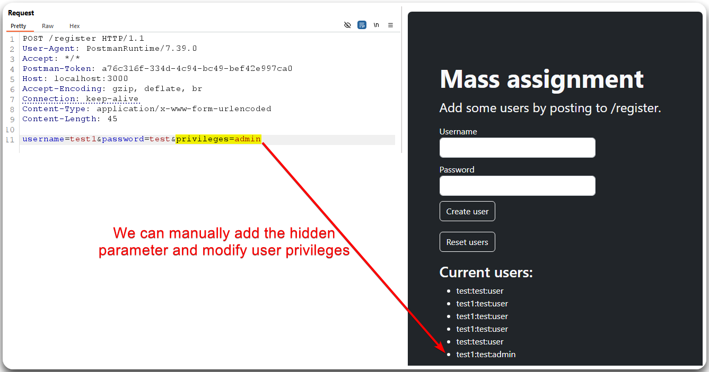
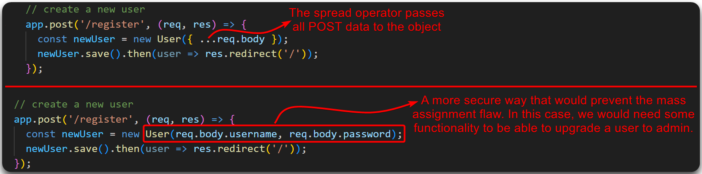
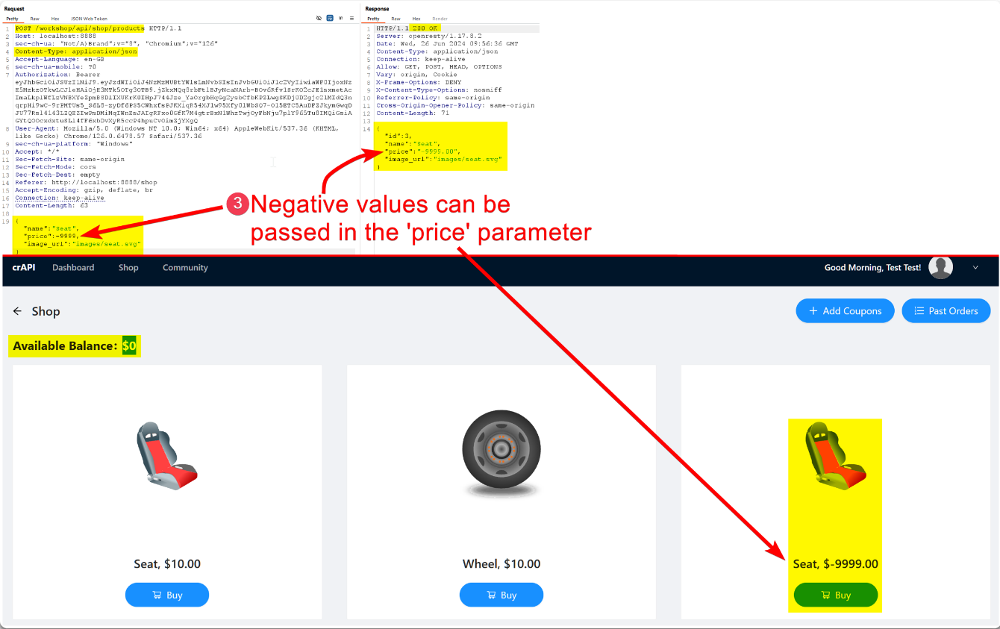

# Mass Assignment


Mass Assignment (aka auto-binding) is a vulnerability where an application automatically assigns user-supplied data to model attributes without proper validation or restrictions.



This can lead to unauthorized modification of sensitive attributes or fields, such as changing user roles or settings, due to the application accepting and processing more input than intended.



Explicitly define and whitelist allowed attributes for mass assignment, use strong parameter filtering, and validate user inputs to ensure only permitted fields are modified


* Registration requests are a good candidate for mass assignment flaws (Figure 1 & 2).
* Check documentation if available (Figure 1, 2, & 3).
* `POST` requests that accept user input (convert `GET` requests to `POST`) (Figure 4 & 5).
* Potential parameters can be identified via fuzzing, code review, JWTs, leaky API endpoints, front-end code review, etc.

> _The below example is based on TCM's_ [_Practical API Hacking_](https://academy.tcm-sec.com/p/hacking-apis) _course._

<figure><figcaption>
Figure 1: Finding 'hidden' parameters in the documentation.
</figcaption></figure>

<figure><figcaption>
Figure 2: Adding the <code>privileges</code> parameter to the registration request.
</figcaption></figure>

<figure><figcaption>
Figure 3: The root cause of the above mass assignment vulnerability.
</figcaption></figure>

> _The below example is based on the_ [_crAPI_](https://github.com/OWASP/crAPI) _application._

<figure><figcaption>
Figure 4: Tampering with the HTTP verbs.
</figcaption></figure>

<figure><figcaption>
Figure 5: Exploiting a mass assignment vulnerability.
</figcaption></figure>
