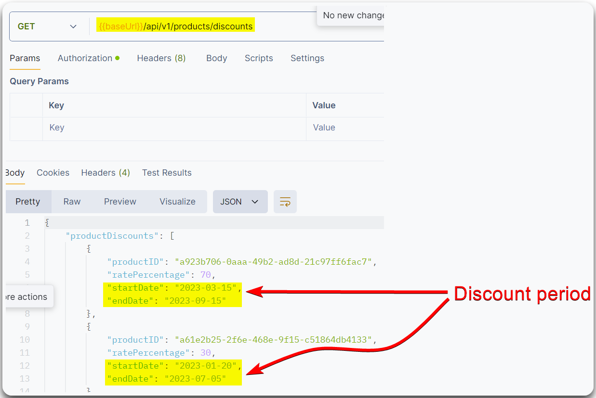

# Unrestricted Access to Sensitive Business Flows


Unrestricted Access to Sensitive Business Flows occurs when users can access or manipulate sensitive business processes or functionalities without appropriate authorization or access controls.



This can lead to unauthorized actions, data exposure, or financial loss, as users might perform operations or access information beyond their intended privileges.



Implement strict access controls and authorization checks for sensitive business processes, validate user permissions before allowing access to critical functionalities, and regularly review and audit access policies and roles.


> _The below example is based on HTB's_ [_API Attacks_](https://academy.hackthebox.com/course/preview/api-attacks) _module._

The endpoint below reveas the products' discount period which can be exploited by a threat actor by making automated purchases on the starting date and reselling them later at a higher price (Figure 1).

<figure><figcaption>
Figure 1: An endpoint that exposes a sensitive business flow.
</figcaption></figure>

