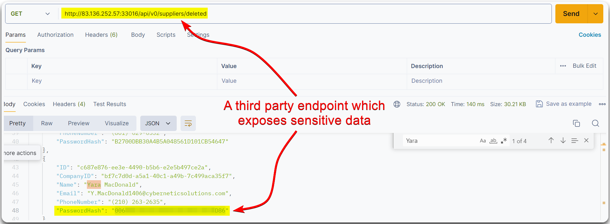

# Unsafe API Consumption


Unsafe API Consumption occurs when an application or service interacts with APIs in a way that exposes it to vulnerabilities, such as not validating inputs or failing to handle sensitive data securely.



This can lead to security issues such as data breaches, unauthorized access, or exploitation of API-related vulnerabilities.



Implement strong input validation and sanitization, use authentication and authorization mechanisms, ensure secure handling of sensitive data, and regularly review and test API interactions for potential security flaws.


> _The below example is based on HTB's_ [_API Attacks_](https://academy.hackthebox.com/course/preview/api-attacks) _module._

This flaw is present when an API consumes another API in an insecure manner, for instance, a 3rd party endpoint vulnerable to [Excessive Data Exposure](excessive-data-exposure.md) (Figure 1).

<figure><figcaption>
Figure 1: A vulnerable 3rd party endpoint.
</figcaption></figure>
