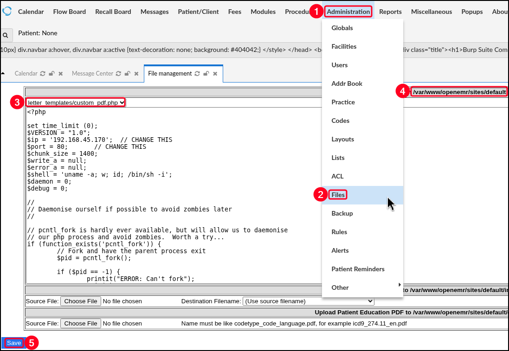

---
layout:
  width: default
  title:
    visible: true
  description:
    visible: false
  tableOfContents:
    visible: true
  outline:
    visible: true
  pagination:
    visible: true
  metadata:
    visible: true
---

# OpenEMR

OpenEMR is an open-source electronic medical record (EMR) and practice management system used by healthcare providers to manage patient records, appointments, billing, prescriptions, and clinical workflows. It is built primarily with PHP and runs on a LAMP stack, making it a web-based solution typically deployed in hospitals, clinics, and medical practices.

The configuration file for the SQL database is typically under:

```
/var/www/openemr/sites/default/sqlconf.php
/var/www/html/openemr/sites/default/sqlconf.php
```

If elevated access is obtain in the OpenEMR application, RCE can be achieved:

<figure><figcaption></figcaption></figure>
