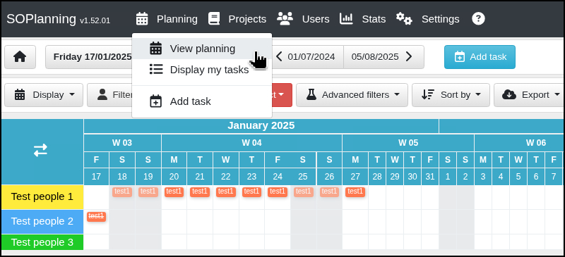
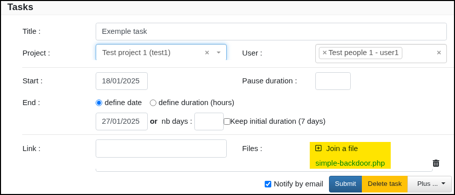

---
layout:
  width: default
  title:
    visible: true
  description:
    visible: false
  tableOfContents:
    visible: true
  outline:
    visible: true
  pagination:
    visible: true
  metadata:
    visible: true
---

# SO Planning

Simple Online Planning (SOPlanning) is a lightweight web-based application designed to manage and visualize project schedules and team availability. It provides a calendar-style interface that allows users to assign tasks, track progress, and coordinate resources across various projects. SOPlanning serves as a project and resource planning tool commonly used within organizations to streamline internal workflow and task management. It is built with PHP and uses a MySQL database, making it easy to deploy in typical LAMP stack environments.

## Default Credentials

The default credentials can be found in the [`demo_data.inc`](https://app.gitbook.com/o/asuXdppEfmgK9Dr478w0/s/mjLkek16kB60c2WFd5lf/) file and are `admin:admin`. The SHA1 hashed password is: `df5b909019c9b1659e86e0d6bf8da81d6fa3499e`. If privileges access to the database is obtained, the password of the `admin`  account can be modified:


```sql
MySQL [soplanning]> UPDATE planning_user SET password='df5b909019c9b1659e86e0d6bf8da81d6fa3499e' WHERE login='admin';
Query OK, 1 row affected (0.038 sec)
Rows matched: 1  Changed: 1  Warnings: 0
```


## Authenticated RCE

SOPlanning version `1.52.01` contains an **authenticated RCE** vulnerability. The flaw lies in improper handling of user input or misconfigured access control within administrative or backend components of the application. Once authenticated, a low-privileged user may exploit specific endpoints or functionalities—such as file upload mechanisms or misused PHP functions—to inject and execute arbitrary PHP code. This leads to full server-side code execution within the context of the web server.

From the dashboard, the user can click on a planned task (e.g. `test1`) to open its configuration:

<figure><figcaption></figcaption></figure>

Then a file can be joined and accessed, such as a PHP webshell:

<figure><figcaption></figcaption></figure>
