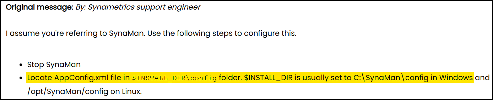
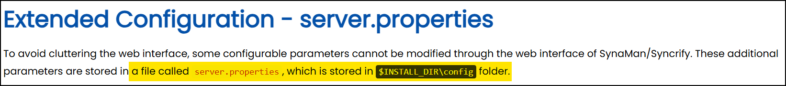

---
layout:
  width: default
  title:
    visible: true
  description:
    visible: false
  tableOfContents:
    visible: true
  outline:
    visible: true
  pagination:
    visible: true
  metadata:
    visible: true
---

# SynaMan

[SynaMan](https://web.synametrics.com/SynaMan.htm), developed by Synametrics Technologies, is a remote file manager that enables web-based access to files and directories over HTTP and HTTPS. It is designed to be cross-platform, operating on Windows, Linux, and macOS, with a lightweight installation footprint. The application typically runs on port `6060` (HTTP) and `6443` (HTTPS), though configurations may vary. Its purpose is to simplify remote file transfers and sharing within organizations without relying on traditional VPN setups. Due to its role in providing direct access to a host system’s file structure and its accessibility from a browser, it is an attractive target for adversaries seeking unauthorized data access or privilege escalation.

## Files

<figure><figcaption><p><a href="https://www.synametrics.com/SynametricsWebApp/Forums?operation=5&#x26;msgId=5156&#x26;seqno=2">https://www.synametrics.com/SynametricsWebApp/Forums?operation=5&#x26;msgId=5156&#x26;seqno=2</a></p></figcaption></figure>

<figure><figcaption><p><a href="https://web.synametrics.com/server-properties.htm">https://web.synametrics.com/server-properties.htm</a></p></figcaption></figure>

```sh
# Files of interest
synaman/config/appconfig.xml
synaman/config/server.propertries
```

## SMTP Credential Disclosure

SynaMan version `4.0` build `1488` is affected by a cleartext credential storage vulnerability ([CVE-2018-10814](https://nvd.nist.gov/vuln/detail/CVE-2018-10814)) due to improper handling of SMTP authentication data within its configuration files. The application stores the SMTP account password in plaintext inside the `AppConfig.xml` file, which is accessible to any local user on the system.

Exploitation of this vulnerability requires local access with at least low-privileged user rights. Once access is obtained, an attacker can navigate to the SynaMan configuration directory (e.g., `C:\SynaMan\config\`) and read the `AppConfig.xml` file. Within this file, the `smtpPassword` parameter is written in cleartext, allowing the attacker to recover the full SMTP credential without any decoding or decryption effort ([PoC](https://www.exploit-db.com/exploits/45387)).

