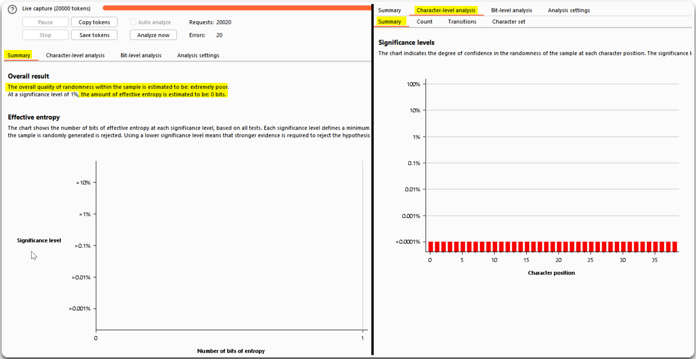
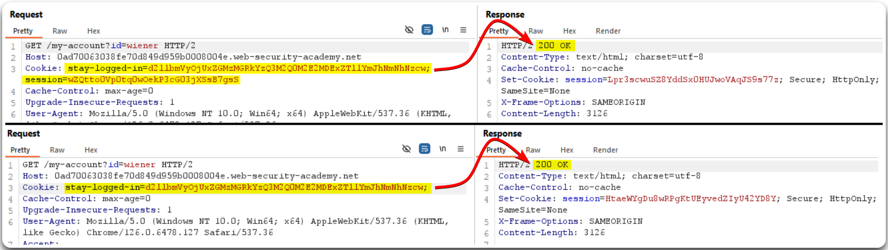

---
layout:
  title:
    visible: true
  description:
    visible: false
  tableOfContents:
    visible: true
  outline:
    visible: true
  pagination:
    visible: true
---

# Session Tokens


Session token attacks occur when an attacker steals, manipulates, or exploits session tokens to gain unauthorized access to a user's session or account.



This can lead to unauthorized access to user accounts, data theft, or impersonation, as attackers can hijack or impersonate legitimate user sessions.



Use secure session management practices, such as generating random and unique session tokens, implementing HTTPS to protect tokens in transit, and using [secure cookie attributes](../common-findings/cookie-flags.md) (e.g., HttpOnly, Secure). Regularly regenerate session tokens and implement proper session expiration and invalidation mechanisms.


> _The example below is based on PostSwigger's_ [_Brute-forcing a stay-logged-in cookie_](https://portswigger.net/web-security/authentication/other-mechanisms/lab-brute-forcing-a-stay-logged-in-cookie) _lab._

When logged in as `wiener` we get two cookies: `stay-logged-in` and `session` (Figure 1). The former seems static, i.e., does not change with a new request, whereas the latter is dynamic.

<figure><figcaption><p>Figure 1: Inspecting cookies' behavior.</p></figcaption></figure>

When analyzing the cookie's pattern using Sequencer (Figure 2), it indeed validates that this is a static cookie (Figure 3).

<figure><figcaption><p>Figure 2: Configuring cookie's position and sequencer's settings.</p></figcaption></figure>

<figure><figcaption><p>Figure 3: Reviewing Sequencer's results &#x26; confirming that the <code>stay-logged-in</code> is indeed a static cookie.</p></figcaption></figure>

The decoded value of the `stay-logged-in` cookie seems to have the format `username:hash`. We can find out the type of hash and try to crack it.

```bash
# Identifying the hash type
$ hash-identifier
   #########################################################################
   #     __  __                     __           ______    _____           #
   #    /\ \/\ \                   /\ \         /\__  _\  /\  _ `\         #
   #    \ \ \_\ \     __      ____ \ \ \___     \/_/\ \/  \ \ \/\ \        #
   #     \ \  _  \  /'__`\   / ,__\ \ \  _ `\      \ \ \   \ \ \ \ \       #
   #      \ \ \ \ \/\ \_\ \_/\__, `\ \ \ \ \ \      \_\ \__ \ \ \_\ \      #
   #       \ \_\ \_\ \___ \_\/\____/  \ \_\ \_\     /\_____\ \ \____/      #
   #        \/_/\/_/\/__/\/_/\/___/    \/_/\/_/     \/_____/  \/___/  v1.2 #
   #                                                             By Zion3R #
   #                                                    www.Blackploit.com #
   #                                                   Root@Blackploit.com #
   #########################################################################
--------------------------------------------------
 HASH: 51dc30ddc473d43a6011e9ebba6ca770

Possible Hashs:
[+] MD5
[+] Domain Cached Credentials - MD4(MD4(($pass)).(strtolower($username)))
<SNIP>

# Cracking the hash
$ hashcat -m0 51dc30ddc473d43a6011e9ebba6ca770 /usr/share/wordlists/rockyou
<SNIP>

51dc30ddc473d43a6011e9ebba6ca770:peter
```

The cookie's pattern is `username:md5(password)`. We also notice that if we remove the `session` cookie, we can still access the current account's profile as normal (Figure 4).

<figure><figcaption><p>Figure 4: Removing the <code>session</code> cookie does not affect the application's behaviour.</p></figcaption></figure>

As a result, we can try brute-forcing `carlos` cookie using Intruder by rebuilding the cookie's hashing and encoding patterns (Figure 5).

<figure><figcaption><p>Figure 5: Performing a BFA on <code>carlos</code>'s cookie.</p></figcaption></figure>
