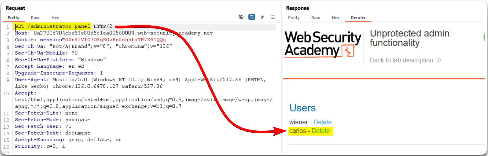

---
layout:
  title:
    visible: true
  description:
    visible: false
  tableOfContents:
    visible: true
  outline:
    visible: true
  pagination:
    visible: true
---

# IDOR / BFLA


Insecure Direct Object Reference (IDOR) or Broken Function Level Authorization (BFLA) is a vulnerability where attackers can access or perform actions on objects or functions they are not authorized to by manipulating request parameters or URLs.



This can lead to unauthorized access to resources, data exposure, or unintended actions being performed by exploiting inadequate authorization checks.



Implement robust access controls and authorization checks for every request, ensure proper validation of user permissions, and avoid exposing sensitive object references or functionality directly.


> _The example below is based on PostSwigger's_ [_Unprotected admin functionality_](https://portswigger.net/web-security/access-control/lab-unprotected-admin-functionality) _lab._

Burp's Active Scan reveals an exposed `robots.txt` file which reveals the `/administrator-panel` directory (Figure 1).

<figure><figcaption>
Figure 1: Performing an Active Scan on the target host.
</figcaption></figure>

This directory gives us direct access to administrative functionalities (Figure 2).

<figure><figcaption>
Figure 2: Obtaining access to administrative functionalities.
</figcaption></figure>
