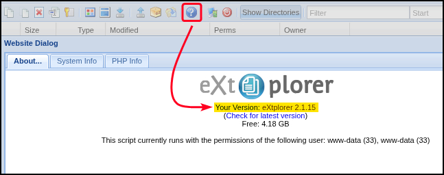

# eXtplorer

eXtplorer is a web-based PHP file manager often used as a Joomla component or standalone tool. It provides browser-accessible file operations, making it a common target in outdated or misconfigured environments. Known for file upload capabilities and occasional authentication flaws, it can expose systems to remote code execution or privilege escalation if not properly secured.

## Attacks

The app's [default credentias](https://app.gitbook.com/o/asuXdppEfmgK9Dr478w0/s/mjLkek16kB60c2WFd5lf/) are `admin:admin`. The version can be seen as shown below:

<figure><figcaption></figcaption></figure>

eXtplorer standalone instances between versions `2.1.0` to `2.1.2` and `2.1.0RC5`  are vulnerable to **arbitrary file upload to writable directories within the web root**, including malicious scripts. Once uploaded, these files can be executed remotely, leading to full RCE on the target system.
