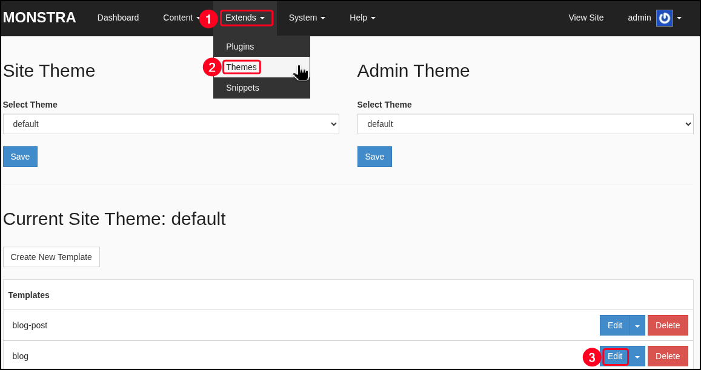
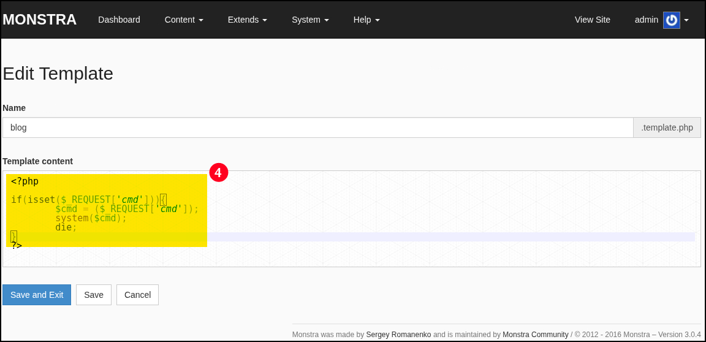

# Monstra

[Monstra CMS](https://monstra.org/) is a lightweight, open-source, flat-file content management system written in PHP. It is designed for rapid deployment, requiring no database, which simplifies installation and reduces server overhead. Its architecture relies on plain text files for storing site data, making it portable and easy to back up or migrate. The platform integrates HTML, CSS, and JavaScript minification and combination features to optimize page load performance, while responsive design ensures compatibility with devices ranging from smartphones to desktop systems.

The system supports multi-user environments with configurable roles such as administrators, editors, and general users. Each role has distinct permissions, enabling separation of duties and more granular control over content management operations. Administrative control is centralized through a web-based dashboard, where site structure, plugins, themes, and system settings can be managed.

## Authenticated RCE

Monstra CMS version `3.0.4` is affected by a RCE vulnerability due to insufficient validation of template file content within the Theme Blog editor. The application allows authenticated users with access to the theme editing functionality to **inject arbitrary PHP code directly into the blog template**. Once injected, the code is stored and executed by the server whenever the modified template is rendered, enabling the execution of system commands with the privileges of the web server process. An available [PoC](https://github.com/monstra-cms/monstra/issues/470) exists.

<figure><figcaption></figcaption></figure>

<figure><figcaption></figcaption></figure>
