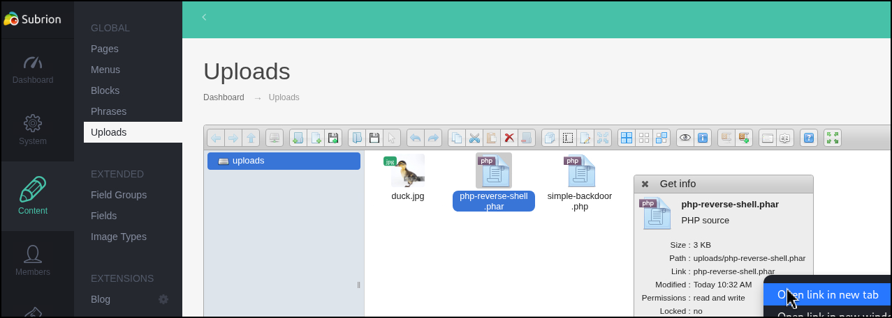

# Subrion

Subrion CMS is a PHP-based, database-driven CMS with a modular design and built-in features for blogging, user management, and SEO. It uses MySQL for storing content and configurations, and its plugin system allows for extensive customization. The admin panel is typically found at predictable paths like `/panel/`, making it easy to identify during recon. Due to its reliance on third-party plugins and inconsistent patching in the wild, Subrion is often exposed to various vulnerabilities.

## Authenticated RCE

Subrion CMS versions `4.2.1` and below are vulnerable to an **authenticated RCE** vulnerability ([CVE-2018-19422](https://cve.mitre.org/cgi-bin/cvename.cgi?name=2018-19422)). The issue stems from the CMS allowing file uploads with extensions like `.phar`, `.pht`, or `.xhtml`, which are executable by the server despite the presence of a `.htaccess` file intended to restrict such behavior. This allows an authenticated user to upload a malicious file, such as a PHP reverse shell disguised with one of the allowed extensions, and trigger it for code execution.

<figure><figcaption></figcaption></figure>
