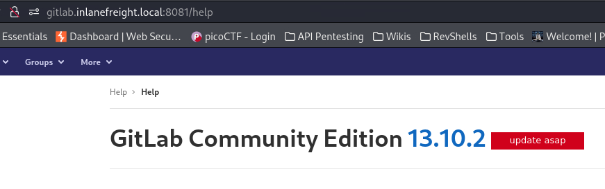
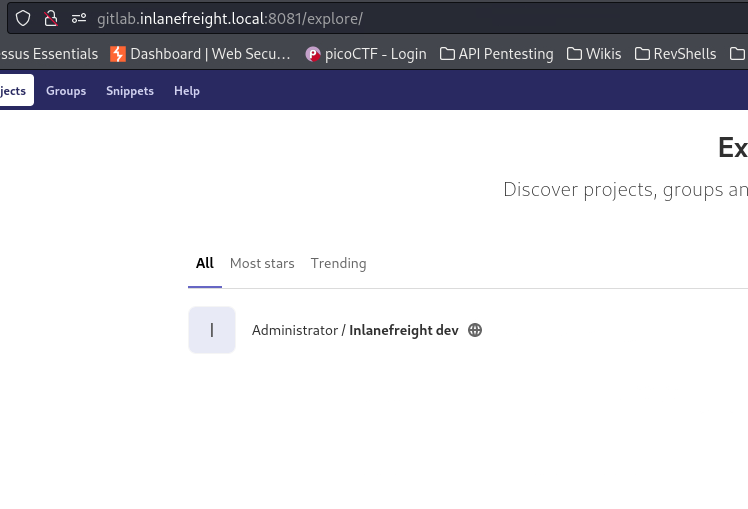
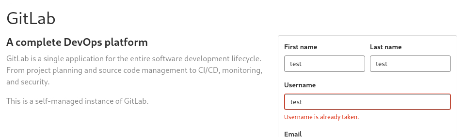

---
layout:
  title:
    visible: true
  description:
    visible: false
  tableOfContents:
    visible: true
  outline:
    visible: true
  pagination:
    visible: true
---

# GitLab

## General

In GitLab the 2FA is disabled by default. It has the following three types of repositories:

<table><thead><tr><th width="217">Repository</th><th>Access</th></tr></thead><tbody><tr><td>Public</td><td>Available to everyone (no authentication required)</td></tr><tr><td>Internal</td><td>Available to all authenticated users</td></tr><tr><td>Private</td><td>Restricted to specific users</td></tr></tbody></table>

## Footprinting

> _The below examples has been taken from the Gitlab section of the_ [_Attacking Common Applications_](https://academy.hackthebox.com/module/113) _HTB's module._

For finding the version we can register an account and browse to `/help` (Figure 1).

<figure><figcaption><p>Figure 1: Footprinting GitLab as authenticated users.</p></figcaption></figure>

## Manual Enumeration

We can browse to `/explore` both as unauthenticated (Figure 2) and authenticated users (Figure 3).

<div><figure><figcaption><p>Figure 2: Exploring project as an unauthenticated user.</p></figcaption></figure> <figure><figcaption><p>Figure 3: Exploring project as an authenticated user.</p></figcaption></figure></div>

Check for registration errors (Figure 4):

<figure><figcaption><p>Figure 4: Enumerating usernames via registration errors.</p></figcaption></figure>

## User Enumeration








```bash
# download script
wget https://raw.githubusercontent.com/dpgg101/GitLabUserEnum/main/gitlab_userenum.py
# usage
./gitlab_userenum.py --url URL --wordlist WORDLIST
```









```bash
./gitlab_userenum.sh --url URL --userlist WORDLIST
```



